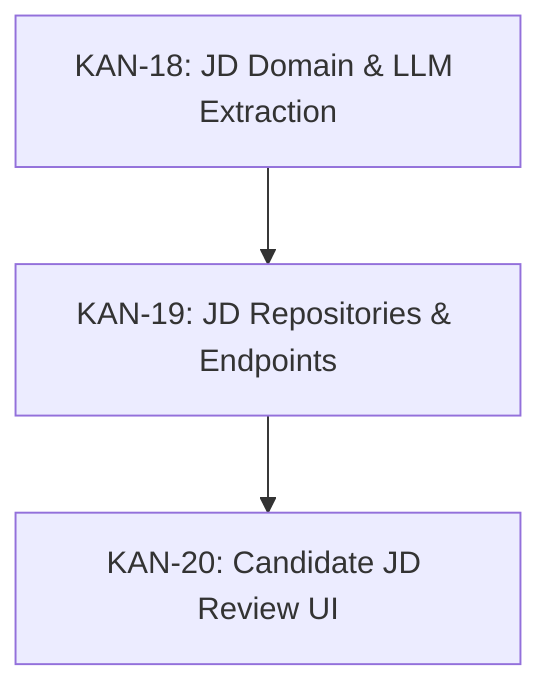
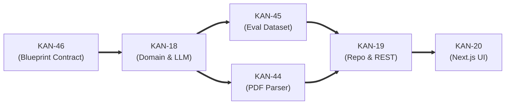

# Current Execution Queue — JD Domain

> **Active Sprint Focus:** Job Description (JD) Pipeline  
> **Execution Mindset:** Maximum throughput — finish each ticket as early as possible without waiting for deadlines.

---

## 1. Active Task Roster

| Jira Key | Task Summary | Committed Deadline | Status | Owner / Area | Core Responsibility |
| :--- | :--- | :--- | :--- | :--- | :--- |
| **[[KAN-46]]** | [Backend][JD] Define JD interview blueprint contract | **2026-09-11 14:00** | `IN PROGRESS` | Backend / Arch | Formalize blueprint JSON schema to decouple JD from interview. |
| **[[KAN-18]]** | Implement JD domain model and structured LLM extraction | **2026-09-11 23:59** | `PENDING KAN-46` | Backend / AI | Domain entities, prompt engineering, structured JSON LLM output. |
| **[[KAN-44]]** | [Backend][JD] Implement JD PDF extraction pipeline | **2026-09-12 18:00** | `QUEUED` | Backend | PDF bytes -> raw UTF-8 text extraction (decoupled from LLM). |
| **[[KAN-45]]** | [Testing][JD] Set up JD extraction evaluation dataset | **2026-09-12 23:59** | `QUEUED` | QA / Testing | Curate 15-20 diverse JD samples + ground-truth extraction benchmarks. |
| **[[KAN-19]]** | Implement JD repository, use cases and REST endpoints | **2026-09-13 23:59** | `QUEUED` | Backend | PostgreSQL schema, sqlc queries, Gin HTTP handlers, envelope mapping. |
| **[[KAN-20]]** | Build JD upload, editable skill review and blueprint preview UI | **2026-09-14 23:59** | `QUEUED` | Frontend | Next.js wizard: upload/paste -> review extracted skills -> preview blueprint. |

---

## 2. Dependency Graph vs. Execution Optimization

### Formal Jira Dependencies

### Operational Execution Sequence (Optimized Throughput)

- **KAN-46 Contract First:** Stabilizing the output blueprint schema prevents costly rework in KAN-18 and interview orchestration.
- **KAN-44 Separation:** PDF ingestion must be cleanly isolated as `(bytes) -> string`. Do NOT couple PDF reading directly to LLM prompt logic.
- **KAN-45 Reusability:** Evaluation dataset must be structured as automated test fixtures, not discarded documentation.
