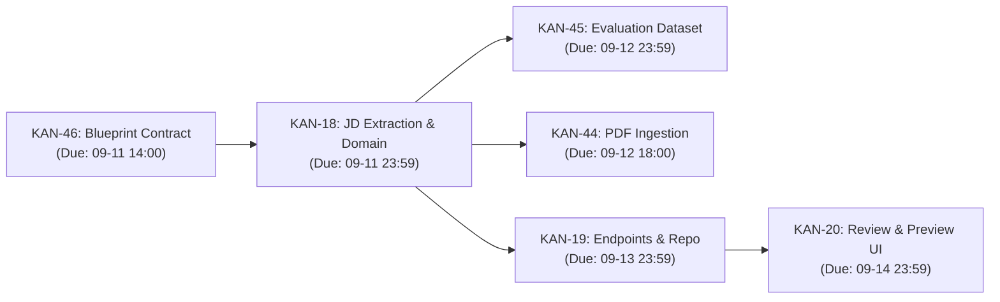

# SEP490 Project Brain — Command Center

> **Operational Hub & Navigation Center**  
> **Product:** RoleCue — AI-Powered Virtual Technical Mock Interview Platform  
> **Capstone Group:** 09 (`09_GFA26SE84`) | **Supervisor:** Mr. Nguyễn Thế Hoàng  
> **Current Date:** 2026-09-11 | **Active Sprint Focus:** Job Description (JD) Processing Pipeline

---

## ⚡ Quick Navigation

| Operational Zone | Key Notes & Maps | Primary Role / Description |
| :--- | :--- | :--- |
| **Control Center** | [[Source-of-Truth]] [[Decision-Registry]] [[Open-Questions]] [[Current-State]] [[Current-Queue]] [[Sync-Log]] | Normative authority rules, accepted architectural records, open blockers, active queues, sync deltas. |
| **System Contracts** | [[Product-Contract]] [[Backend-Contract]] [[Frontend-Contract]] [[API-Contract]] [[JD-Contract]] [[Interview-Contract]] [[Avatar-Audio-Contract]] [[Payment-Contract]] | Authoritative behavior, inputs/outputs, invariants, and boundaries for all subsystems. |
| **Feature Domains** | [[JD-Overview]] [[03_Domains/Auth/README\|Auth Domain]] [[03_Domains/Interview/README\|Interview Domain]] [[03_Domains/Avatar-Audio/README\|Avatar & Audio]] [[03_Domains/Evaluation-Reporting/README\|Evaluation Domain]] [[03_Domains/Payment/README\|Payment Domain]] [[03_Domains/Admin/README\|Admin Domain]] | Deep domain logic, workflows, specifications, and specialized schemas. |
| **Codebase Reality** | [[Repo-Map]] [[Backend-Reality]] [[Frontend-Reality]] [[Integration-Boundaries]] [[Technical-Debt-and-Gaps]] | Ground-truth audit of merged code in `api/` and `frontend/`. Identifies gaps vs. specs. |
| **Execution & Jira** | [[Current-Sprint]] [[Dependency-Map]] [[Done-History]] [[KAN-46]] · [[KAN-18]] · [[KAN-44]] · [[KAN-45]] · [[KAN-19]] · [[KAN-20]] | Sprint tracking, Jira task dependencies, deadlines, and execution order. |
| **Academic Reports** | [[08_Reports/README\|Reports Hub]] [[08_Reports/Lecturer/Lecturer-note.jpg\|Lecturer Directives]] [[08_Reports/Lecturer/9_GFA26SE84_AI_Virtual_Technical_Interview_Capstone_Register.pdf\|Capstone Register]] | University deliverables, submission templates, supervisor constraints. |
| **Historical Archive** | [[90_Legacy-Reference/README\|Legacy Reference Hub]] [[SPECIFICATION]] [[IMPLEMENTATION_PLAN]] | Speculative, unapproved, or superseded historical artifacts (*Reference only*). |

---

## 🎯 Current Operational Focus: JD Domain Sprint

The active execution stream focuses on stabilizing the **Job Description (JD) extraction and blueprinting pipeline**:

- **Active Blocker / Task:** Stabilize [[KAN-46]] contract and proceed directly to [[KAN-18]].
- **Open Decisions to Resolve:** See [[Open-Questions]] for LLM provider choice, PDF parsing library, and schema design.
