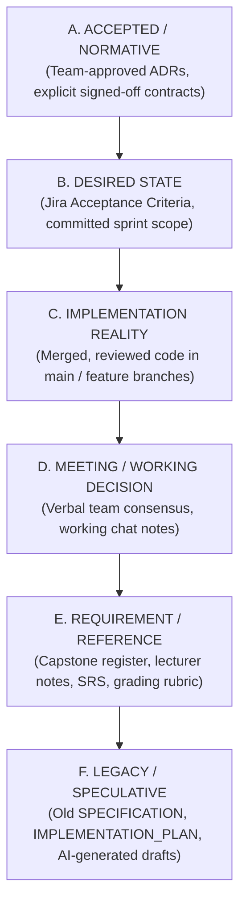

# Source of Truth & Authority Model

> [!CAUTION]
> ### CRITICAL PRINCIPLE
> **OLD SPECIFICATION AND IMPLEMENTATION PLAN ARE REFERENCE ONLY.**  
> **DO NOT IMPLEMENT DIRECTLY FROM THEM.**
> 
> Historical documents (`SPECIFICATION.md`, `IMPLEMENTATION_PLAN.md`) contain speculative, AI-generated, or obsolete technical assumptions (e.g., Clean Architecture, GORM, Goose, Redis queues, obsolete paths) that were never approved by the team and do not match repository reality.

---

## 1. Six-Tier Authority Hierarchy

When reading information, resolving architectural choices, or implementing code, evaluate evidence strictly against this hierarchy. Never collapse categories together.

| Tier | Category | Definition & Scope | Examples in SEP490 |
| :--- | :--- | :--- | :--- |
| **A** | **ACCEPTED / NORMATIVE** | Team-approved architectural decision records (ADRs), ratified interface contracts, explicitly confirmed team agreements. | `api/` root structure, `sqlc` + `pgx/v5`, `pkg/apperror`, `pkg/response`. |
| **B** | **DESIRED STATE** | Explicit Jira ticket acceptance criteria, confirmed team commitments, approved sprint goals. | [[KAN-46]] blueprint contract target, [[KAN-18]] extraction scope. |
| **C** | **IMPLEMENTATION REALITY** | What reviewed, merged code actually executes in the repository today. | Go 1.27, Gin routes (`/auth/auth/login`), Next.js 16 App Router, custom fetch transport. |
| **D** | **MEETING / WORKING DECISION** | Discussed or tentatively agreed in meetings/Discord, but not yet formalized in an ADR. | Tentative pipeline separation for PDF parsing vs. LLM. |
| **E** | **REQUIREMENT / REFERENCE** | Capstone registration documents, university syllabus, lecturer constraints, formal academic submissions. | 3D avatar presence, voice interaction, 20 concurrent users, Report 7 docx submission rules. |
| **F** | **LEGACY / SPECULATIVE** | Historical specifications, superseded plans, unvalidated AI architectural proposals. | `SPECIFICATION.md` v1.1.0, `IMPLEMENTATION_PLAN.md` v2.1.0. |

---

## 2. The Implementation Rule of Precedence

Before making any technical decision or writing code, systematically verify evidence in this exact order:

1. **Accepted Contract / ADR** (`01_Contracts/`, `02_Decisions/accepted/`)
2. **Jira Acceptance Criteria / Approved Task Scope** (`04_Execution/Jira/`)
3. **Current Repository Implementation** (`05_Codebase/`, real repo inspection)
4. **Meeting Decisions** (`06_Meetings/`)
5. **Reports / Lecturer Requirements** (`08_Reports/`)
6. **Legacy Specs** (`90_Legacy-Reference/` — *Reference only!*)
7. **AI-Generated Suggestions** (*Unvalidated hypotheses*)

---

## 3. Discrepancy Recording Rule (No Silent Rewrites)

If a conflict is detected between two tiers (e.g., Jira states behavior $X$ while code does $Y$, or an old spec claims $Z$):

1. **Do NOT silently rewrite one to match the other.**
2. **Record BOTH states explicitly** in the appropriate domain or codebase note:
   - **Desired State:** $X$ (Source: Jira [[KAN-18]])
   - **Implementation Reality:** $Y$ (Source: `api/internal/auth/transport/http/server.go`)
   - **Identified Gap:** $X \neq Y$
3. Log the discrepancy in [[Open-Questions]] or [[Technical-Debt-and-Gaps]].
4. Escalate to the team for an explicit decision before normalizing.
