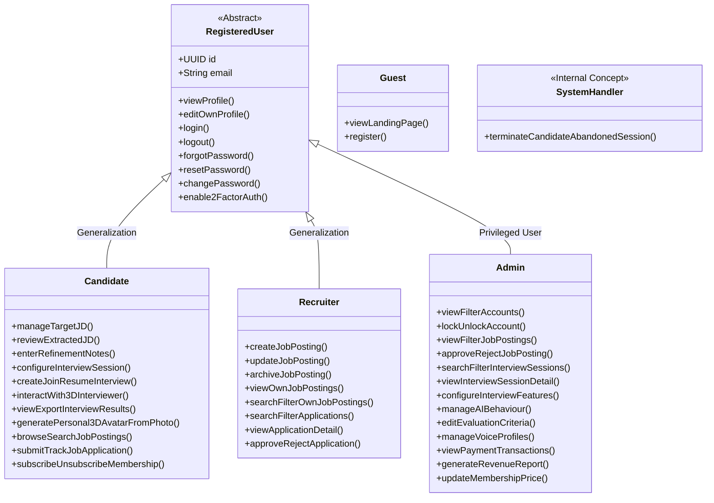

# Actors and Capabilities

This document defines the actors of the RoleCue platform and establishes their canonical capability boundaries according to the finalized product scope.

---

## 1. Actor Catalog & Hierarchy

### Detailed Actor Definitions

#### 1.1. Guest (Public Visitor)
* **Definition:** An unauthenticated visitor accessing the public web application.
* **Canonical Capabilities:**
  * **View Landing Page:** View platform value proposition, product overview, and public information.
  * **Register:** Initiate registration to create an account as a Candidate or Recruiter.
* **Boundary Invariant:** Guests do **NOT** have access to pricing exploration, pricing plan viewing, public 3D avatar teasers, avatar previews, 2-question voice demos, anonymous voice demos, or public interactive demos.

#### 1.2. Registered User (Abstract Authenticated User)
* **Definition:** The shared authenticated-user abstraction representing any verified account holder. Serves as the common base for Candidate, Recruiter, and Admin.
* **Canonical Capabilities:**
  * View Profile
  * Edit Own Profile
  * Log in
  * Log out
  * Forgot Password
  * Reset Password
  * Change Password
  * Enable 2-Factor Authentication

#### 1.3. Candidate (Interview Practice & Career Seeker)
* **Definition:** An authenticated job seeker using RoleCue to prepare for technical interviews and discover career opportunities.
* **Canonical Capabilities:**
  * **Target JD for Practice Management:** Upload or paste target job descriptions (text or PDF) for personal practice.
  * **AI-Extracted JD Review:** Inspect and modify structured technical competencies extracted by AI.
  * **Refinement Notes:** Enter natural-language instructions (e.g., *"Exclude C# from the interview"*) before blueprint compilation.
  * **Interview Configuration:** Configure composite session parameters (interviewer persona, voice profile, 3D environment, difficulty, duration).
  * **Interview Session Lifecycle:** Create, check readiness (preflight), join, pause, and resume interview sessions.
  * **Spoken Interaction with 3D AI Interviewer:** Conduct real-time voice conversation with speech-synchronized 3D interviewer animation and adaptive probing.
  * **Interview History & Results:** Review performance reports, scores across 5 core competencies, radar charts, question critiques, actionable recommendations, and export results.
  * **Personal 3D Avatar from Photo:** Upload a front-facing portrait photo to generate a personal 3D avatar (feasibility demonstrated via the Avaturn spike).
  * **Job Posting Discovery:** Browse, search, filter, and view details of active recruiter Job Postings.
  * **Job Application Submission:** Submit job applications to active Job Postings and track application status.
  * **Membership Management:** Subscribe and unsubscribe to Candidate membership.
* **Boundary Invariant:** Candidates do **NOT** purchase practice credit packages or submit refund dispute claims. Candidates **never** view, edit, or confirm Interview Blueprints.

#### 1.4. Recruiter (Employer Hiring Representative)
* **Definition:** A verified recruiter or hiring representative publishing job opportunities and reviewing incoming applications.
* **Canonical Capabilities:**
  * **Create Job Posting:** Author and publish a Job Posting (which is the company's Job Description).
  * **Update Job Posting:** Modify requirements, details, or metadata of existing Job Postings.
  * **Archive Job Posting:** Archive inactive or filled Job Postings.
  * **View & Search Own Job Postings:** Inspect, filter, and search own published and archived Job Postings.
  * **Search & Filter Applications:** Filter candidate applications submitted to own Job Postings.
  * **View Application Detail:** Review applicant profile, contact details, and resume reference.
  * **Approve / Reject Application:** Render a definitive **Approve** or **Reject** status decision.
* **Boundary Invariant:**
  * **Job Posting IS the Company JD:** There is no separate "Corporate JD" entity or workflow.
  * **Scope Termination:** Recruitment scope strictly terminates at **Approve / Reject Application**. RoleCue does not model multi-stage hiring funnels, panel scheduling, interview assignments, offers, compensation negotiations, or onboarding.
  * **No Unsupported Corporate Features:** Recruiters do not manage company profile branding as a separate use case, manage Business Tax Codes, purchase recruiter memberships/subscriptions, manage corporate billing, or receive VAT invoices. Basic recruiter identity exists as ordinary profile metadata.

#### 1.5. Administrator (Platform Governance & Operations)
* **Definition:** A privileged operator responsible for platform security, content oversight, AI calibration, and financial governance.
* **Canonical Capabilities:**
  * **Account Governance:** View and filter user accounts; lock and unlock accounts.
  * **Job Posting Governance:** View and filter published Job Postings; approve and reject Job Postings.
  * **Interview Session Oversight:** Search and filter interview sessions; view interview session detail.
  * **Interview Feature Configuration:** Configure interview features and runtime toggles.
  * **AI Behaviour Management:** Manage AI system prompts and probing instructions.
  * **Evaluation Criteria Calibration:** Edit evaluation criteria, rubric templates, and scoring weights.
  * **Voice Profile Catalog Management:** View voice profiles, fetch voice profiles from external TTS providers, and delete voice profiles.
  * **Financial Governance:** View payment transactions, generate revenue reports, and update membership prices.
* **Boundary Invariant:**
  * **Admin DOES manage:** Provider-sourced Voice Profiles (viewing, fetching from providers, deleting).
  * **Admin does NOT manage:** 3D avatar catalog or 3D interview room environments (which are built-in presets).
  * **No Dispute Queues:** Admins do not adjudicate refund requests or manage billing disputes.
  * **No Generic Telemetry Dashboards:** Administrative oversight is focused on accepted use case governance and financial revenue reporting.

#### 1.6. System Handler (Internal Automated Handler)
* **Definition:** An internal automated system handler executing scheduled background operations.
* **Canonical Capability:**
  * **Terminate Candidate's Abandoned Session:** Detects and terminates abandoned or orphaned interview sessions after extended inactivity.
* **Boundary Invariant:** The System Handler is strictly an **internal concept**, not an external entity on context diagrams. It does **not** manage invented background jobs like draft JD expiration, subscription reconciliation, or generic scheduled maintenance.

---

## 2. Canonical Capability Mapping

RoleCue's finalized capabilities are organized semantically into nine cohesive domain areas:

### 2.1. Authentication & Account Management
* **Actors:** Registered User, Guest
* **Capabilities:**
  * View landing page
  * Register new account
  * Log in & log out
  * View & edit own profile
  * Password recovery (forgot password, reset password)
  * Change password
  * Enable 2-factor authentication

### 2.2. Target Job Description & Refinement
* **Actors:** Candidate
* **Capabilities:**
  * Upload or paste target Job Description (text or PDF) for personal practice
  * Review AI-extracted technical competencies (languages, frameworks, databases, tools, seniority)
  * Enter natural-language refinement notes (e.g., *"Exclude C# from the interview"*)
  * Approve extracted JD to authorize internal blueprint generation
  * Manage personal Target JD library

### 2.3. Interview Planning & Configuration
* **Actors:** Candidate, System
* **Capabilities:**
  * Configure composite interview session (interviewer persona, voice profile, 3D environment, difficulty level, session duration)
  * Generate internal Interview Blueprint (system-executed, strictly hidden from candidate)

### 2.4. Real-Time Interview Simulation
* **Actors:** Candidate, System Handler
* **Capabilities:**
  * Preflight hardware check (microphone and audio readiness)
  * Join and start 3D mock interview simulation
  * Real-time conversational spoken interaction with 3D avatar (STT / TTS with lip-sync visemes)
  * Adaptive technical probing and question depth progression
  * Pause, resume, or end interview session
  * Terminate abandoned interview session (System Handler)

### 2.5. Post-Interview Evaluation & History
* **Actors:** Candidate
* **Capabilities:**
  * View interview history and session listings
  * View comprehensive performance report with overall score (0–100)
  * View 5-competency breakdown and radar visualization
  * Inspect turn-by-turn critiques and recommended model answers
  * View actionable learning roadmap and study recommendations
  * Export interview results and report

### 2.6. Personal 3D Avatar
* **Actors:** Candidate
* **Capabilities:**
  * Generate personal 3D avatar from an uploaded portrait photograph (feasibility proven via Avaturn spike)
  * View personal 3D avatar in candidate profile/library

### 2.7. Recruiter Job Posting Management
* **Actors:** Recruiter
* **Capabilities:**
  * Create Job Posting (company JD)
  * Update Job Posting
  * Archive Job Posting
  * View own Job Postings
  * Search and filter own Job Postings

### 2.8. Job Application Workflow
* **Actors:** Candidate, Recruiter
* **Capabilities:**
  * Candidate browses, searches, and views active Job Postings
  * Candidate submits application with profile details and resume reference
  * Candidate tracks application status
  * Recruiter searches and filters received applications
  * Recruiter views candidate application detail
  * Recruiter renders definitive **Approve** or **Reject** decision

### 2.9. Membership & Payment Governance
* **Actors:** Candidate, Admin, External Payment Gateway
* **Capabilities:**
  * Candidate subscribes to membership via external payment gateway
  * Candidate unsubscribes from membership
  * System enforces active membership options and status
  * Admin views payment transactions
  * Admin generates revenue reports
  * Admin updates membership price

### 2.10. Administration & System Governance
* **Actors:** Admin
* **Capabilities:**
  * View and filter user accounts
  * Lock and unlock user accounts
  * View and filter job postings
  * Approve and reject job postings
  * Search and filter interview sessions
  * View interview session detail
  * Configure interview features
  * Manage AI behavior prompts
  * Edit evaluation criteria and rubrics
  * Manage Voice Profiles (view, fetch from TTS providers, delete)

---

## 3. Strict Scope Invariants

1. **No ATS Progression:**
   Recruitment scope strictly terminates at `Approve / Reject Application`. There are no capabilities for multi-stage hiring pipelines, panel scheduling, interview scorecards, offer management, or employee onboarding.
2. **Hidden Blueprint Rule:**
   Candidates **never** view, edit, or confirm an Interview Blueprint. Blueprints are strictly internal system artifacts generated after candidate JD approval and configuration.
3. **No Multi-Tenancy Architecture:**
   Recruiters manage their Job Postings directly. There are no company tenants, company workspaces, tenant-specific schemas, or tenant isolation middleware.
4. **No 3D Marketplace:**
   Avatars are limited to curated platform presets and candidate-generated personal avatars. There is no community publishing, avatar store, trading, or monetization.
5. **No Credit Bundles or Refund Workflows:**
   Monetization is governed strictly by Candidate Membership Subscriptions and recorded Payment Transactions. There are no practice credit wallets, credit bundles, corporate billing tiers, VAT invoices, or refund dispute queues.
