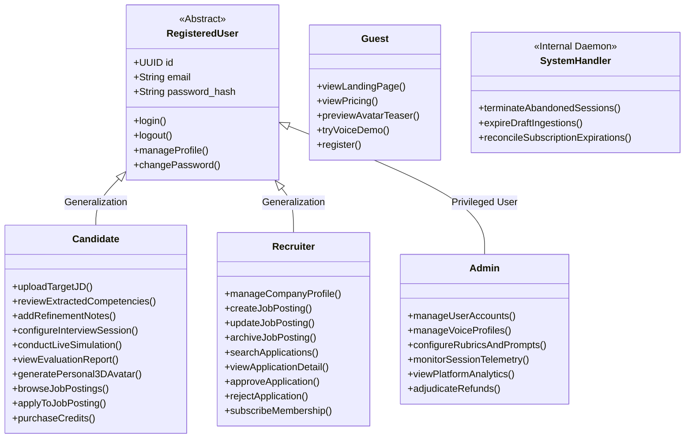

# Actors and Capabilities

This document defines the actors of the RoleCue platform and maps their responsibilities across the platform's **58 formal use cases**.

---

## 1. Actor Catalog & Hierarchy

### Detailed Actor Definitions

#### 1.1. Guest (Public Visitor)
* **Definition:** An unauthenticated visitor accessing the public web application.
* **Responsibilities:** Explores the landing page, reviews transparent pricing plans, interacts with a lightweight 3D WebGL avatar hero preview, tests a 2-question spoken voice demo without login, and initiates user registration.

#### 1.2. Registered User (Abstract Base User)
* **Definition:** An authenticated individual possessing validated credentials. Serves as the generalization parent for `Candidate` and `Recruiter`.
* **Responsibilities:** Authenticates via email/password, refreshes stateless JWT access tokens, manages profile information, triggers password recovery, and manages personal account security.

#### 1.3. Candidate (Primary Practice Actor & Job Applicant)
* **Definition:** A job seeker preparing for technical interviews or seeking technical job opportunities.
* **Responsibilities:** Ingests target Job Descriptions (raw text or PDF), reviews and refines AI-extracted requirements, submits natural-language refinement notes, configures composite interview parameters, conducts live speech-driven 3D mock interviews, reviews 5-competency evaluation reports, generates personal 3D avatars from portrait photos, purchases practice credits, browses recruiter job postings, applies to openings, and tracks application status.

#### 1.4. Recruiter (Company Hiring Representative)
* **Definition:** A talent acquisition specialist or hiring manager representing an employer.
* **Responsibilities:** Manages company profile details and branding, authors, updates, and archives Job Postings (the company's JDs), searches and reviews received candidate applications, renders a definitive **Approve** or **Reject** decision on applications, and subscribes to recruiter membership tiers.

#### 1.5. Administrator (Platform Operator & Governance)
* **Definition:** A privileged operator responsible for platform reliability, content quality, and business governance.
* **Responsibilities:** Manages user accounts (locking/unlocking), curates Voice Profiles sourced from TTS providers, tunes AI prompts and evaluation rubrics, oversees live and historical session telemetry, analyzes platform usage metrics, and adjudicates payment refund disputes.
* **Boundary Invariant:** The Admin does **NOT** manage the 3D avatar catalog or 3D room environments (which are built-in system presets). The Admin **DOES** manage Voice Profiles sourced from TTS providers.

#### 1.6. System Handler (Automated Background Daemon)
* **Definition:** An internal automated background scheduler/worker.
* **Responsibilities:** Executes scheduled maintenance, detects and terminates abandoned interview sessions (> 5-minute inactivity), cleans up unpersisted extraction drafts, and triggers recurring subscription status checks.
* **Boundary Invariant:** The System Handler is an internal system concept, not an external entity on context diagrams.

---

## 2. Capability Matrix Across 58 Use Cases

The 58 capabilities of RoleCue are organized into 10 cohesive functional areas:

| # | Capability Domain | Use Case Coverage | Primary Actor | Description |
| :---: | :--- | :---: | :--- | :--- |
| **1** | **Authentication & Account** | UC-01 .. UC-08 | Registered User, Guest | Account registration, email verification, login, password recovery, profile editing, and credential management. |
| **2** | **Administration & Governance** | UC-09 .. UC-16 | Admin | User account locking/unlocking, TTS Voice Profile management, rubric/prompt tuning, telemetry, and refund dispute review. |
| **3** | **Job Description & Refinement** | UC-17 .. UC-22 | Candidate, System | Raw text & multi-page PDF ingestion, structured AI extraction, interactive requirement editing, natural-language refinement notes, and final JD approval. |
| **4** | **Interview Configuration & Planning** | UC-23 .. UC-26 | Candidate, System | Composite session configuration (avatar, voice, environment, difficulty, duration), internal Interview Blueprint generation (hidden from candidate), and JD library management. |
| **5** | **Real-Time Interview Simulation** | UC-27 .. UC-33 | Candidate, System Handler | Preflight device check, 3D WebGL room orchestration, real-time spoken dialogue (STT/TTS + 15 Oculus visemes), adaptive question probing, 2D waveform fallback mode, pause/resume, and session conclusion. |
| **6** | **Evaluation & Feedback** | UC-34 .. UC-38 | Candidate | Automated 5-competency grading, overall score calculation, turn-by-turn critiques with model answers, radar charts, and actionable study roadmaps. |
| **7** | **3D Identity & Customization** | UC-39 .. UC-42 | Candidate | Photo upload, personal 3D avatar generation (Avaturn integration), avatar preview, and interview avatar selection. |
| **8** | **Job Posting (Recruiter Board)** | UC-43 .. UC-46 | Recruiter | Create, update, archive, and view company Job Postings. |
| **9** | **Job Application Workflow** | UC-47 .. UC-52 | Candidate, Recruiter | Candidate browsing, searching, and viewing Job Postings; submitting job applications; Recruiter searching applications, viewing details, and executing **Approve / Reject**. |
| **10** | **Payment & Public Showcase** | UC-53 .. UC-58 | Candidate, Recruiter, Guest | Practice credit purchases, recruiter membership subscriptions, digital VAT invoices, refund requests, landing 3D teaser, and 2-question voice demo. |

---

## 3. Core Architectural Boundaries & Prohibitions

1. **No ATS Progression:**
   Use cases for the Recruiter strictly terminate at `Approve / Reject Application`. There are no capabilities for scheduling on-site interviews, panel assignments, candidate ranking algorithms, offer management, or onboarding.
2. **No Blueprint Exposure:**
   There is **no use case** for a Candidate to view, edit, or directly manipulate an Interview Blueprint. Blueprints are strictly internal system artifacts generated after candidate JD approval and configuration.
3. **No Direct Multi-Tenant Workspaces:**
   Recruiters administer Job Postings tied to their company profile, but there are no organizational multi-tenant hierarchies, role-delegation trees, or tenant-partitioned subdomains.
