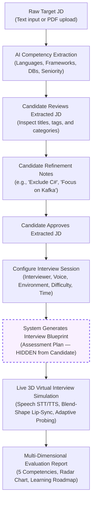
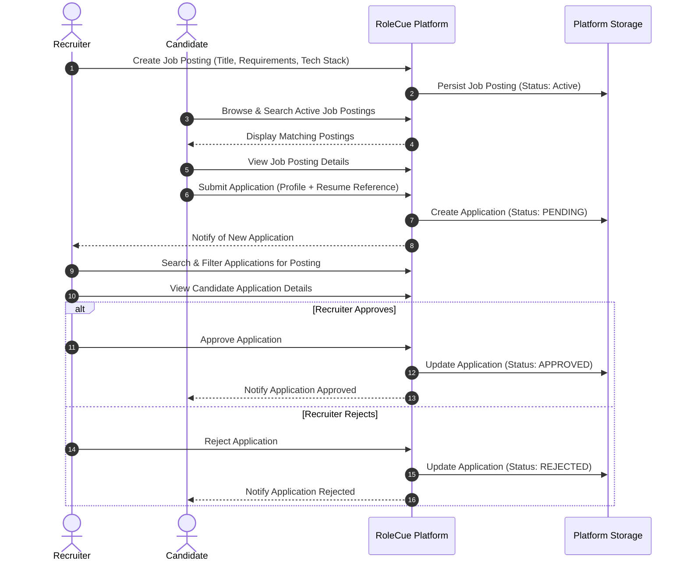
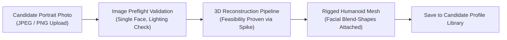

# Core Product Flows

This document details the primary end-to-end user workflows within RoleCue:
1. **Flow A:** Candidate Practice Flow (The flagship technical interview simulation)
2. **Flow B:** Job Application Flow (Lightweight recruiter job posting & candidate application)
3. **Flow C:** Personal Avatar Generation Flow (Photo-to-3D personal avatar creation)

---

## Flow A: Candidate Practice Flow

The Candidate Practice Flow is the central value engine of RoleCue. It takes a raw target job description and guides the candidate through structured requirement review and refinement, composite configuration, internal blueprint generation, real-time 3D simulation, and comprehensive diagnostic evaluation.

### Step-by-Step Breakdown

#### 1. Ingestion & Preprocessing
* The Candidate provides a target Job Description by either pasting raw text or uploading a PDF document.
* If a PDF is uploaded, text is extracted in natural reading order and character encodings are normalized into clean UTF-8.

#### 2. AI Competency Extraction & Deterministic Validation
* The normalized text is parsed by an LLM via structured extraction prompts.
* The system extracts:
  * Role Title and Seniority Level (`intern`, `junior`, `mid`, `senior`, `lead`).
  * Technical Skills categorized by: `programming_language`, `framework`, `database`, `tool`, `technology`, `other`.
  * Requirement weights (`required` vs. `preferred`).
  * Technologies and Core Domain Knowledge.
* The extracted payload is deterministically validated before presentation. Duplicate or conflicting skills are reconciled. Soft skills are intentionally excluded.

#### 3. Candidate Review & Natural-Language Refinement
* The Candidate reviews the extracted requirements in the user interface.
* The Candidate may:
  * Adjust the job title or seniority badge.
  * Add missing technologies or remove irrelevant tags.
  * Enter **Natural-Language Refinement Notes** in a dedicated instruction field (e.g., *"Exclude C# from the interview"*, *"Focus heavily on system architecture and distributed caching"*, *"Candidate has 2 years of Go experience"*).
* The Candidate approves the finalized requirements.

#### 4. Configure Interview Session
* The Candidate configures the execution parameters in a single composite configuration step:
  * **Interviewer Persona:** Visual appearance choice for the 3D interviewer.
  * **Voice Profile:** Voice profile choice (tone, accent, gender) sourced from TTS providers.
  * **Interview Environment:** 3D virtual room background choice.
  * **Difficulty:** `easy`, `medium`, or `hard` (independent of JD seniority).
  * **Session Length & Question Budget:** Planned duration (e.g., 30, 45, 60 minutes) and question budget.

#### 5. Autonomous Blueprint Generation (INTERNAL & HIDDEN)
* The system generates the assessment plan by combining:
  $$\text{Interview Blueprint} = \text{Approved Extracted JD} + \text{Candidate Refinement Notes} + \text{Interview Configuration}$$
* An internal AI semantic planner builds the **Interview Blueprint**:
  * Topic and competency coverage matrix.
  * Question slots with target difficulty and depth milestones.
  * Expected technical benchmarks and grading rubrics.
* > [!IMPORTANT]
  > **The Blueprint is strictly INTERNAL and HIDDEN.** The Candidate **never views, edits, or confirms the Blueprint**. It serves as an immutable internal plan for the interview engine.

#### 6. Live Virtual Interview Simulation
* The Candidate checks device readiness (microphone and audio preflight) and enters the interview room.
* The session initializes an immutable `blueprint_snapshot` to freeze evaluation criteria.
* The simulation executes via real-time streaming communication:
  1. The AI interviewer delivers a technical question according to the blueprint.
  2. Spoken audio plays while the 3D avatar's mouth articulates in synchronization using blend-shape visemes.
  3. The Candidate responds via microphone.
  4. Voice Activity Detection (VAD) detects speech boundaries, streaming audio to STT.
  5. The LLM evaluates the candidate's transcript against the active blueprint slot.
  6. The interviewer poses contextual, adaptive follow-up questions if an answer lacks depth, or advances to the next slot if satisfied.
* If client hardware cannot sustain 3D rendering or lacks WebGL support, the interface gracefully degrades to a 2D animated waveform display without interrupting the voice conversation.

#### 7. Evaluation & Learning Roadmap
* Upon session completion, the turn transcript is graded against the blueprint rubrics across the **5 Core Competencies**:
  1. Technical Accuracy
  2. Depth of Understanding
  3. Problem-Solving & Approach
  4. Answer Relevance
  5. Communication Clarity
* An immutable Performance Report is stored and displayed on the candidate's dashboard, featuring an overall score (0–100), a competency radar chart, turn-by-turn critiques with model answers, and a prioritized study roadmap.

---

## Flow B: Job Application Flow

RoleCue incorporates a lightweight job board and application flow connecting Candidates and Recruiters. The scope is deliberately constrained to maintain simplicity.

### Step-by-Step Breakdown

1. **Job Posting Creation:**
   * A Recruiter creates a **Job Posting** specifying job title, seniority, description, and required technologies.
   * *Note:* A Job Posting **is** the company's Job Description. No separate "Corporate JD" entity exists.
2. **Browsing & Discovery:**
   * Candidates browse and search active public Job Postings by keyword, seniority, or technology.
3. **Application Submission:**
   * The Candidate views details of an active Job Posting and clicks **Apply**.
   * The system submits an **Application** attaching the candidate's contact details, profile, and resume link. The status is initialized to `PENDING`.
4. **Recruiter Review:**
   * The Recruiter accesses their dashboard to view incoming applications filtered by posting.
   * The Recruiter views the application details and candidate profile.
5. **Definitive Decision (Scope Termination):**
   * The Recruiter clicks **Approve** or **Reject**.
   * The Application status transitions to `APPROVED` or `REJECTED`.
   * The Candidate views the updated status in their application history.
* > [!IMPORTANT]
  > **Scope Boundary:** Recruitment scope terminates immediately at `Approve / Reject Application`. RoleCue does not manage interview panels, offer letters, hiring pipelines, or employee onboarding.

---

## Flow C: Personal Avatar Generation Flow

RoleCue supports generating a personal 3D avatar from a single photograph as an accepted product capability. Technical feasibility has been proven via the Avaturn integration spike.

### Step-by-Step Breakdown

1. **Photo Upload:**
   * The Candidate uploads a clear, front-facing portrait photo.
2. **Preflight Validation:**
   * Client-side checks ensure proper aspect ratio, single-face presence, and adequate lighting.
3. **3D Reconstruction & Synthesis:**
   * The image is processed by the 3D avatar generation pipeline.
   * The pipeline reconstructs facial mesh geometry, maps textures, and attaches a standardized humanoid skeleton with facial blend-shapes for animation.
4. **Library Persistence:**
   * The resulting rigged 3D avatar asset is stored and linked to the Candidate's profile.
   * Candidates can view their personal 3D avatar within their profile library.
