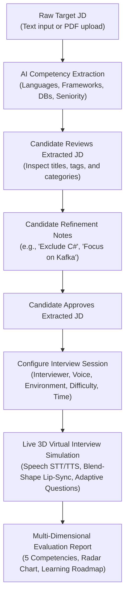

# Core Product Flows

This document details the primary end-to-end user workflows within RoleCue:
1. **Flow A:** Candidate Practice Flow (The flagship technical interview simulation)
2. **Flow B:** Job Application Flow (Lightweight recruiter job posting & candidate application)
3. **Flow C:** Personal Avatar Generation Flow (Photo-to-3D personal avatar creation)

---

## Flow A: Candidate Practice Flow

The Candidate Practice Flow is the central value engine of RoleCue. It takes a raw target job description and guides the candidate through structured requirement review and refinement, composite configuration, real-time 3D simulation, and comprehensive diagnostic evaluation. The system prepares its hidden Blueprint and immutable execution context internally.



### Step-by-Step Breakdown

#### 1. Ingestion & Preprocessing
* The Candidate provides a target Job Description by either pasting raw text or uploading a PDF document.
* If a PDF is uploaded, text is extracted in natural reading order and character encodings are normalized into clean UTF-8.

#### 2. AI Competency Extraction & Deterministic Validation
* The normalized text is parsed by an LLM via structured extraction prompts.
* The system extracts:
  * Role Title and Seniority Level (`intern`, `junior`, `mid`, `senior`, `lead`).
  * Technical Skills categorized by: `programming_language`, `framework`, `database`, `tool`, `technology`, `other`.
  * Requirement weights (`required` vs. `preferred`).
  * Technologies and Core Domain Knowledge.
* The extracted payload is deterministically validated before presentation. Duplicate or conflicting skills are reconciled. Soft skills are intentionally excluded.

#### 3. Candidate Review & Natural-Language Refinement
* The Candidate reviews the extracted requirements in the user interface.
* The Candidate may:
  * Adjust the job title or seniority badge.
  * Add missing technologies or remove irrelevant tags.
  * Enter **Natural-Language Refinement Notes** in a dedicated instruction field (e.g., *"Exclude C# from the interview"*, *"Focus heavily on system architecture and distributed caching"*, *"Candidate has 2 years of Go experience"*).
* The Candidate approves the finalized requirements.

#### 4. Configure Interview Session
* The Candidate configures the execution parameters in a single composite configuration step:
  * **Interviewer Persona:** Visual appearance choice for the 3D interviewer.
  * **Voice Profile:** Voice profile choice (tone, accent, gender) sourced from TTS providers.
  * **Interview Environment:** 3D virtual room background choice.
  * **Difficulty:** `easy`, `medium`, or `hard` (independent of JD seniority).
  * **Session Length & Question Budget:** Planned duration (e.g., 30, 45, 60 minutes) and question budget.

#### 5. Autonomous Blueprint Generation (INTERNAL & HIDDEN)
* The system generates the assessment plan by combining:
  $$\text{Interview Blueprint} = \text{Approved Extracted JD} + \text{Candidate Refinement Notes} + \text{Interview Configuration}$$
* An internal AI semantic planner builds the **Interview Blueprint**:
  * Topic and competency coverage matrix.
  * Question slots with target difficulty and depth milestones.
  * Expected technical benchmarks and grading rubrics.
* > [!IMPORTANT]
  > **The Blueprint is strictly INTERNAL and HIDDEN.** The Candidate **never views, edits, or confirms the Blueprint**. It serves as an immutable internal plan for the interview engine.

#### 6. Live Virtual Interview Simulation
* The Candidate completes **Test Audio and Interview Readiness** (microphone and audio) and enters the interview room.
* The session initializes an immutable `blueprint_snapshot` to freeze evaluation criteria.
* The simulation executes via real-time streaming communication:
  1. The system obtains or determines the next **Question** using the immutable Interview Context.
  2. TTS synthesizes the interviewer's speech, and the 3D interviewer renders it with lip-sync.
  3. The Candidate answers by voice; Voice Activity Detection (VAD) detects speech boundaries and sends the audio to STT.
  4. STT transcribes the Candidate's speech.
  5. The LLM receives the Answer and Interview Context, analyzes the answer, and determines the next **Question**.
  6. The loop repeats while Questions remain; otherwise the session proceeds to Evaluation.
* For MVP, the LLM performs the next-Question decision. There is no separate Decision Layer.
* If client hardware cannot sustain 3D rendering or lacks WebGL support, the interface gracefully degrades to a 2D animated waveform display without interrupting the voice conversation.

#### 7. Evaluation & Learning Roadmap
* Upon session completion, the turn transcript is graded against the blueprint rubrics across the **5 Core Competencies**:
  1. Technical Accuracy
  2. Depth of Understanding
  3. Problem-Solving & Approach
  4. Answer Relevance
  5. Communication Clarity
* An immutable Performance Report is stored and displayed on the candidate's dashboard, featuring an overall score (0–100), a competency radar chart, turn-by-turn critiques with model answers, and a prioritized study roadmap.

---

## Flow B: Job Application Flow

RoleCue incorporates a lightweight job board and application flow connecting Candidates and Recruiters. The scope is deliberately constrained to maintain simplicity.

```mermaid
sequenceDiagram
    autonumber
    actor Recruiter
    actor Candidate
    actor Admin
    participant System as RoleCue Platform
    participant DB as Platform Storage

    Recruiter->>System: Create Job Posting from JD-like content
    System->>System: Optionally extract structured job information for Recruiter review
    Recruiter->>System: Confirm content; select company 3D interviewer model and Voice Profile
    Recruiter->>System: Submit Job Posting for approval
    System->>DB: Persist Job Posting (Pending Admin Approval)
    Admin->>System: Approve or Reject Job Posting
    alt Admin approves
        System->>DB: Mark Job Posting approved and publicly available
    else Admin rejects
        System->>DB: Mark Job Posting rejected
    end

    opt Job Posting is approved
        Candidate->>System: Browse & Search Approved Job Postings
        System-->>Candidate: Display Matching Postings
        Candidate->>System: View Job Posting Details and select Apply
        Candidate->>System: Upload CV/resume
        Candidate->>System: Complete required technical interview
        Note over Candidate,System: Company 3D interviewer model and Voice Profile are locked
        System->>DB: Store Interview Result associated with Job Posting
        System->>DB: Attach Interview Result and CV/resume to completed Application
        System-->>Recruiter: Make completed Application available
        System-->>Candidate: Confirm successful submission

        Recruiter->>System: Search & Filter Applications for Posting
        Recruiter->>System: View candidate application, CV/resume, and Interview Result

        alt Recruiter Approves
            Recruiter->>System: Approve Application
            System->>DB: Update Application (Status: APPROVED)
            System-->>Candidate: Notify Application Approved
        else Recruiter Rejects
            Recruiter->>System: Reject Application
            System->>DB: Update Application (Status: REJECTED)
            System-->>Candidate: Notify Application Rejected
        end
    end
```

### Step-by-Step Breakdown

1. **Job Posting Creation:**
   * A Recruiter creates a **Job Posting** from JD-like content, specifying job title, seniority, description, and required technologies. RoleCue may extract structured information for Recruiter review and confirmation.
   * *Note:* A Job Posting **is** the company's Job Description. No separate "Corporate JD" entity exists.
   * Before submission for approval, the Recruiter selects the company 3D interviewer model and Voice Profile for interviews originating from the Job Posting.
   * An Administrator approves or rejects the submission. Only an approved Job Posting is publicly available.
2. **Browsing & Discovery:**
   * Candidates browse and search approved public Job Postings by keyword, seniority, or technology.
3. **Application Submission:**
   * The Candidate views details of an approved Job Posting and clicks **Apply**.
   * The Candidate uploads a CV/resume and completes the required technical interview using the Job Posting's company-defined 3D interviewer model and Voice Profile; these settings cannot be overridden.
   * The system stores the Interview Result, attaches it to the Application with the candidate application information and CV/resume, then makes the completed Application available to the Recruiter and confirms submission.
4. **Recruiter Review:**
   * The Recruiter accesses their dashboard to view incoming applications filtered by posting.
   * The Recruiter views the application details and candidate profile.
5. **Definitive Decision (Scope Termination):**
   * The Recruiter clicks **Approve** or **Reject**.
   * The Application status transitions to `APPROVED` or `REJECTED`.
   * The Candidate views the updated status in their application history.
* > [!IMPORTANT]
  > **Scope Boundary:** Recruitment scope terminates immediately at `Approve / Reject Application`. RoleCue does not manage interview panels, offer letters, hiring pipelines, or employee onboarding.

---

## Flow C: Personal Avatar Generation Flow

RoleCue supports personal 3D avatar generation through an embedded free Avaturn iframe experience. Avaturn owns capture, validation, customization, and final GLB generation; RoleCue converts and persists the final production VRM asset.

```mermaid
flowchart LR
    START["Candidate opens Personal 3D Avatar Generator in RoleCue"] --> IFRAME["Embedded free Avaturn iframe experience"]
    IFRAME --> CAPTURE["Avaturn capture instructions and 3 required photos"]
    CAPTURE --> VALIDATE["Avaturn validation and retake workflow"]
    VALIDATE --> PREVIEW["Avaturn preview avatar and customization UI"]
    PREVIEW --> GLB["Avaturn final GLB"]
    GLB --> CONVERT["RoleCue receives GLB and converts it to VRM"]
    CONVERT --> LIB["Persist VRM Personal 3D Avatar for Candidate"]
```



### Step-by-Step Breakdown

1. **Embedded Generator:**
   * The Candidate accesses the Personal 3D Avatar Generator from RoleCue, which embeds the free Avaturn iframe experience.
2. **Avaturn Capture and Customization:**
   * Avaturn presents capture instructions, collects the three required photos, performs validation and any retake workflow, generates the preview, and provides the accessory and customization interface.
3. **Final Asset Handoff:**
   * Avaturn generates the final GLB and RoleCue receives it. RoleCue does not orchestrate Avaturn capture, customization, or generation through Avaturn Pro APIs.
4. **RoleCue Conversion and Persistence:**
   * RoleCue converts the received GLB to VRM, persists the VRM Personal 3D Avatar, and associates it with the owning Candidate.
   * Candidates can view their personal VRM avatar within their profile library.
