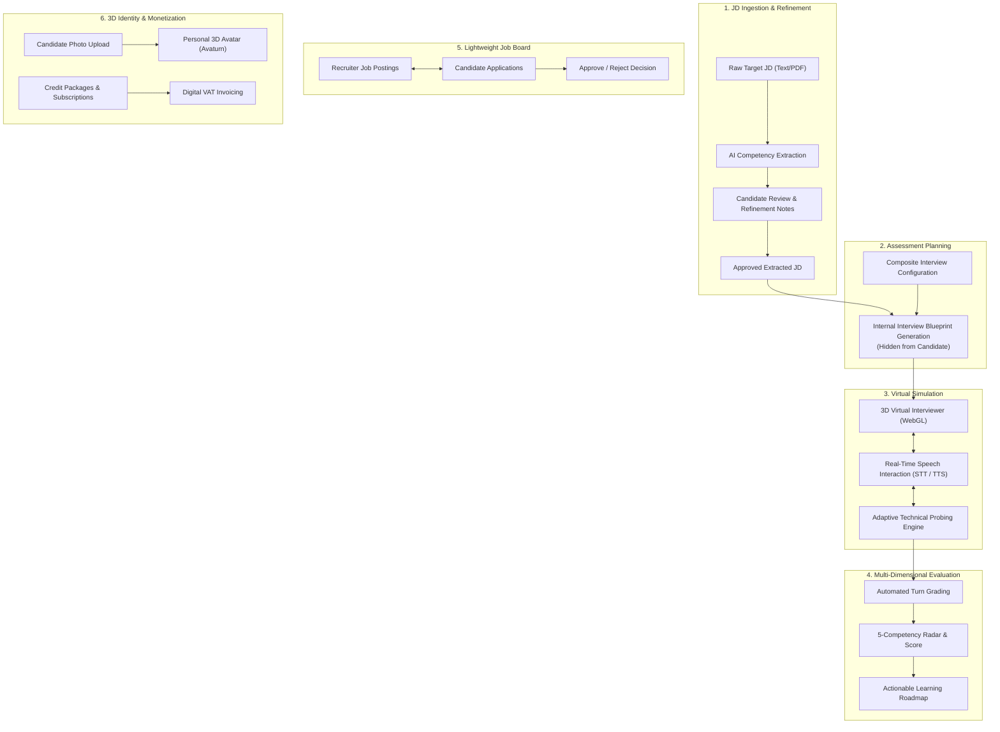

# Project Overview — RoleCue Platform

**RoleCue** is an AI-powered virtual technical interview simulation platform designed to bridge the gap between static self-study and high-stakes real-world technical interviews.

---

## 1. The Problem

Technical interview preparation is critical for career progression in software engineering, yet traditional preparation mechanisms suffer from severe structural shortcomings:

1. **Lack of Job Description (JD) Personalization:**
   Traditional platforms (e.g., LeetCode, generic question banks) present static, disconnected algorithmic puzzles. They fail to align with the specific tech stack, architecture patterns, domain constraints, and seniority expectations of a candidate's target job opening.
2. **Limited Availability of Expert Interviewers:**
   Scheduling realistic mock interviews with senior engineers or mentors is prohibitively expensive, difficult to coordinate, and rarely repeatable at scale.
3. **Absence of Real-Time Conversational Pressure:**
   Static multiple-choice quizzes and automated code grading do not prepare candidates for live technical dialogue. Candidates struggle to articulate trade-offs, explain system design rationale, and handle spontaneous probing from an interviewer under time constraints.
4. **Superficial & Non-Actionable Feedback:**
   Existing tools provide binary pass/fail outcomes or generic scores. Candidates are left without insight into their root-cause conceptual gaps, technical depth, problem-solving methodology, or concrete study roadmaps.

---

## 2. Core Value Proposition

RoleCue solves these challenges by combining AI semantic parsing, generative conversational intelligence, real-time speech processing, and interactive 3D WebGL graphics into an end-to-end interview simulation experience:

* **Targeted Practice:** Practice against the exact Job Description a candidate is targeting.
* **Realistic Pressure:** Converse face-to-face with an animated 3D virtual interviewer using natural spoken voice.
* **Intelligent Probing:** Experience adaptive follow-up questioning that pushes candidate answers deeper based on a pre-planned assessment blueprint.
* **Objective Diagnostic Feedback:** Receive immediate, granular scoring across 5 core technical competencies accompanied by turn-by-turn critiques and personalized learning roadmaps.

---

## 3. Product Users & Personas

RoleCue is designed for four primary user groups:

| Actor | Profile | Primary Motivation |
| :--- | :--- | :--- |
| **Candidate** | Software engineers, students, career switchers | Prepare for specific technical job interviews, assess technical readiness, and discover matching job postings. |
| **Recruiter** | Tech talent acquisition, hiring managers, company reps | Publish company Job Postings to attract qualified candidates and screen incoming applications. |
| **Guest** | Unauthenticated visitors, prospective users | Explore platform capabilities, evaluate transparent pricing, preview 3D avatars, and test a brief interactive voice demo. |
| **Administrator** | Platform operators, technical governance | Maintain platform health, curate Voice Profiles sourced from TTS providers, tune AI prompt/rubric templates, and adjudicate billing disputes. |

> [!NOTE]
> System semantics also recognize **Registered User** (the shared authentication and profile base for Candidates and Recruiters) and **System Handler** (the automated daemon executing scheduled background jobs, such as session cleanup). Neither is an external actor.

---

## 4. Major Product Capabilities

RoleCue organizes its capabilities into six core functional pillars:

1. **Job Description Extraction & Refinement:**
   Ingests raw text or multi-page PDF documents. Extracts normalized technical competencies (languages, frameworks, databases, tools, domain knowledge, seniority). Empowers the candidate to review extracted tags and provide natural-language refinement notes (e.g., *"Exclude C# from the interview"*).
2. **Internal Interview Blueprint Generation:**
   Translates the approved JD, candidate refinement notes, and interview configuration into a comprehensive, structured assessment plan. Specifies topic matrices, question slots, depth thresholds, and rubrics. **The blueprint remains strictly internal and hidden from the candidate.**
3. **Real-Time 3D Virtual Interview Simulation:**
   Renders a 3D animated avatar in the browser via Three.js WebGL. Delivers questions using realistic TTS with 15 synchronized Oculus viseme morph targets. Listens to candidate responses via client-side Voice Activity Detection (VAD) and Speech-to-Text (STT). Dynamically adapts the conversation with follow-ups.
4. **Automated Multi-Dimensional Evaluation:**
   Grades completed sessions across 5 core competencies: *Technical Accuracy*, *Depth of Understanding*, *Problem-Solving*, *Answer Relevance*, and *Communication Clarity*. Generates comprehensive performance reports with radar charts and personalized improvement roadmaps.
5. **Lightweight Job Posting & Application:**
   Enables Recruiters to create, update, and archive Job Postings (company JDs). Allows Candidates to browse postings and apply with their profiles. Recruiters search applications and render a final **Approve** or **Reject** decision.
6. **Personal 3D Avatar & Customization:**
   Supports generating a personalized 3D avatar from a single candidate portrait photograph, proven viable via the Avaturn integration spike. Allows candidates to configure interview environments and interviewer personas.

---

## 5. Product Scope Boundaries

To maintain focus on interview simulation and delivery excellence, RoleCue establishes strict, long-lived boundaries:

### What RoleCue IS NOT:
* **NOT a Full Applicant Tracking System (ATS):**
  RoleCue provides a lightweight job board and application submission workflow, but recruitment scope strictly terminates at **Application Approve / Reject**. RoleCue does **NOT** support multi-stage hiring funnels, interview panel scheduling, offer letter generation, salary negotiations, background checks, or employee onboarding.
* **NOT an Autonomous Hiring Decision Engine:**
  RoleCue does not rank applicants for employers, eliminate candidates automatically, or make official employment decisions. It is an educational practice simulator and pre-application preparation platform.
* **NOT a Multi-Tenant SaaS:**
  RoleCue does not employ a complex multi-tenant architecture. There are no tenant schemas, no Row-Level Security (RLS) tenant isolation policies, and no organization workspace hierarchies. Recruiter accounts associate with company metadata via simple relational foreign keys.
* **NOT a 3D Asset Marketplace:**
  There is no community asset store, creator marketplace, or user-published 3D model sharing. Avatars and environments are curated platform presets or candidate-generated personal avatars.
* **NOT a Soft-Skills or Behavioral Grader:**
  JD extraction, blueprint generation, and interview scoring concentrate strictly on **technical competencies**. Personality analysis, micro-expression tracking, and non-technical behavioral scoring are intentionally excluded.

---

## 6. Document Cross-References
* Actors & Use Cases: [[00_Project/Actors-and-Capabilities|Actors and Capabilities]]
* Core Workflows: [[00_Project/Core-Flows|Core Flows]]
* Terminology Standards: [[00_Project/Glossary|Glossary]]
* System Architecture: [[02_System/Context|System Context]] & [[02_System/Domain-Model|Domain Model]]
* Long-Lived Decisions: [[03_Decisions/Product-Decisions|Product Decisions]]
