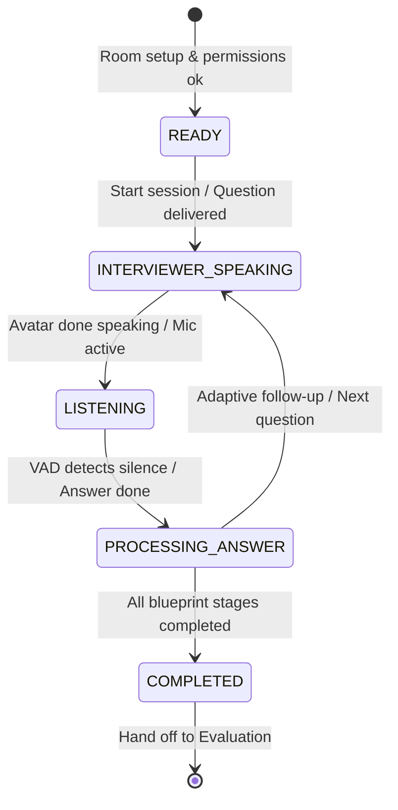

# Interview Engine Contract

## 1. Status & Metadata
- **Status:** `DRAFT / REFERENCE` (Architectural proposal in `IMPLEMENTATION_PLAN.md`; pending formal team ratification)
- **Domain:** Real-Time Virtual Interview Orchestration

## 2. Subsystem Scope
Coordinates the real-time interaction between candidate, AI interviewer logic, speech services, and 3D avatar animation during a mock interview session.

## 3. High-Level Lifecycle States

## 4. Invariants
- **Session Isolation:** Each candidate interview is bound to a single unique session ID and JWT.
- **Audio Privacy:** Audio chunks are buffered for speech recognition and not shared with other sessions.
- **Turn Integrity:** Every question, follow-up, candidate transcript, and evaluation note must be sequentially indexed and persisted.

## 5. Open Questions
- WebSocket vs. WebRTC protocol choice for low-latency bidirectional voice.
- Real-time turn-taking timeout thresholds (e.g., candidate silence cutoff).
- Failure recovery upon WebSocket disconnect (5-minute session resumption window).

## 6. Traceability
- **Reference Spec:** [[90_Legacy-Reference/Plans/IMPLEMENTATION_PLAN]] (Section 2: WebSocket FSM)
- **Open Questions:** [[Open-Questions]] OQ-06, OQ-07
