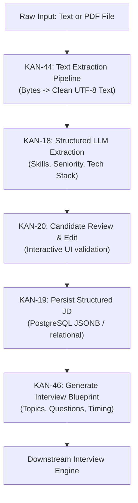

# Job Description (JD) Processing Contract

## 1. Status & Metadata
- **Status:** `DRAFT` (Target of active sprint: [[KAN-46]], [[KAN-18]], [[KAN-44]], [[KAN-19]], [[KAN-20]])
- **Domain:** Job Description Analysis & Interview Blueprinting

## 2. End-to-End Ingestion Flow


## 3. Invariants
- **Decoupled PDF Parsing:** PDF text extraction ([[KAN-44]]) must be a clean standalone component returning UTF-8 text. It must NOT be tightly coupled to LLM extraction prompts.
- **Reviewability:** The candidate must be allowed to review and edit extracted skills before the system commits the final blueprint.
- **Blueprint Immutability:** Once an interview session begins, the snapshot of the blueprint used for that session is immutable.

## 4. Contract Schemas (Under Active Definition)

### A. Structured JD Extracted Entity (Draft — KAN-18)
```json
{
  "jobTitle": "Backend Engineer",
  "seniority": "Senior",
  "domain": "Fintech / Payments",
  "yearsOfExperience": 5,
  "requiredTechnicalSkills": [
    { "name": "Go", "level": "advanced", "category": "language" },
    { "name": "PostgreSQL", "level": "advanced", "category": "database" }
  ],
  "softSkills": ["Cross-functional communication", "Mentorship"],
  "rawSummary": "..."
}
```

### B. Interview Blueprint Entity (Draft — KAN-46)
```json
{
  "blueprintId": "uuid",
  "jdId": "uuid",
  "estimatedDurationMinutes": 30,
  "difficulty": "hard",
  "stages": [
    {
      "stageIndex": 1,
      "name": "Technical Deep Dive",
      "focusTopics": ["Go concurrency", "Database indexing"],
      "questionCount": 3
    }
  ],
  "evaluationRubric": {
    "competencies": ["Technical Accuracy", "System Design", "Problem Solving"]
  }
}
```

## 5. Open Questions
- [[Open-Questions]] OQ-01: Final schema ratification for KAN-46 (Deadline: today 14:00).
- [[Open-Questions]] OQ-02: Skill category taxonomy for KAN-18 (Deadline: today 23:59).
- [[Open-Questions]] OQ-03: Selection of Go PDF extraction package for KAN-44.

## 6. Traceability
- **Jira Tasks:** [[KAN-46]], [[KAN-18]], [[KAN-44]], [[KAN-45]], [[KAN-19]], [[KAN-20]]
