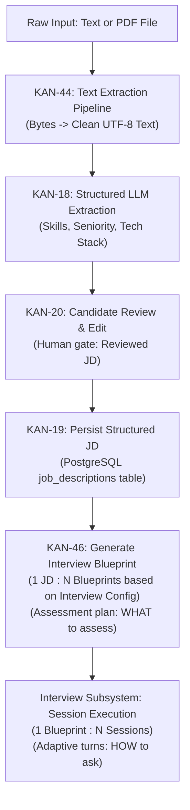

# Job Description (JD) Processing & Blueprint Contract

## 1. Status & Metadata
- **Status:** `DRAFT / PROPOSED TEAM CONTRACT` (Target of active sprint: [[KAN-46]], [[KAN-18]], [[KAN-44]], [[KAN-19]], [[KAN-20]])
- **Domain:** Job Description Analysis & Interview Blueprinting
- **Authority:** Local Working Contract (subject to backend lead & team ratification)

---

## 2. End-to-End Processing & Execution Flow


---

## 3. Canonical Terminology
* **JD:** What the target job requires.
* **Reviewed JD:** Extracted requirements after candidate review/edit (`is_reviewed = true`).
* **Interview Config:** Candidate's practice parameters (difficulty, duration, question count, optional focus areas).
* **Interview Blueprint:** Materialized assessment plan generated from Reviewed JD + Config + Policy.
* **Interview Session:** One runtime execution attempt of a Blueprint.
* **Runtime Question:** Concrete adaptive question formulated on-the-fly during session execution.

---

## 4. Invariants & Business Rules (Proposed Team Contract)
1. **Decoupled File Ingestion:** PDF text parsing ([[KAN-44]]) must be modular and testable, returning clean UTF-8 without coupling to LLM prompts.
2. **Review Authority:** Candidates must review and confirm extracted skills before blueprint generation ([[KAN-20]]).
3. **1:N Cardinality (JD to Blueprints):** One Reviewed JD can yield multiple Blueprints across varying configurations.
4. **1:N Cardinality (Blueprint to Sessions):** One Blueprint can be practiced multiple times across separate interview sessions.
5. **WHAT vs. HOW Separation:** A Blueprint specifies evaluation objectives, stages, timing, and question budgets. It is **NOT** a static question list.
6. **Adaptive Runtime Questioning:** Actual interview questions and contextual follow-ups are generated adaptively at runtime during turns.
7. **Difficulty Independence:** Configured interview difficulty is independent of JD seniority.
8. **Budget & Timing Constraints:** Blueprint stage question budgets must equal configured `questionCount`, and stage durations must respect total configured duration.
9. **Traceability:** Evaluated skills must trace to Reviewed JD requirements or user-selected focus areas.
10. **Normalized Persistence:** Blueprints live in a dedicated `interview_blueprints` table; `interview_sessions` references `blueprint_id`.
11. **Session Immutability Snapshot:** `interview_sessions` stores `blueprint_snapshot JSONB NOT NULL` so historical grading remains permanently reproducible.
12. **Non-Destructive Regeneration:** Failed regeneration attempts must never overwrite or destroy previously valid saved Blueprints.
13. **Deletion Protection (`ON DELETE RESTRICT`):** `interview_sessions.blueprint_id` enforces `ON DELETE RESTRICT`. Deleting a reusable Blueprint must never cascade-delete historical sessions, turns, or reports.

---

## 5. Contract Schemas (Under Active Definition)

### A. Structured JD Extracted Entity (Draft — KAN-18)
```json
{
  "jobTitle": "Backend Engineer",
  "seniority": "Senior",
  "domain": "Fintech / Payments",
  "yearsOfExperience": 5,
  "requiredTechnicalSkills": [
    { "name": "Go", "level": "advanced", "category": "language" },
    { "name": "PostgreSQL", "level": "advanced", "category": "database" }
  ],
  "softSkills": ["Cross-functional communication", "Mentorship"],
  "rawSummary": "..."
}
```

### B. Interview Blueprint Entity (Proposed Team Contract — KAN-46)
```json
{
  "contractVersion": "1.0.0-draft",
  "blueprintId": "uuid",
  "accountId": "uuid",
  "jdId": "uuid",
  "title": "Backend Senior Go Assessment",
  "configuration": {
    "difficulty": "hard",
    "durationMinutes": 30,
    "totalQuestionBudget": 10,
    "focusAreas": ["Go concurrency", "PostgreSQL indexing"]
  },
  "assessmentPlan": {
    "coverage": ["Go concurrency", "PostgreSQL indexing", "Distributed Systems"],
    "stages": [
      {
        "stageIndex": 1,
        "stageType": "introduction",
        "title": "Warm-up & Background",
        "allocatedMinutes": 5,
        "questionBudget": 2,
        "targetSkills": ["Communication", "Domain Background"],
        "expectedDepth": "conceptual"
      },
      {
        "stageIndex": 2,
        "stageType": "technical_deep_dive",
        "title": "Core Technical & Architecture",
        "allocatedMinutes": 15,
        "questionBudget": 5,
        "targetSkills": ["Go concurrency", "PostgreSQL indexing"],
        "expectedDepth": "architectural"
      },
      {
        "stageIndex": 3,
        "stageType": "behavioral",
        "title": "Problem Solving & Trade-offs",
        "allocatedMinutes": 10,
        "questionBudget": 3,
        "targetSkills": ["Failure Recovery", "Trade-offs"],
        "expectedDepth": "tradeoff"
      }
    ]
  },
  "evaluationPlan": {
    "competencies": [
      { "name": "Technical Depth", "weight": 0.4 },
      { "name": "Architecture & Scalability", "weight": 0.3 },
      { "name": "Problem Solving & Communication", "weight": 0.3 }
    ],
    "passThreshold": 7.0
  },
  "generationMetadata": {
    "version": 1,
    "createdAt": "2026-09-11T10:00:00Z"
  }
}
```

---

## 6. Architectural Diagrams
* **Target Database ERD (10 tables):** [Target-Database-ERD.drawio](file:///home/dorriss/Documents/SEP490/03_Domains/JD/architecture/target-database/Target-Database-ERD.drawio) | [Target-Database-ERD.png](file:///home/dorriss/Documents/SEP490/03_Domains/JD/architecture/target-database/Target-Database-ERD.png)
* **Data Flow Architecture:** [jd-to-blueprint-dataflow.html](file:///home/dorriss/Documents/SEP490/03_Domains/JD/architecture/blueprint-dataflow/jd-to-blueprint-dataflow.html)
* **Sequence Architecture:** [generate-preview-save-execute-sequence.html](file:///home/dorriss/Documents/SEP490/03_Domains/JD/architecture/blueprint-sequence/generate-preview-save-execute-sequence.html)
* **Lifecycle State Machine:** [interview-blueprint-lifecycle.html](file:///home/dorriss/Documents/SEP490/03_Domains/JD/architecture/blueprint-lifecycle/interview-blueprint-lifecycle.html)
* **Historical Baseline (PR #7):** [PR7-Database-ERD.drawio](file:///home/dorriss/Documents/SEP490/03_Domains/JD/architecture/pr7-database/PR7-Database-ERD.drawio)

---

## 7. Open Questions
- [[Open-Questions]] OQ-01: Blueprint JSON schema contract ([[KAN-46]]) — Status: `PROPOSED` (Awaiting backend team review).
- [[Open-Questions]] OQ-02: Skill category taxonomy for KAN-18 (Deadline: today 23:59).
- [[Open-Questions]] OQ-03: Selection of Go PDF extraction package for KAN-44.

---

## 8. Traceability
- **Jira Tasks:** [[KAN-46]], [[KAN-18]], [[KAN-44]], [[KAN-45]], [[KAN-19]], [[KAN-20]]
- **Authority:** Proposed Team Contract (Local Working Decisions BR-01 to BR-13; subject to backend team ratification)
