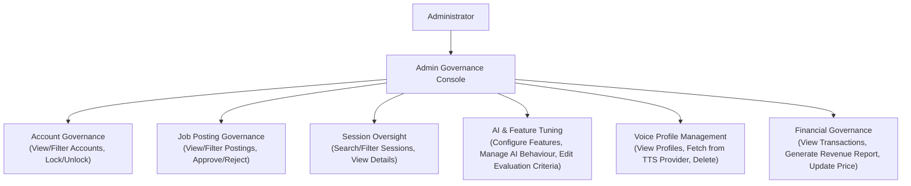

# Administration & Governance Domain

The **Administration & Governance Domain** provides the operational, supervisory, and configuration controls required to manage user accounts, review job postings, inspect interview sessions, calibrate AI behavior and evaluation criteria, curate TTS voice profiles, and govern membership revenue.

---

## 1. Purpose

Empower platform administrators with centralized governance tools to enforce account security, maintain job posting standards, oversee interview sessions, calibrate conversational AI behavior, manage voice synthesis options, and track membership revenue.

---

## 2. Core Concepts

* **Account Governance:**
  Administrative oversight of Candidate and Recruiter accounts. Supports account search and filtering, along with security locking and unlocking.
* **Job Posting Governance:**
  Supervisory review of Job Postings published by Recruiters. Supports viewing, filtering, and approving or rejecting job postings.
* **Interview Session Oversight:**
  Supervisory access to interview session records. Enables searching, filtering, and inspecting interview session details.
* **Interview Feature Configuration:**
  System-wide configuration of interview features, parameter boundaries, and operational toggles.
* **AI Behaviour Management:**
  Governance of AI system prompt templates, conversational guidance instructions, and adaptive probing strategies.
* **Evaluation Criteria Calibration:**
  Configuration and calibration of evaluation criteria, rubric templates, and scoring weights across the 5 Core Competencies.
* **Voice Profile Catalog Management:**
  Administrative management of Text-to-Speech (TTS) voice profiles made available during session configuration. Supports viewing voice profiles, fetching new voice profiles from TTS providers, and deleting obsolete voice profiles.
* **Financial Governance:**
  Administrative oversight of platform revenue. Supports viewing payment transactions, generating revenue reports, and updating membership prices.

---

## 3. Actors Involved

* **Administrator:** Privileged platform operator exercising governance authority across platform domains.

---

## 4. Main Domain Flow

---

## 5. Business Rules & Invariants

1. **Admin Scope Boundaries (What Admin Manages vs. Does NOT Manage):**
   * **Admin DOES manage:** Voice Profiles sourced from external TTS providers (viewing voice profiles, fetching new profiles via provider APIs, deleting voice profiles).
   * **Admin does NOT manage:** 3D avatar meshes or 3D background scenes (which are built-in platform presets).
   * **No Dispute Queues:** The platform does not model refund dispute adjudication, refund approval/rejection queues, or billing dispute resolution.
   * **No Generic Telemetry Dashboards:** Administrative oversight focuses on accepted governance capabilities and revenue reporting, rather than unbudgeted platform telemetry.
2. **Immediate Account Revocation:**
   Locking a user account immediately invalidates active sessions and prevents subsequent login attempts.
3. **Candidate Session Privacy:**
   Administrative session oversight is focused on operational diagnostics and session details. Unrestricted administrative browsing of candidate practice content is bounded by privacy invariants.
4. **Versioned AI Configurations:**
   Modifications to evaluation criteria, rubrics, or AI behaviour prompts apply to future sessions and must **never** retroactively alter or recalculate completed historical Performance Reports.
5. **Two-Party Auditability:**
   All administrative actions (locking accounts, approving/rejecting job postings, modifying voice profiles, updating membership prices) are recorded in an immutable audit log.

---

## 6. Relationships to Other Domains

* **[[01_Domains/Auth/README|Auth Domain]]:**
  Executes account locking and unlocking operations.
* **[[01_Domains/Job-Posting-Application/README|Job-Posting-Application Domain]]:**
  Enables administrative review, filtering, and approval/rejection of published Job Postings.
* **[[01_Domains/Interview/README|Interview Domain]]:**
  Allows Administrators to search, filter, and inspect interview session details, configure interview features, and govern AI behavior.
* **[[01_Domains/Avatar-Voice/README|Avatar-Voice Domain]]:**
  Maintains the active catalog of Voice Profiles sourced from TTS providers.
* **[[01_Domains/Evaluation/README|Evaluation Domain]]:**
  Calibrates evaluation criteria, rubric templates, and scoring weights.
* **[[01_Domains/Payment/README|Payment Domain]]:**
  Provides transaction inspection, revenue report generation, and membership pricing updates.

---

## 7. External Integrations

* **TTS Providers:** Fetches available voice profiles from provider APIs and manages active voice options.
* **Email Provider:** Dispatches administrative notices (e.g., account lock/unlock notifications).
