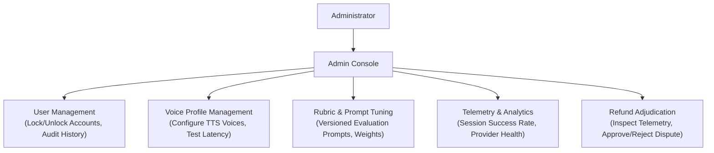

# Administration & Governance Domain

The **Administration & Governance Domain** provides the operational, analytical, and configuration controls required to maintain platform health, calibrate AI behavior, manage voice styles, and oversee business transactions.

---

## 1. Purpose

Empower platform administrators with centralized governance tools to enforce account security, maintain voice synthesis options, optimize evaluation rubrics, monitor system performance, and adjudicate user disputes while upholding candidate privacy.

---

## 2. Core Concepts

* **User Governance:**
  Administrative oversight of Candidate and Recruiter accounts. Supports account lookup, activity audits, and security locking/unlocking.
* **Voice Profile Catalog:**
  The centralized catalog of Text-to-Speech (TTS) voice profiles made available to candidates during session configuration. Configured with external provider IDs, display names, language codes, accents, and gender tags.
* **AI Evaluation Rubrics & Prompt Templates:**
  System-wide configuration of rubric weights and guidance prompts applied by the LLM extraction, interview probing, and evaluation engines.
* **Platform Telemetry & Operational Analytics:**
  Aggregated metrics tracking session completions, average latency, STT/TTS failure rates, and error occurrences.
* **Refund Dispute Adjudication:**
  The decision queue where Administrators inspect refund disputes and approve or reject financial reimbursements.

---

## 3. Actors Involved

* **Administrator:** Platform operator exercising administrative and governance authority.

---

## 4. Main Domain Flow

---

## 5. Business Rules & Invariants

1. **Admin Scope Boundaries (What Admin Manages vs. Does NOT Manage):**
   * **Admin DOES manage:** Voice Profiles sourced from TTS providers (adding voice styles, testing audio, activating/deactivating options).
   * **Admin does NOT manage:** The 3D avatar catalog or 3D interview backgrounds. These 3D assets are built-in platform presets.
2. **Immediate Account Revocation:**
   Locking a user account immediately invalidates their active refresh tokens and prevents subsequent login attempts.
3. **Candidate Privacy Shield:**
   Administrators **cannot** browse or inspect private candidate interview transcripts or audio recordings unless a session is explicitly flagged for a technical failure or submitted in a refund dispute.
4. **Versioned AI Configurations:**
   Modifications to evaluation rubrics, scoring weights, or system prompts are stored with incremented version tags. Changes apply strictly to future sessions and must **never** retroactively recalculate or alter completed historical Performance Reports.
5. **Two-Party Auditability:**
   All administrative actions (locking an account, modifying a voice profile, approving a refund) are logged in an immutable administrative audit log with admin ID, action type, timestamp, and justification.

---

## 6. Relationships to Other Domains

* **[[01_Domains/Auth/README|Auth Domain]]:**
  Applies account locks, unlocks, and role verifications.
* **[[01_Domains/Avatar-Voice/README|Avatar-Voice Domain]]:**
  Maintains the active catalog of Voice Profiles sourced from external TTS providers.
* **[[01_Domains/Evaluation/README|Evaluation Domain]]:**
  Supplies versioned scoring rubrics and prompt instructions used by the evaluation engine.
* **[[01_Domains/Payment/README|Payment Domain]]:**
  Reviews revenue summaries and adjudicates candidate refund disputes.

---

## 7. External Integrations

* **TTS Providers:** Validates external voice IDs and synthesizes test voice samples during voice profile curation.
* **Email Provider:** Dispatches administrative alerts and notification emails to users whose accounts have been locked or whose refund requests have been adjudicated.
