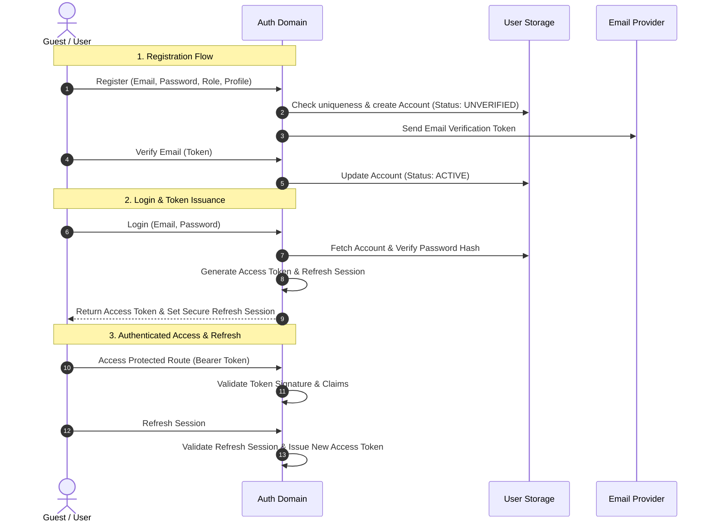

# Authentication & Identity Domain

The **Authentication & Identity Domain** manages user onboarding, credential verification, authenticated session management, role-based authorization, and account security.

---

## 1. Purpose

Provide secure, reliable identity verification and authorization for all users. Ensures that Candidates, Recruiters, and Administrators are authenticated securely and that domain resources are strictly isolated according to ownership and role boundaries.

---

## 2. Core Concepts

* **User Account (`accounts`):** The foundational identity record containing unique email, secure password hash, display name, account status, and assigned system role.
* **System Roles:**
  * `Candidate`: Job seekers who practice interviews and apply to job postings.
  * `Recruiter`: Hiring representatives who create Job Postings and review applications.
  * `Admin`: Privileged operators who govern platform accounts, job postings, sessions, voice profiles, and pricing.
* **Account Status:**
  * `UNVERIFIED`: Account registered; pending email confirmation.
  * `ACTIVE`: Normal operating state.
  * `LOCKED`: Administratively suspended; all login and session refresh attempts rejected.
* **Token Model:**
  * **Access Token:** Short-lived, stateless token containing user ID and role claims.
  * **Refresh Token:** Cryptographic session token stored securely to issue new access tokens without requiring re-authentication.

---

## 3. Actors Involved

* **Guest:** Explores public landing page and initiates registration as a Candidate or Recruiter.
* **Registered User (Candidate / Recruiter / Admin):** Manages shared account capabilities:
  * View Profile
  * Edit Own Profile
  * Log in
  * Log out
  * Forgot Password (including password-reset behavior)
  * Change Password
  * Enable 2-Factor Authentication
* **Administrator:** Views and filters user accounts; locks/unlocks accounts for security governance.

---

## 4. Main Domain Flow

---

## 5. Business Rules & Invariants

1. **Password Security:** Passwords must be cryptographically hashed using standard salted hashing algorithms. Plaintext passwords are never logged or stored.
2. **Stateless Access Verification:** Access tokens must contain all claims necessary for authorization (`sub` = user ID, `role`, `exp`). Route handlers authorize requests without querying the database for every HTTP turn.
3. **Immediate Lock Enforcement:** When an Administrator marks an account as `LOCKED`, subsequent token refresh requests and authenticated actions must fail immediately.
4. **Email Uniqueness:** Email addresses are normalized to lowercase and must be strictly unique across all accounts.
5. **No Anonymous Privilege Escalation:** Guests have zero access to authenticated candidate, recruiter, or admin operations.
6. **Role Isolation:** A Candidate cannot access Recruiter management endpoints; a Recruiter cannot access Candidate practice resources or submit mock interview configurations without an authorized Candidate account.
7. **Password Recovery:** `Forgot Password` is the single password-recovery capability. It includes issuing and validating a recovery link or token and setting a replacement password; `Reset Password` is not a separate formal capability. `Change Password` remains the authenticated-user capability for replacing a known password.

---

## 6. Relationships to Other Domains

* **All Domains:** Provides the authoritative `user_id` foreign key referenced across:
  * [[01_Domains/Job-Description/README|Job-Description]] (`job_descriptions.user_id`)
  * [[01_Domains/Job-Posting-Application/README|Job-Posting-Application]] (`job_postings.recruiter_id`, `applications.candidate_id`)
  * [[01_Domains/Interview/README|Interview]] (`interview_sessions.user_id`)
  * [[01_Domains/Avatar-Voice/README|Avatar-Voice]] (`personal_avatars.candidate_id`)
  * [[01_Domains/Payment/README|Payment]] (`membership_subscriptions.candidate_id`, `payment_transactions.user_id`)
* **[[01_Domains/Administration/README|Administration]]:** Admin user governance operates directly on user accounts (viewing, filtering, locking/unlocking).

---

## 7. External Integrations

* **Email Provider:** Dispatches account verification emails, password recovery links, and security alert notifications.
