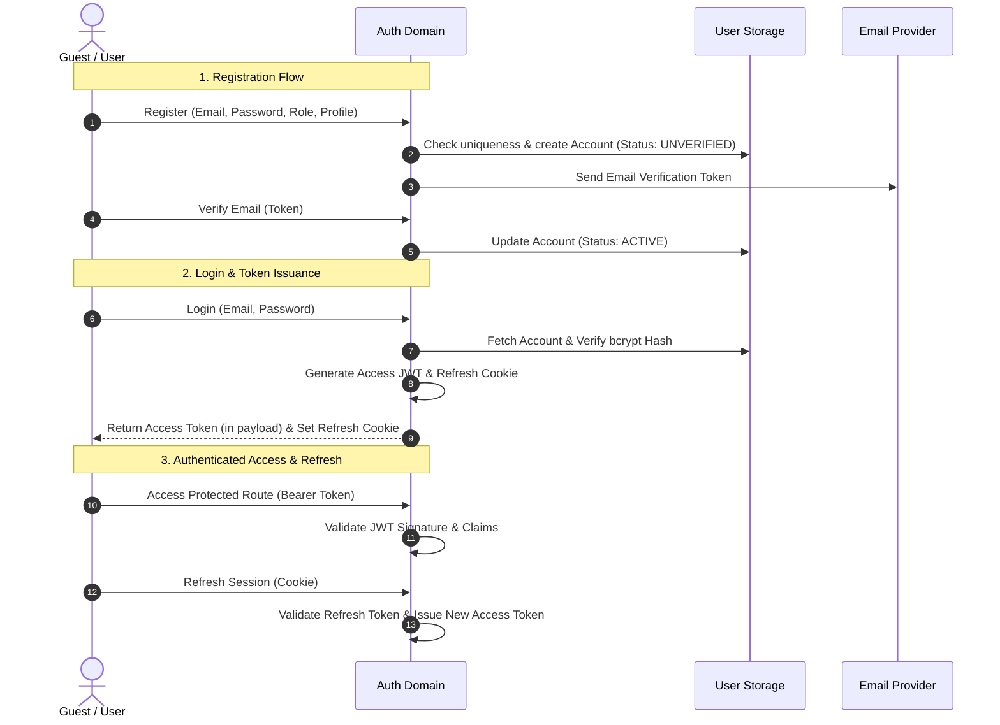

# Authentication & Identity Domain

The **Authentication & Identity Domain** manages user onboarding, credential verification, stateless session management, role-based authorization, and account security.

---

## 1. Purpose

Provide secure, reliable identity verification and authorization for all users. Ensures that Candidates, Recruiters, and Administrators are authenticated securely and that domain resources are strictly isolated according to ownership and role boundaries.

---

## 2. Core Concepts

* **User Account (`accounts`):** The foundational identity record containing unique email, bcrypt password hash, display name, account status, and assigned system role.
* **System Roles:**
  * `Candidate`: Job seekers who practice interviews and apply to job postings.
  * `Recruiter`: Company talent acquisition agents who post jobs and review applications.
  * `Admin`: Privileged operators who govern platform telemetry, voice profiles, and disputes.
* **Account Status:**
  * `UNVERIFIED`: Account registered; pending email confirmation.
  * `ACTIVE`: Normal operating state.
  * `LOCKED`: Administratively suspended; all login and session refresh attempts rejected.
* **Dual-Token JWT Model:**
  * **Access Token:** Short-lived (e.g., 15 minutes), stateless JWT passed via `Authorization: Bearer <token>` headers. Contains user ID and role claims.
  * **Refresh Token:** Long-lived (e.g., 7 days) cryptographic token stored securely in an `HttpOnly`, `SameSite=Lax` browser cookie. Used to issue new access tokens without requiring re-authentication.

---

## 3. Actors Involved

* **Guest:** Initiates registration as a Candidate or Recruiter; requests password reset emails.
* **Registered User (Candidate / Recruiter):** Authenticates, refreshes tokens, edits profile, changes password, and logs out.
* **Administrator:** Inspects user accounts; locks/unlocks compromised or abusive accounts.

---

## 4. Main Domain Flow

---

## 5. Business Rules & Invariants

1. **Password Security:** Passwords must be securely hashed using bcrypt with a work factor $\ge 12$. Plaintext passwords are never logged or stored.
2. **Stateless Access Verification:** Access tokens must contain all claims necessary for authorization (`sub` = user ID, `role`, `exp`). Route handlers must authorize requests without querying the database for every HTTP turn.
3. **Immediate Lock Enforcement:** When an Administrator marks an account as `LOCKED`, subsequent refresh token requests and sensitive actions must fail with `USER_INACTIVE`.
4. **Email Uniqueness:** Email addresses are normalized to lowercase and must be strictly unique across all active and locked accounts.
5. **No Anonymous Privilege Escalation:** Guests have zero access to authenticated candidate, recruiter, or admin API endpoints.
6. **Role Isolation:** A Candidate cannot access Recruiter management endpoints; a Recruiter cannot access Candidate practice histories or submit mock interview configurations as a candidate without a candidate role.

---

## 6. Relationships to Other Domains

* **All Domains:** Provides the authoritative `user_id` foreign key referenced across:
  * [[01_Domains/Job-Description/README|Job-Description]] (`job_descriptions.user_id`)
  * [[01_Domains/Job-Posting-Application/README|Job-Posting-Application]] (`job_postings.recruiter_id`, `applications.candidate_id`)
  * [[01_Domains/Interview/README|Interview]] (`interview_sessions.user_id`)
  * [[01_Domains/Avatar-Voice/README|Avatar-Voice]] (`personal_avatars.candidate_id`)
  * [[01_Domains/Payment/README|Payment]] (`credit_accounts.user_id`, `transactions.user_id`)
* **[[01_Domains/Administration/README|Administration]]:** Admin user governance operates directly on user accounts.

---

## 7. External Integrations

* **Email Provider:** Dispatches account verification emails, password recovery links, and security alert notifications.
