# Avatar & Voice Domain

The **Avatar & Voice Domain** governs the visual rendering, lip-sync articulation, personalized 3D avatar generation, and synthesized speech profiles for virtual technical interview simulations.

---

## 1. Purpose

Provide a lifelike, engaging human presence during virtual technical interviews. Eliminates the impersonality of text bots by delivering real-time 3D facial expressions, accurate speech-synchronized lip movement, customizable voice personas, and personalized candidate 3D avatars.

---

## 2. Core Concepts

* **3D Virtual Interviewer:**
  A rigged humanoid 3D mesh rendered client-side using Three.js / WebGL. Supports real-time head movements, idle breathing animations, eye blinks, and facial morph targets.
* **15 Oculus Visemes:**
  Standardized mouth blend-shapes corresponding to phonemic sounds (e.g., `viseme_aa`, `viseme_E`, `viseme_I`, `viseme_O`, `viseme_U`, `viseme_PP`, `viseme_SS`, `viseme_TH`, `viseme_sil`). Morph target weights are interpolated in real time based on timestamped viseme frames delivered with TTS audio.
* **Personal 3D Avatar from Photo:**
  An accepted product capability enabling Candidates to generate a fully rigged, personal 3D humanoid avatar from a single uploaded portrait photo. Technical feasibility has been proven via the **Avaturn** integration spike.
* **Voice Profile (`voice_profiles`):**
  A synthesized vocal persona sourced from third-party Text-to-Speech (TTS) providers. Encapsulates external voice IDs, language, accent (e.g., US English, British English, Vietnamese-accented English), gender, and speaking rate parameters.
* **3D Environment Presets:**
  Curated virtual 3D room backgrounds (e.g., Modern Tech Office, Engineering Studio, Corporate Boardroom, Minimalist Studio) rendered behind the virtual interviewer.
* **2D Waveform Fallback Mode:**
  A performance-resilient fallback interface displaying an interactive, responsive audio waveform instead of the 3D WebGL canvas when client hardware lacks GPU acceleration or cannot maintain 20 FPS.

---

## 3. Actors Involved

* **Candidate:**
  * Uploads a portrait photo to generate a Personal 3D Avatar.
  * Previews and selects their personal avatar or a default persona during interview session configuration.
  * Selects the preferred 3D interview environment background.
* **Administrator:**
  * Curates and manages **Voice Profiles** sourced from TTS providers (adding new voice models, testing speech latency, setting default voices).
  * *Important Invariant:* The Admin does **NOT** manage the 3D avatar catalog or 3D background presets (which are built-in platform presets).

---

## 4. Main Domain Flow

```mermaid
flowchart TD
    subgraph PersonalAvatar["Personal 3D Avatar Generation Flow"]
        P1["Candidate Portrait Photo (JPEG/PNG)"] --> P2["Preflight Validation (Single face, lighting)"]
        P2 --> P3["3D Reconstruction Pipeline (Avaturn Spike Proven)"]
        P3 --> P4["Standard Rig & 15 Visemes Attached"]
        P4 --> P5["Stored in Candidate Library"]
    end

    subgraph RuntimeSync["Runtime Spoken Lip-Sync Flow"]
        R1["Interviewer Spoken Response Text"] --> R2["TTS Provider Synthesis"]
        R2 --> R3["Audio Stream + Viseme Timestamp Array"]
        R3 --> R4["Web Audio API Playback"]
        R3 --> R5["Three.js Morph Target Animator (60 FPS)"]
        R4 <--> R5
    end

    subgraph AdminVoice["Admin Voice Governance"]
        V1["Admin Audits Available Voices from TTS Provider"] --> V2["Configure Voice Profile (Language, Accent, Gender)"]
        V2 --> V3["Expose in Candidate Interview Configuration"]
    end
```

---

## 5. Business Rules & Invariants

1. **3D Scope is First-Class:**
   3D virtual interaction is a primary, ratified product pillar of RoleCue. It is not an experimental or optional decoration.
2. **Personal 3D Avatar from Photo is Accepted:**
   Generating a personal 3D avatar from a candidate's photo is an accepted product capability. Technical feasibility was proven via the **Avaturn** integration spike. Production integration details may continue to evolve, but the capability is officially in-scope and accepted.
3. **Admin Governance Boundary:**
   * **Admin DOES manage:** Voice Profiles sourced from TTS providers (configuring voice IDs, display labels, language accents, and active/inactive status).
   * **Admin does NOT manage:** 3D avatar models or 3D room environments. These assets are built-in system presets.
4. **Strict Audiovisual Synchronization:**
   TTS audio playback and 3D facial morph animation must remain synchronized within a drift tolerance of $\le 50$ milliseconds.
5. **Non-Blocking Graphics Pipeline:**
   The client-side WebGL rendering loop must execute on an animation frame loop that never blocks the audio playback buffer or network WebSocket message processing.
6. **Graceful 2D Degradation:**
   If the candidate's browser environment reports WebGL context loss or sustained framerate below 20 FPS, the system must offer seamless degradation to the 2D Waveform mode without dropping the active call turn.
7. **No 3D Marketplace:**
   RoleCue does **NOT** provide a public 3D asset marketplace, community model sharing, or creator monetization. Avatars are restricted to system presets and candidate-owned personal avatars.

---

## 6. Relationships to Other Domains

* **[[01_Domains/Interview/README|Interview Domain]]:**
  Provides the visual interviewer and vocal presentation during live mock interviews. Configured during the composite `Configure Interview Session` step.
* **[[01_Domains/Administration/README|Administration Domain]]:**
  Administrators manage the catalog of available Voice Profiles sourced from external TTS providers.
* **[[01_Domains/Auth/README|Auth Domain]]:**
  Personal 3D avatars are owned by the authenticated Candidate (`candidate_id`).

---

## 7. External Integrations

* **TTS Provider:** Synthesizes spoken voice audio and produces phoneme/viseme timing metadata arrays.
* **3D Reconstruction Provider (Avaturn Feasibility):** Generates rigged 3D humanoid mesh avatars from candidate photographs.
