# Avatar & Voice Domain

The **Avatar & Voice Domain** governs the visual rendering, lip-sync articulation, personalized 3D avatar generation, and synthesized speech profiles for virtual technical interview simulations.

---

## 1. Purpose

Provide a lifelike, engaging human presence during virtual technical interviews. Eliminates the impersonality of text bots by delivering real-time 3D facial expressions, accurate speech-synchronized lip movement, customizable voice personas, and personalized candidate 3D avatars.

---

## 2. Core Concepts

* **3D Virtual Interviewer:**
  A rigged humanoid 3D mesh rendered client-side using WebGL. Supports real-time head movements, idle animations, eye blinks, and facial blend-shape morph targets.
* **Blend-Shape Visemes:**
  Standardized mouth blend-shapes corresponding to phonemic sounds. Morph target weights are interpolated in real time based on timestamped viseme frames delivered with TTS audio.
* **Personal 3D Avatar from Photo:**
  An accepted product capability enabling Candidates to generate a fully rigged, personal 3D humanoid avatar from a single uploaded portrait photo. Technical feasibility has been proven via the Avaturn integration spike. The resulting avatar is stored in the candidate's profile library.
* **Voice Profile (`voice_profiles`):**
  A synthesized vocal persona sourced from third-party Text-to-Speech (TTS) providers. Encapsulates external voice IDs, language, accent, gender, and speaking rate parameters. Curated and managed by Administrators.
* **3D Environment Presets:**
  Curated virtual 3D room backgrounds (e.g., Modern Tech Office, Engineering Studio, Boardroom, Minimalist Studio) rendered behind the virtual interviewer. Built-in presets.
* **2D Waveform Fallback Mode:**
  A performance-resilient fallback interface displaying a responsive audio waveform instead of the 3D WebGL canvas when client hardware lacks GPU acceleration or WebGL support.

---

## 3. Actors Involved

* **Candidate:**
  * Uploads a portrait photo to generate a Personal 3D Avatar.
  * Views personal 3D avatar in their profile library.
  * Selects preferred interviewer persona, voice profile, and 3D environment during composite interview configuration.
* **Administrator:**
  * Curates and manages **Voice Profiles** sourced from external TTS providers (viewing voice profiles, fetching new voice profiles from TTS providers, deleting voice profiles).
  * *Important Invariant:* The Admin does **NOT** manage the 3D avatar catalog or 3D background presets (which are built-in platform presets).

---

## 4. Main Domain Flow

```mermaid
flowchart TD
    subgraph PersonalAvatar["Personal 3D Avatar Generation Flow"]
        P1["Candidate Portrait Photo (Upload)"] --> P2["Preflight Validation (Single face, lighting)"]
        P2 --> P3["3D Reconstruction Pipeline (Spike Proven)"]
        P3 --> P4["Rigged Humanoid Mesh with Blend-Shapes"]
        P4 --> P5["Stored in Candidate Profile Library"]
    end

    subgraph RuntimeSync["Runtime Spoken Lip-Sync Flow"]
        R1["Interviewer Spoken Response Text"] --> R2["TTS Provider Synthesis"]
        R2 --> R3["Audio Stream + Viseme Timestamp Data"]
        R3 --> R4["Audio Playback"]
        R3 --> R5["3D Morph Target Viseme Articulation"]
        R4 <--> R5
    end

    subgraph AdminVoice["Admin Voice Profile Governance"]
        V1["Fetch Available Voice Profiles from TTS Provider"] --> V2["Manage / Curate Voice Profiles"]
        V2 --> V3["Available in Candidate Interview Configuration"]
    end
```

---

## 5. Business Rules & Invariants

1. **3D Scope is First-Class:**
   3D virtual interaction is a primary, ratified product pillar of RoleCue. It is not an experimental or optional decoration.
2. **Personal 3D Avatar from Photo is Accepted:**
   Generating a personal 3D avatar from a candidate's photo is an accepted product capability. Technical feasibility was proven via the Avaturn integration spike. Production integration details may continue to evolve, but the capability is officially in-scope and accepted.
3. **No 3D Marketplace:**
   RoleCue does **NOT** provide a 3D asset marketplace, community model sharing, or creator monetization. Avatars are restricted to system presets and candidate-owned personal avatars.
4. **Admin Governance Boundary:**
   * **Admin DOES manage:** Voice Profiles sourced from TTS providers (viewing, fetching from provider APIs, deleting).
   * **Admin does NOT manage:** 3D avatar models or 3D room environments. These 3D assets are built-in system presets.
5. **Speech and Facial Synchronization:**
   TTS audio playback and 3D facial morph animation articulate in tight visual synchronization.
6. **Graceful 2D Degradation:**
   If the candidate's browser environment reports WebGL context loss or insufficient rendering capabilities, the system provides seamless degradation to 2D Waveform mode without dropping the active call turn.

---

## 6. Relationships to Other Domains

* **[[01_Domains/Interview/README|Interview Domain]]:**
  Provides the visual interviewer and vocal presentation during live mock interviews. Configured during the composite `Configure Interview Session` step.
* **[[01_Domains/Administration/README|Administration Domain]]:**
  Administrators manage the catalog of available Voice Profiles sourced from external TTS providers.
* **[[01_Domains/Auth/README|Auth Domain]]:**
  Personal 3D avatars are owned by the authenticated Candidate (`candidate_id`).

---

## 7. External Integrations

* **TTS Provider:** Synthesizes spoken voice audio and produces phoneme/viseme timing metadata for facial blend-shape animation. Sourced voice models are cataloged as Voice Profiles.
* **3D Reconstruction Pipeline:** Reconstructs rigged 3D humanoid mesh avatars from candidate photographs (feasibility demonstrated through Avaturn spike).
