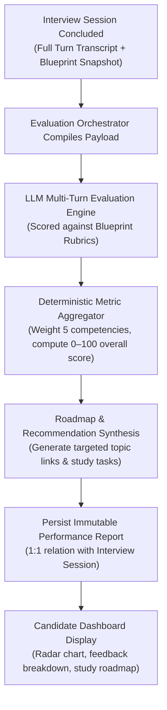

# Post-Interview Evaluation & Reporting Domain

The **Post-Interview Evaluation & Reporting Domain** transforms raw interview transcripts into structured, multi-dimensional technical assessments, actionable feedback, and personalized learning roadmaps.

---

## 1. Purpose

Provide objective, diagnostic technical feedback to Candidates. Identifies specific conceptual blind spots, assesses depth of understanding against target job requirements, and provides clear study recommendations to accelerate career readiness.

---

## 2. Core Concepts

* **5 Core Competencies:**
  The standardized evaluation dimensions used to grade technical interview performance:
  1. **Technical Accuracy:** Correctness of technical concepts, code syntax, architectural patterns, and algorithmic complexity.
  2. **Depth of Understanding:** Ability to explain underlying system mechanisms, internal memory models, trade-offs, and boundary edge cases.
  3. **Problem-Solving & Approach:** Structured reasoning, decomposing complex requirements, handling constraints, and proposing systematic solutions.
  4. **Answer Relevance:** Direct alignment with the asked question and context of the target JD without drifting or evasiveness.
  5. **Communication Clarity:** Conciseness, technical vocabulary precision, structured articulation, and professional tone.
* **Performance Report (`performance_reports`):**
  The authoritative evaluation record generated upon session completion. Contains:
  * Overall numerical score (0–100 scale).
  * Competency score breakdown across the 5 dimensions.
  * Turn-by-turn critiques comparing candidate responses against model answers.
  * Identified knowledge gaps and misconceptions.
* **Competency Radar Chart:**
  Visual representation plotting candidate scores across the 5 competencies against the expected benchmark profile of the target JD seniority.
* **Actionable Learning Roadmap:**
  A prioritized set of study recommendations, official documentation links, and targeted practice topics generated to address identified gaps.

---

## 3. Actors Involved

* **Candidate:** Views interview history, reviews performance reports, inspects 5-competency radar visualizations and scores, reviews turn-by-turn critiques and model answers, follows personalized study recommendations, and exports results.
* **Administrator:** Edits evaluation criteria, rubric templates, and scoring weights; manages AI evaluation prompts.

---

## 4. Main Domain Flow

### Evaluation Stages:
1. **Compilation:** Upon session conclusion, the system bundles the complete sequence of conversational turns and the immutable `blueprint_snapshot`.
2. **Turn Grading:** The LLM evaluation engine evaluates each candidate turn against the specific rubric criteria established for that question slot in the blueprint.
3. **Multi-Dimensional Aggregation:** The system calculates individual scores (0–100) for each of the 5 Core Competencies and computes the overall weighted interview score.
4. **Actionable Roadmap Generation:** The engine synthesizes key takeaways, identifies root-cause technical misconceptions, and generates concrete study recommendations.
5. **Report Delivery:** The report is saved permanently and made available on the candidate's dashboard.

---

## 5. Business Rules & Invariants

1. **Strict Blueprint Adherence:**
   Evaluations must **strictly score against the expectations recorded in the session's immutable `blueprint_snapshot`**. The grading engine cannot introduce arbitrary criteria outside the blueprint.
2. **1:1 Session Cardinality:**
   Every completed Interview Session produces **at most one** Performance Report:
   $$\text{Interview Session (1)} \longleftrightarrow \text{Performance Report (0..1)}$$
3. **Report Immutability:**
   Once generated and persisted, a Performance Report is **immutable**. Historical scores, critiques, and radar values can never be altered or recalculated.
4. **Candidate Privacy Scoping:**
   Performance reports are confidential to the candidate. Recruiters have **no access** to individual candidate interview reports or transcripts.
5. **Formative & Diagnostic Purpose:**
   RoleCue evaluations serve as educational feedback tools. RoleCue does **NOT** issue official hiring certifications, pass/fail employment determinations, or applicant rankings.

---

## 6. Relationships to Other Domains

* **[[01_Domains/Interview/README|Interview Domain]]:**
  Consumes completed interview turns and `blueprint_snapshot` from interview sessions.
* **[[01_Domains/Job-Description/README|Job-Description Domain]]:**
  Uses the target JD requirements embedded in the blueprint to anchor technical relevance scoring.
* **[[01_Domains/Administration/README|Administration Domain]]:**
  Administrators calibrate the grading rubrics and scoring prompts applied by the evaluation engine.

---

## 7. External Integrations

* **LLM Provider:** Analyzes dialogue turns, performs rubric-based grading, identifies technical misconceptions, and generates learning roadmaps.
