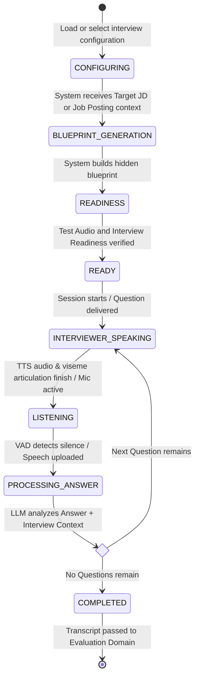

# Real-Time Interview Simulation Domain

The **Real-Time Interview Simulation Domain** coordinates the live technical interview interaction between the Candidate, the 3D virtual interviewer, speech services, and the LLM-driven Question loop.

---

## 1. Purpose

Orchestrate a lifelike, conversational technical interview simulation. Executes assessment plans defined by internal blueprints, determines each next Question from the Candidate's Answer and immutable Interview Context, synchronizes spoken audio with 3D avatar animations, and captures rich conversation turns for evaluation.

---

## 2. Core Concepts

* **Interview Configuration (Composite Capability):**
  A single setup capability whose visual and voice selection depends on the interview origin:
  * **Target JD for Practice:** The Candidate may choose an available system 3D interviewer or eligible Candidate-owned personal 3D model, an available Voice Profile, a 3D environment, difficulty, and duration/question budget.
  * **Recruiter Job Posting:** The Recruiter selects the company 3D interviewer model and Voice Profile before Job Posting approval. The Candidate must use those settings and cannot override them.
* **Interview Blueprint (`interview_blueprints`):**
  A first-class, internal assessment plan generated autonomously by the system:
  $$\text{Target JD Blueprint} = \text{Approved Extracted JD} + \text{Candidate Refinement Notes} + \text{Candidate Interview Configuration}$$
  $$\text{Job Posting Blueprint} = \text{Job Posting} + \text{Company Interview Configuration}$$
  * Defines the topic matrix, question slots, depth thresholds, and evaluation rubrics.
  * **Strict Invariant:** The Blueprint is **strictly internal and hidden from the Candidate**. Candidates never view, edit, or directly manipulate the Blueprint.
* **Interview Session (`interview_sessions`):**
  A single concrete interview attempt executing an Interview Blueprint. It records whether the session originated from a Target JD or a Job Posting and preserves the source's execution context.
* **Blueprint Snapshot (`blueprint_snapshot`):**
  An immutable copy of the originating blueprint stored in the session record upon creation. Guarantees that historical turn grading, replay, and scoring remain 100% reproducible.
* **Conversational Turns (`session_turns`):**
  Sequentially indexed dialogue units capturing interviewer question text, TTS audio playback, candidate transcript, and real-time response data.
* **Question:**
  The generic runtime unit obtained or determined for each turn. The runtime does not require separate top-level Core Question or follow-up question flows.

---

## 3. Actors Involved

* **Candidate:** Configures Target JD interview parameters, completes Test Audio and Interview Readiness, creates, joins, pauses, resumes, and concludes the live spoken interview. For a Job Posting interview, uses the locked presentation configured by the Recruiter.
* **System Handler (Internal Handler):** Detects and terminates abandoned or orphaned interview sessions after extended inactivity.
* **Administrator:** Searches and filters interview sessions, views interview session details, configures interview features, and manages AI behavior.

---

## 4. Main Domain Flow

### Turn Orchestration Loop:
1. **Next Question:** The system obtains or determines the next **Question** from the immutable Interview Context.
2. **Speech and Rendering:** TTS synthesizes the interviewer speech, and the 3D interviewer renders the speech with lip-sync.
3. **Candidate Answer:** The Candidate answers by voice. Voice Activity Detection (VAD) monitors speech boundaries.
4. **Speech-to-Text (STT):** Audio streams to the STT provider, producing a Candidate speech transcript.
5. **LLM Decision:** The LLM receives the Answer and Interview Context, analyzes the Answer, and determines the next **Question**.
6. **Loop or Evaluation:** If more Questions remain, the loop repeats; otherwise the session finalizes and hands the turn transcript to the Evaluation Domain.

For MVP, the LLM performs the next-Question decision. There is no separate Decision Layer.

---

## 5. Business Rules & Invariants

1. **Blueprint is Strictly Internal & Hidden:**
   Candidates must **never** be shown the Interview Blueprint, rubric tables, or question budgets. Candidates interact exclusively through the natural conversational interface.
2. **Refinement Notes Precede Blueprint Generation:**
   For Target JD interviews, Candidate refinement notes (e.g., *"Exclude C#"*) are incorporated during Blueprint compilation. Blueprints are immutable once compiled for a session.
3. **Composite Configuration Step:**
   For a Target JD interview, interviewer selection, voice profile selection, 3D environment selection, difficulty, and duration are configured as part of a single composite `Configure Interview Session` action. For a Job Posting interview, the company-defined 3D interviewer model and Voice Profile are locked by the Job Posting and cannot be overridden by the Candidate.
4. **Blueprint Multiplicity (1:N):**
   One reviewed Target JD can generate multiple distinct Interview Blueprints across different difficulty levels and focus configurations.
5. **Session Multiplicity (1:N):**
   One saved Interview Blueprint can be executed across multiple practice attempts over time. Starting a session does not consume or mutate the blueprint.
6. **Session Deletion Protection (`ON DELETE RESTRICT`):**
   The relational link between `interview_sessions` and `interview_blueprints` enforces `ON DELETE RESTRICT`. Deleting a Blueprint from a library must never cascade-delete completed historical sessions.
7. **Immutable Execution Snapshot:**
   Every session stores `blueprint_snapshot`. Historical evaluations remain permanent and verifiable even if blueprint templates or system prompts evolve.
8. **Graceful 2D Degradation:**
   If a candidate's client device lacks WebGL support or cannot sustain 3D rendering, the system provides graceful fallback to an animated 2D audio waveform display without interrupting the voice session.
9. **Abandoned Session Cleanup:**
   If an interview session is disconnected and remains abandoned, the **System Handler** automatically marks the session as terminated and releases resources.
10. **Generic Question Runtime:**
   Runtime orchestration uses the generic concept `Question`. The LLM determines the next Question from the Answer and immutable Interview Context. No separate Decision Layer or additional decision service is part of the MVP.

---

## 6. Relationships to Other Domains

* **[[01_Domains/Job-Description/README|Job-Description Domain]]:**
  Provides the Approved Extracted JD and Candidate Refinement Notes that feed Blueprint generation.
* **[[01_Domains/Avatar-Voice/README|Avatar-Voice Domain]]:**
  Supplies 3D avatar models, blend-shape viseme definitions, and TTS Voice Profiles configured for the session.
* **[[01_Domains/Evaluation/README|Evaluation Domain]]:**
  Receives the final turn transcript and `blueprint_snapshot` to compute scores, radar charts, and learning roadmaps.
* **[[01_Domains/Payment/README|Payment Domain]]:**
  Verifies that the candidate possesses an active membership subscription prior to session launch.
* **[[01_Domains/Administration/README|Administration Domain]]:**
  Administrators search and filter sessions, view session details, configure interview features, and manage AI behaviour.

---

## 7. External Integrations

* **LLM Provider:** Generates internal Blueprint structures, analyzes each Candidate Answer with the immutable Interview Context, and determines the next runtime Question.
* **STT Provider:** Transcribes candidate spoken audio to text.
* **TTS Provider:** Synthesizes realistic interviewer voice audio and supplies phoneme/viseme timing metadata for avatar mouth animation.
