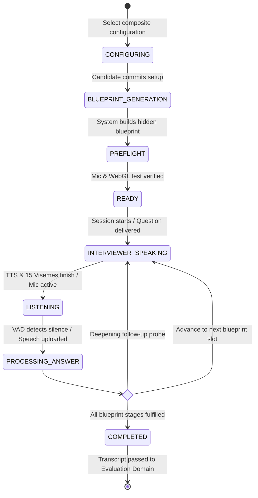

# Real-Time Interview Simulation Domain

The **Real-Time Interview Simulation Domain** coordinates the live technical interview interaction between the Candidate, the 3D virtual interviewer, speech services, and the adaptive question generation engine.

---

## 1. Purpose

Orchestrate a lifelike, low-latency conversational technical interview simulation. Executes assessment plans defined by internal blueprints, dynamically probes candidate answers, synchronizes spoken audio with 3D avatar animations, and captures rich conversation turns for evaluation.

---

## 2. Core Concepts

* **Interview Configuration (Composite Capability):**
  A single, composite setup capability executed before interview launch. Consists of:
  * **3D Interviewer Persona:** Visual avatar appearance (preset model or Candidate's personal 3D avatar).
  * **Voice Profile:** Synthesized TTS voice persona (tone, accent, gender).
  * **Interview Environment:** Virtual 3D room/background (e.g., Tech Office, Minimalist Studio).
  * **Difficulty Level:** `easy`, `medium`, or `hard` (independent of role seniority).
  * **Duration & Question Count:** Planned time limit (e.g., 30, 45, 60 minutes) and question budget.
* **Interview Blueprint (`interview_blueprints`):**
  A first-class, internal assessment plan generated autonomously by the system:
  $$\text{Interview Blueprint} = \text{Approved Extracted JD} + \text{Candidate Refinement Notes} + \text{Interview Configuration}$$
  * Defines the topic matrix, question slots, depth thresholds, and evaluation rubrics.
  * **Strict Invariant:** The Blueprint is **strictly internal and hidden from the Candidate**. Candidates never view, edit, or directly manipulate the Blueprint.
* **Interview Session (`interview_sessions`):**
  A single concrete practice attempt executing an Interview Blueprint.
* **Blueprint Snapshot (`blueprint_snapshot`):**
  An immutable JSONB copy of the originating blueprint stored in the session record upon creation. Guarantees that historical turn grading, replay, and scoring remain 100% reproducible.
* **Conversational Turns (`session_turns`):**
  Sequentially indexed dialogue units capturing interviewer question text, TTS audio timing, candidate transcript, and real-time response latency.

---

## 3. Actors Involved

* **Candidate:** Configures the composite interview parameters; completes preflight hardware checks; conducts the live spoken interview; pauses or concludes the simulation.
* **System Handler (Automated Daemon):** Detects and terminates abandoned or orphaned interview sessions exceeding timeout limits (> 5 minutes of inactivity).

---

## 4. Main Domain Flow

### Turn Orchestration Loop:
1. **Question Delivery:** The system selects or generates the next question according to the internal blueprint's active competency slot. The TTS engine synthesizes audio along with 15 Oculus viseme timestamp frames.
2. **Avatar Spoken Articulation:** The browser plays the audio stream while the Three.js 3D avatar moves its mouth in tight synchronization ($\le 50$ ms viseme alignment).
3. **Candidate Response:** The candidate speaks into their microphone. The client-side Voice Activity Detection (VAD) monitors speech boundaries.
4. **Speech-to-Text (STT):** Audio chunks stream to the STT provider, producing an accurate text transcript.
5. **Adaptive Evaluation & Follow-Up:** The LLM evaluates the candidate's response against the blueprint rubric. If the response is superficial or ambiguous, the interviewer generates a contextual follow-up question. If satisfactory, it transitions to the next competency slot.
6. **Session Handoff:** Once all blueprint slots or time limits are reached, the session finalizes and hands the turn transcript to the Evaluation Domain.

---

## 5. Business Rules & Invariants

1. **Blueprint is Strictly Internal & Hidden:**
   Candidates must **never** be shown the Interview Blueprint JSON, rubric tables, or question budgets. Candidates interact exclusively through the natural conversational interface.
2. **Refinement Notes Precede Blueprint Generation:**
   Candidate refinement notes (e.g., *"Exclude C#"*) are incorporated during blueprint compilation. Blueprints are immutable once compiled for a session.
3. **Blueprint Multiplicity (1:N):**
   One reviewed Target JD can generate multiple distinct Interview Blueprints across different difficulty levels and focus configurations.
4. **Session Multiplicity (1:N):**
   One saved Interview Blueprint can be executed across multiple practice attempts over time. Starting a session does not consume or mutate the blueprint.
5. **Session Deletion Protection (`ON DELETE RESTRICT`):**
   The relational link between `interview_sessions` and `interview_blueprints` enforces `ON DELETE RESTRICT`. Deleting a Blueprint from a library must never cascade-delete completed historical sessions.
6. **Immutable Execution Snapshot:**
   Every session stores `blueprint_snapshot JSONB NOT NULL`. Historical evaluations remain permanent and verifiable even if blueprint templates or system prompts evolve.
7. **Session Isolation:**
   Each live session operates within an isolated WebSocket channel authenticated via unique session JWT. Audio and transcripts are strictly private to the executing candidate.
8. **Graceful 2D Degradation:**
   If a candidate's client device lacks WebGL2 support or drops below 20 FPS, the system automatically transitions to an animated 2D audio waveform display without interrupting the voice session.
9. **Abandoned Session Cleanup:**
   If a WebSocket connection disconnects and is not resumed within 5 minutes, the **System Handler** automatically marks the session as `ABANDONED` and releases resources.

---

## 6. Relationships to Other Domains

* **[[01_Domains/Job-Description/README|Job-Description Domain]]:**
  Provides the Approved Extracted JD and Candidate Refinement Notes that feed Blueprint generation.
* **[[01_Domains/Avatar-Voice/README|Avatar-Voice Domain]]:**
  Supplies 3D avatar models (or personal photo avatars), 15 Oculus viseme morph targets, and TTS Voice Profiles configured for the session.
* **[[01_Domains/Evaluation/README|Evaluation Domain]]:**
  Receives the final turn transcript and `blueprint_snapshot` to compute scores, radar charts, and learning roadmaps.
* **[[01_Domains/Payment/README|Payment Domain]]:**
  Verifies that the candidate possesses sufficient practice credits before allowing session initialization.

---

## 7. External Integrations

* **LLM Provider:** Generates internal blueprint structures, orchestrates conversational dialog, and devises dynamic follow-up questions.
* **STT Provider:** Transcribes candidate spoken audio to text with sub-500ms target latency.
* **TTS Provider:** Synthesizes realistic interviewer voice audio and supplies phoneme/viseme timing metadata for avatar mouth animation.
