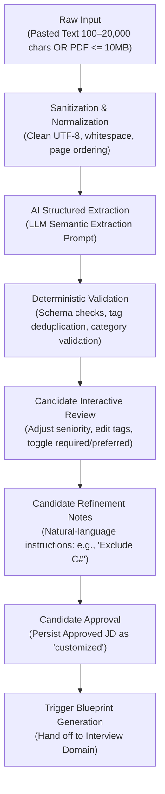

# Job Description Domain

The **Job Description (JD) Domain** governs the ingestion of raw target job descriptions, AI-powered structured technical competency extraction, candidate review, and natural-language refinement prior to interview planning.

---

## 1. Purpose

Transform unstructured, heterogeneous job postings (provided by Candidates) into normalized, verified technical requirement profiles. It ensures that subsequent interview simulation plans are tightly aligned with specific employer expectations while giving candidates fine-grained control over their practice focus.

---

## 2. Core Concepts

* **Target JD for Practice (`job_descriptions`):** A job description uploaded or pasted by a Candidate to structure a mock interview simulation. Owned exclusively by that candidate.
* **Extracted JD Schema:** The structured technical competency payload extracted by the AI engine:
  * `title`: Target role title (e.g., "Backend Engineer", "Cloud Architect").
  * `seniority_level`: Inferred or candidate-selected seniority (`intern`, `junior`, `mid`, `senior`, `lead`).
  * `skills`: Categorized technical skill items:
    * `category`: `programming_language`, `framework`, `database`, `tool`, `technology`, `other`.
    * `requirement`: `required` or `preferred`.
  * `technologies`: Specific software packages, libraries, or runtimes (e.g., "Kafka", "Docker", "Redis").
  * `domain_knowledge`: Specialized industry domains (e.g., "Fintech", "Payment Gateways", "Distributed Systems").
* **Candidate Refinement Notes:** Natural-language instructions provided by the candidate during review (e.g., *"Exclude C# from the interview"*, *"Candidate has strong SQL background, emphasize NoSQL caching"*). Stored alongside the reviewed requirements.
* **Approved Extracted JD:** The final, human-verified requirements state. Serves as the immutable input to the Interview Blueprint generation engine.

---

## 3. Actors Involved

* **Candidate:** Ingests raw JD text or PDF files; reviews and modifies extracted skill tags; provides natural-language refinement notes; approves finalized requirements; manages their personal JD library.
* **System Handler:** Cleans up unpersisted extraction drafts and expired temporary files.

---

## 4. Main Domain Flow

### Flow Details:
1. **Ingestion:** The candidate submits raw text (100–20,000 Unicode characters) or uploads a PDF ($\le$ 10 MB). PDF ingestion extracts raw text in logical reading order without executing any LLM prompts directly.
2. **AI Extraction:** The normalized plain text is submitted to an LLM provider using a strict JSON schema contract.
3. **Deterministic Validation:** The raw output is treated as untrusted until verified by backend validation rules:
   * Title and competency collections must be present and non-empty.
   * Case-insensitive duplicate skills are merged; conflicting category assignments fail validation.
   * Soft skills (interpersonal traits, punctuality) are explicitly stripped or rejected.
4. **Interactive Candidate Review:** The candidate inspects extracted skills, changes the seniority badge, deletes unneeded items, and adds missing technologies.
5. **Refinement Notes:** The candidate supplies free-form natural language notes to constrain the upcoming interview.
6. **Approval & Persistence:** The candidate confirms the requirements. The record transitions to `customized` status, ready for interview session configuration.

---

## 5. Business Rules & Invariants

1. **Target JD vs. Job Posting Distinction:**
   A Target JD is a candidate's personal practice resource. It is **not** a Recruiter Job Posting. Candidates cannot publish their Target JDs to the public job board, and Recruiters cannot view Candidate Target JDs.
2. **Candidate Ownership Scoping:**
   Target JDs are private. Every read, update, list, and delete query is strictly filtered by the authenticated `user_id`. Cross-user access returns a 404 (Not Found).
3. **Seniority vs. Difficulty Independence:**
   A role's `seniority_level` (`intern` to `lead`) describes job seniority, **not** mock interview session difficulty (`easy`, `medium`, `hard`). A candidate preparing for a `senior` JD can configure an `easy` diagnostic warm-up or a `hard` high-stress simulation.
4. **Technical Competencies Exclusivity:**
   Extraction and interview planning focus exclusively on technical domain skills. Behavioral attributes and soft skills are out of scope.
5. **Refinement Notes Precede Blueprint Generation:**
   Candidate natural-language refinement notes must be captured and committed *before* the system generates the Interview Blueprint. Once the Blueprint is generated, candidate refinement notes are frozen for that blueprint.
6. **Immutability of Ingested Raw Text:**
   When a Candidate updates their reviewed requirements (`parsed_data`), the original `raw_text` remains immutable for traceability.
7. **Deletion Safety:**
   Deleting a Target JD from the library must not corrupt historical completed interview sessions or performance reports associated with it.

---

## 6. Relationships to Other Domains

* **[[01_Domains/Interview/README|Interview Domain]]:**
  The Approved Extracted JD and Candidate Refinement Notes serve as the direct input to internal **Interview Blueprint generation**. One Target JD can spawn multiple Interview Blueprints across different configurations.
* **[[01_Domains/Auth/README|Auth Domain]]:**
  Every Target JD references `user_id` to establish candidate ownership.
* **[[01_Domains/Job-Posting-Application/README|Job-Posting-Application Domain]]:**
  Candidates may choose to copy text from a public Job Posting to create a Target JD for practice, but they remain separate entities.

---

## 7. External Integrations

* **LLM Provider:** Executes structured extraction prompts to parse unstructured raw text into valid JSON competency schemas.
