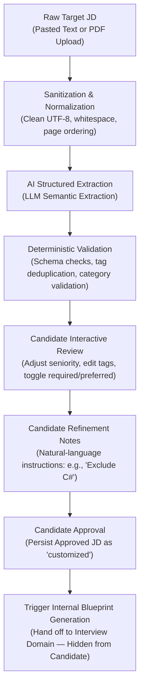

# Job Description Domain

The **Job Description (JD) Domain** governs the ingestion of raw target job descriptions, AI-powered structured technical competency extraction, candidate review, and natural-language refinement prior to interview planning.

---

## 1. Purpose

Transform unstructured, heterogeneous job postings (provided by Candidates) into normalized, verified technical requirement profiles. It ensures that subsequent interview simulation plans are tightly aligned with specific employer expectations while giving candidates fine-grained control over their practice focus.

---

## 2. Core Concepts

* **Target JD for Practice (`job_descriptions`):** A job description uploaded or pasted by a Candidate to structure a mock interview simulation. Owned exclusively by that candidate.
* **Extracted JD Schema:** The structured technical competency payload extracted by the AI engine:
  * `title`: Target role title (e.g., "Backend Engineer", "Cloud Architect").
  * `seniority_level`: Inferred or candidate-selected seniority (`intern`, `junior`, `mid`, `senior`, `lead`).
  * `skills`: Categorized technical skill items:
    * `category`: `programming_language`, `framework`, `database`, `tool`, `technology`, `other`.
    * `requirement`: `required` or `preferred`.
  * `technologies`: Specific software packages, libraries, or runtimes (e.g., "Kafka", "Docker", "Redis").
  * `domain_knowledge`: Specialized industry domains (e.g., "Fintech", "Distributed Systems").
* **Candidate Refinement Notes:** Natural-language instructions provided by the candidate during review (e.g., *"Exclude C# from the interview"*, *"Focus on distributed caching and concurrency"*). Stored alongside the reviewed requirements.
* **Approved Extracted JD:** The final, candidate-verified requirements state. Serves as the input to internal Interview Blueprint generation.

---

## 3. Actors Involved

* **Candidate:** Ingests raw target JD text or PDF files; reviews and modifies extracted skill tags; provides natural-language refinement notes; approves finalized requirements; manages their personal Target JD library.

---

## 4. Main Domain Flow

### Flow Details:
1. **Ingestion:** The candidate submits raw text or uploads a PDF. Text is extracted in logical reading order and normalized into clean text.
2. **AI Extraction:** The normalized plain text is submitted to an LLM provider using structured extraction templates.
3. **Deterministic Validation:** The raw output is verified by backend validation rules:
   * Title and competency collections must be present and non-empty.
   * Case-insensitive duplicate skills are merged; conflicting category assignments fail validation.
   * Soft skills (interpersonal traits, punctuality) are explicitly stripped or rejected.
4. **Interactive Candidate Review:** The candidate inspects extracted skills, changes the seniority badge, deletes unneeded items, and adds missing technologies.
5. **Refinement Notes:** The candidate supplies free-form natural language notes to steer the upcoming interview focus.
6. **Approval & Persistence:** The candidate approves the requirements. The record transitions to approved status, ready for interview session configuration.
7. **Blueprint Generation Handoff:** The approved extracted JD and refinement notes are combined with candidate interview configuration to generate the internal Interview Blueprint, which remains strictly hidden from the candidate.

---

## 5. Business Rules & Invariants

1. **Target JD vs. Job Posting Distinction:**
   A Target JD is a candidate's personal practice resource. It is **not** a Recruiter Job Posting. Candidates cannot publish their Target JDs to the public job board, and Recruiters cannot view Candidate Target JDs.
2. **Candidate Ownership Scoping:**
   Target JDs are private. Every read, update, list, and delete query is strictly filtered by the authenticated `user_id`.
3. **Seniority vs. Difficulty Independence:**
   A role's `seniority_level` (`intern` to `lead`) describes job seniority, **not** mock interview session difficulty (`easy`, `medium`, `hard`). A candidate preparing for a `senior` JD can configure an `easy` diagnostic warm-up or a `hard` high-stress simulation.
4. **Technical Competencies Exclusivity:**
   Extraction and interview planning focus exclusively on technical domain skills. Behavioral attributes and soft skills are out of scope.
5. **Refinement Notes Precede Blueprint Generation:**
   Candidate natural-language refinement notes must be captured and committed *before* the system generates the Interview Blueprint. Once the Blueprint is generated, candidate refinement notes are frozen for that blueprint.
6. **Hidden Blueprint Rule:**
   The Candidate **never** views, edits, or confirms the Interview Blueprint. There is no blueprint preview capability.
7. **Deletion Safety:**
   Deleting a Target JD from the library must not corrupt historical completed interview sessions or performance reports associated with it.

---

## 6. Relationships to Other Domains

* **[[01_Domains/Interview/README|Interview Domain]]:**
  The Approved Extracted JD and Candidate Refinement Notes serve as the direct input to internal **Interview Blueprint generation**. One Target JD can spawn multiple Interview Blueprints across different configurations.
* **[[01_Domains/Auth/README|Auth Domain]]:**
  Every Target JD references `user_id` to establish candidate ownership.
* **[[01_Domains/Job-Posting-Application/README|Job-Posting-Application Domain]]:**
  Candidates may choose to copy text from a public Job Posting to create a Target JD for practice, but they remain separate entities with separate lifecycles.

---

## 7. External Integrations

* **LLM Provider:** Executes structured extraction prompts to parse unstructured raw text into valid JSON competency schemas.
