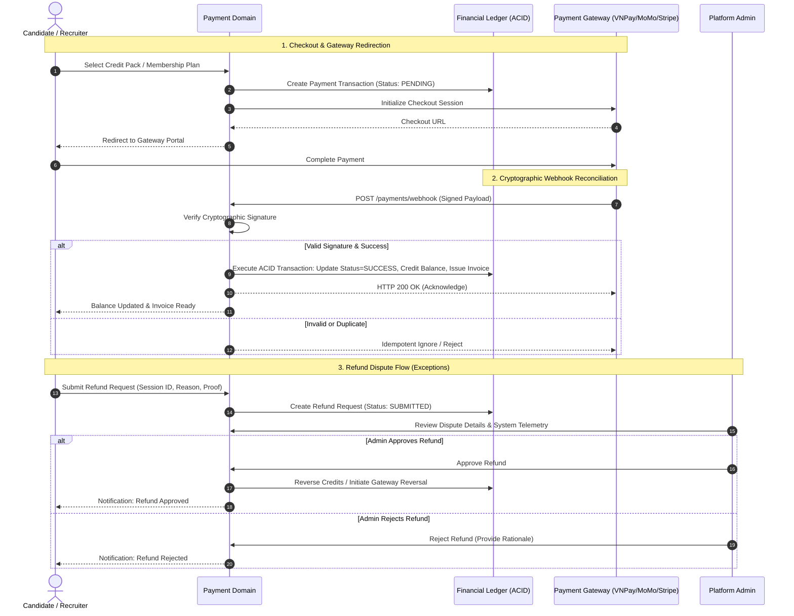

# Payment & Monetization Domain

The **Payment & Monetization Domain** manages candidate mock interview practice credits, recruiter corporate subscriptions, digital VAT invoicing, payment gateway interactions, and refund dispute resolution.

---

## 1. Purpose

Provide a secure, transparent, and legally compliant monetization infrastructure for both B2C (Candidate) and B2B (Recruiter) operations. Ensures transactional idempotency, auditability, and fair dispute handling.

---

## 2. Core Concepts

* **Candidate Practice Credits (`credit_accounts`):**
  A prepaid balance account owned by a Candidate. Each mock interview session consumes a designated number of credits (e.g., 1 credit per 30-minute simulation).
* **Credit Packages:**
  Fixed tiers for purchasing candidate credits (e.g., Starter Pack, Pro Engineer Bundle).
* **Recruiter Membership Tiers:**
  Recurring subscription plans for Recruiters granting posting allowances and candidate application screening access.
* **Payment Transaction (`payment_transactions`):**
  An immutable financial ledger entry recording payment intents and outcomes:
  * Attributes: User ID, Order Reference (`ORD-YYYY-xxxxxx`), Amount, Currency (VND, USD), Gateway Reference, Status (`PENDING`, `SUCCESS`, `FAILED`, `REFUNDED`).
* **Digital VAT Invoice (`invoices`):**
  Compliant electronic tax invoices generated upon successful B2B or B2C payments, including tax code, company name, line items, and downloadable PDF receipt.
* **Refund Request (`refund_requests`):**
  A formal dispute submitted by a Candidate if an interview simulation suffers unrecoverable technical failures (e.g., speech engine outage, persistent connection drop).
  * Status Lifecycle: `SUBMITTED` $\longrightarrow$ `APPROVED` (credits restored, payment refunded) or `REJECTED`.

---

## 3. Actors Involved

* **Candidate:** Purchases practice credit bundles; views transaction history; downloads invoices; submits refund disputes.
* **Recruiter:** Subscribes to recruiter membership tiers; manages corporate billing details; downloads corporate VAT invoices.
* **Administrator:** Monitors platform revenue and transaction logs; adjudicates candidate refund disputes.

---

## 4. Main Domain Flow

---

## 5. Business Rules & Invariants

1. **Transactional Idempotency:**
   Payment webhooks must be strictly idempotent. Receiving duplicate webhook events for the same order reference must never result in duplicate credit allocations or balance mutations.
2. **ACID Balance Updates:**
   All credit balance adjustments (grants, consumption, deductions, reversals) must execute inside atomic database transactions (`SERIALIZABLE` or row-level locked `FOR UPDATE`) to prevent race conditions.
3. **Session Pre-Authorization Gate:**
   A Candidate cannot initiate an Interview Session without sufficient practice credits. Credits are locked or deducted upon successful room initialization.
4. **Non-Transferability:**
   Practice credits and subscription benefits are non-transferable between accounts.
5. **Cryptographic Webhook Verification:**
   Every payment callback must be cryptographically verified against the gateway's shared secret or public key before any state transition occurs.
6. **Refund Adjudication Standard:**
   Refunds are never processed automatically. An Administrator reviews session telemetry (error rates, disconnect timestamps) before approving or rejecting a dispute.

---

## 6. Relationships to Other Domains

* **[[01_Domains/Interview/README|Interview Domain]]:**
  Authorizes session launch based on credit availability. Deducts credits upon session start.
* **[[01_Domains/Job-Posting-Application/README|Job-Posting-Application Domain]]:**
  Gates recruiter job posting volume based on active membership tier limits.
* **[[01_Domains/Administration/README|Administration Domain]]:**
  Administrators oversee financial analytics and adjudicate refund requests.
* **[[01_Domains/Auth/README|Auth Domain]]:**
  All transactions, invoices, and credit balances are tied to authenticated `user_id` records.

---

## 7. External Integrations

* **Payment Gateway:** External processors supporting credit card, bank transfer, and e-wallet checkout (e.g., VNPay, MoMo, PayOS, Stripe).
