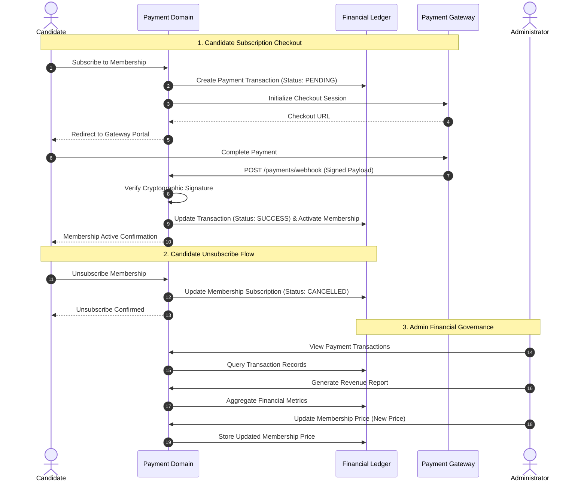

# Payment & Membership Domain

The **Payment & Membership Domain** manages candidate membership subscriptions, payment transactions, pricing governance, and revenue reporting.

---

## 1. Purpose

Provide a secure, streamlined membership subscription infrastructure for Candidates and financial governance tools for Administrators. Ensures reliable payment processing, transaction auditability, and clear membership entitlement boundaries.

---

## 2. Core Concepts

* **Membership Subscription (`membership_subscriptions`):**
  A subscription record owned by a Candidate granting access to platform interview practice capabilities. Tracks subscription start date, expiration/renewal date, and status (`ACTIVE`, `CANCELLED`, `EXPIRED`).
* **Membership Options:**
  Platform-defined subscription choices and access entitlements presented to Candidates.
* **Membership Status:**
  The current entitlement state evaluated by the system before granting access to interview creation and simulation execution.
* **Payment Transaction (`payment_transactions`):**
  An immutable financial ledger entry recording payment intents and outcomes:
  * Attributes: User ID, Order Reference, Amount, Currency (e.g., VND), Gateway Reference, Payment Status (`PENDING`, `SUCCESS`, `FAILED`), Timestamp.
* **Membership Price:**
  The active monetary price for candidate membership subscriptions, governed and updated by Administrators.
* **Revenue Report:**
  Aggregated financial reporting compiled from recorded payment transactions for administrative oversight.

---

## 3. Actors Involved

* **Candidate:** Subscribes to membership, unsubscribes from membership, and views own transaction history.
* **Administrator:** Views payment transactions, generates revenue reports, and updates membership prices.
* **Payment Gateway (External Boundary):** Processes payment checkouts and provides cryptographically signed webhook notifications confirming payment outcomes.

---

## 4. Main Domain Flow

---

## 5. Business Rules & Invariants

1. **Transactional Idempotency:**
   Payment webhooks must be strictly idempotent. Receiving duplicate webhook events for the same order reference must never result in duplicate membership extensions or erroneous state transitions.
2. **Membership Entitlement Gate:**
   Candidates must have an `ACTIVE` membership status to configure and launch live interview practice sessions.
3. **No Practice Credit Accounts or Packages:**
   RoleCue does **NOT** operate a practice credit ledger, credit wallet, per-interview credit deductions, or credit bundle packages. Access is governed through Candidate Membership.
4. **No Recruiter Subscriptions or Corporate Invoicing:**
   Recruiter accounts do not require paid membership tiers, corporate subscription packages, or digital VAT tax invoices.
5. **No Refund Dispute Queue:**
   RoleCue does not model refund dispute workflows, refund request forms, or administrative refund adjudication queues.
6. **Immutability of Payment Transactions:**
   Financial ledger records are append-only. Once recorded, transaction history cannot be modified or deleted.
7. **Cryptographic Webhook Verification:**
   Every payment callback must be cryptographically verified against the gateway's shared secret or public key before updating transaction or membership status.

---

## 6. Relationships to Other Domains

* **[[01_Domains/Interview/README|Interview Domain]]:**
  Verifies active candidate membership status prior to session initialization and launch.
* **[[01_Domains/Auth/README|Auth Domain]]:**
  Associates membership subscriptions and payment transactions with the authenticated Candidate `user_id`.
* **[[01_Domains/Administration/README|Administration Domain]]:**
  Administrators audit payment transactions, generate revenue reports, and manage membership pricing.

---

## 7. External Integrations

* **Payment Gateway:** External electronic payment processors (e.g., VNPay, MoMo, PayOS, Stripe) facilitating candidate membership checkouts and delivering signed status webhooks.
