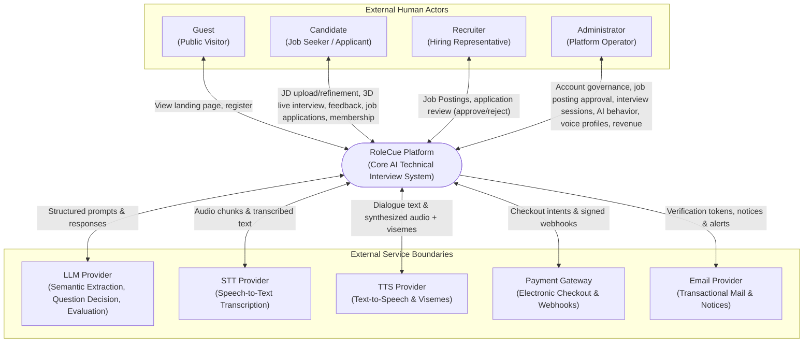

# System Context & External Boundaries

This document defines the high-level boundary of the **RoleCue Platform**, detailing the external actors and external service integrations that interact with the system.

---

## 1. System Context Diagram

---

## 2. Modeling Invariants for System Context

1. **Registered User Representation:**
   * **Rule:** `Registered User` is **not** an external entity in the Context Diagram.
   * *Rationale:* `Registered User` is an abstract generalization encompassing Candidates and Recruiters. In the physical system context, the concrete human interacting with the system is either a **Candidate** or a **Recruiter**.
2. **System Handler Representation:**
   * **Rule:** `System Handler` is **not** an external entity in the Context Diagram.
   * *Rationale:* The System Handler is an internal automated system concept (background handler) that terminates a candidate's abandoned session. It is not an external actor.
3. **External Service Boundaries:**
   * All external services interact via secure, authenticated network protocols (HTTPS / streaming connections).
   * Vendor agnosticism: Integrations use standardized internal adapter interfaces so underlying providers (e.g., swapping LLM or TTS vendors) can evolve without impacting core domain logic.
4. **Embedded Avatar Experience:**
   * The reviewed Context Diagram remains unchanged: Avaturn does not introduce a new human Context actor.
   * RoleCue embeds Avaturn's free iframe experience for personal avatar creation. Avaturn returns a final GLB; RoleCue converts and persists the Candidate-owned VRM artifact. The integration detail is specified in [[02_System/Integrations|External Integrations]].

---

## 3. Boundary Data Flow Specifications

### 3.1. External Human Actors

| External Entity | Inputs to RoleCue | Outputs from RoleCue |
| :--- | :--- | :--- |
| **Guest** | Registration credentials. | Landing page content; account confirmation. |
| **Candidate** | Target JD (text/PDF); refinement notes; composite session configuration; microphone audio stream; access to the embedded Avaturn avatar experience; CV/resume and job application information; membership subscription. | Extracted requirement tags; 3D virtual interviewer presentation; audio speech + lip-sync visemes; 5-competency evaluation reports; Candidate-owned VRM personal avatar; application submission confirmation and status updates; membership status. |
| **Recruiter** | Job Postings from JD-like content; company 3D interviewer model and Voice Profile selections; application review decisions (**Approve / Reject**). | Own Job Postings and their approval state; incoming completed Applications with CV/resume and Job Posting Interview Results. |
| **Administrator** | Account lock/unlock commands; job posting approvals/rejections; interview feature configurations; AI behaviour prompts; evaluation criteria; voice profile fetch/delete commands; membership price updates. | Filtered account lists; job posting lists; interview session details; voice profile catalog; payment transaction records; revenue reports. |

### 3.2. External Service Boundaries

| Service Boundary | Direction | Protocol | Primary Data Exchange |
| :--- | :---: | :---: | :--- |
| **LLM Provider** | Bidirectional | HTTPS | Ingests normalized JD text $\rightarrow$ outputs structured JSON competencies. Ingests each Candidate Answer + Interview Context $\rightarrow$ determines the next runtime Question. Ingests session transcript + rubrics $\rightarrow$ outputs 5-competency evaluation scores. |
| **STT Provider** | Bidirectional | WSS / HTTPS | Ingests candidate audio stream chunks $\rightarrow$ outputs real-time text transcripts. |
| **TTS Provider** | Bidirectional | HTTPS | Ingests interviewer dialogue text $\rightarrow$ outputs synthesized audio buffer with facial blend-shape viseme timing metadata. |
| **Payment Gateway** | Bidirectional | HTTPS | Ingests candidate membership checkout intent $\rightarrow$ returns gateway checkout portal URL. Dispatches cryptographically signed webhooks confirming transaction status. |
| **Email Provider** | Outbound | HTTPS / SMTP | Ingests email payloads (verification tokens, password-recovery links, application notices, system alerts) $\rightarrow$ dispatches to destination mailboxes. |
