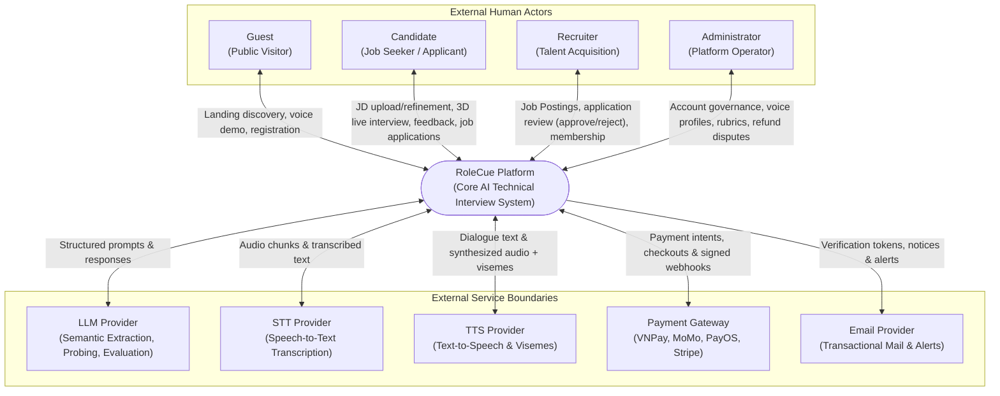

# System Context & External Boundaries

This document defines the high-level boundary of the **RoleCue Platform**, detailing the external actors and external service integrations that interact with the system.

---

## 1. System Context Diagram

---

## 2. Modeling Invariants for System Context

1. **Registered User Representation:**
   * **Rule:** `Registered User` is **not** an external entity in the Context Diagram.
   * *Rationale:* `Registered User` is an abstract object-oriented generalization encompassing Candidates and Recruiters. In the physical system context, the concrete human interacting with the system is either a **Candidate** or a **Recruiter**.
2. **System Handler Representation:**
   * **Rule:** `System Handler` is **not** an external entity in the Context Diagram.
   * *Rationale:* The System Handler is an internal automated daemon (cron/background worker) that executes inside the system boundary to terminate abandoned sessions and expire unpersisted drafts. It is not an external actor.
3. **External Service Boundaries:**
   * All external services interact via secure, authenticated network protocols (HTTPS / WebSockets).
   * Vendor agnosticism: Integrations use standardized internal adapter interfaces so underlying providers (e.g., swapping LLM or TTS vendors) can evolve without impacting core domain logic.

---

## 3. Boundary Data Flow Specifications

### 3.1. External Human Actors

| External Entity | Inputs to RoleCue | Outputs from RoleCue |
| :--- | :--- | :--- |
| **Guest** | Registration credentials; 2-question demo speech input; pricing inquiries. | Landing page assets; WebGL hero preview; demo audio responses; account confirmation. |
| **Candidate** | Target JD (text/PDF); refinement notes; composite session configs; microphone audio stream; photo upload for 3D avatar; job applications. | Extracted requirement tags; 3D virtual interviewer presentation; audio speech + lip-sync; 5-competency evaluation reports; personal 3D avatar; application status updates. |
| **Recruiter** | Company profile & branding; Job Postings; application review decisions (**Approve / Reject**); membership subscription checkout. | Own Job Postings; incoming candidate applications & resume links; corporate VAT invoices. |
| **Administrator** | Account lock/unlock commands; TTS voice configurations; rubric scoring weights; prompt instructions; refund dispute determinations. | Platform telemetry dashboards; aggregated usage metrics; transaction logs; refund dispute review queue. |

### 3.2. External Service Boundaries

| Service Boundary | Direction | Protocol | Primary Data Exchange |
| :--- | :---: | :---: | :--- |
| **LLM Provider** | Bidirectional | HTTPS | Ingests normalized JD text $\rightarrow$ outputs structured JSON competencies. Ingests conversation turns $\rightarrow$ outputs adaptive follow-up questions. Ingests session transcript + rubrics $\rightarrow$ outputs 5-competency evaluation scores. |
| **STT Provider** | Bidirectional | WSS / HTTPS | Ingests candidate audio stream chunks $\rightarrow$ outputs real-time text transcripts. |
| **TTS Provider** | Bidirectional | HTTPS | Ingests interviewer dialogue text $\rightarrow$ outputs synthesized audio buffer with 15 Oculus viseme timestamp array. |
| **Payment Gateway** | Bidirectional | HTTPS | Ingests checkout intent $\rightarrow$ returns gateway checkout URL. Receives cryptographically signed webhooks confirming transaction status. |
| **Email Provider** | Outbound | HTTPS / SMTP | Ingests email payloads (verification tokens, password resets, application notices, system alerts) $\rightarrow$ dispatches to destination mailboxes. |
