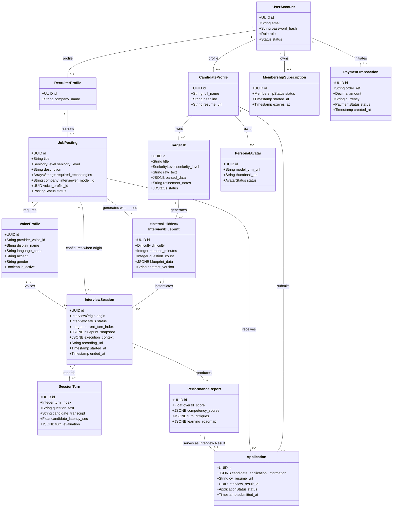

# Conceptual Domain Model

This document maps the primary business entities of the RoleCue platform and illustrates their conceptual relationships and boundaries.

---

## 1. Conceptual Entity-Relationship Model

---

## 2. Entity Descriptions & Invariants

### 2.1. Identity & Profiles
* **`UserAccount`:** Root authentication record. Holds system role (`Candidate`, `Recruiter`, `Admin`) and status (`ACTIVE`, `LOCKED`).
* **`CandidateProfile`:** Profile metadata specific to candidates, containing personal background and default resume links.
* **`RecruiterProfile`:** Employer identity metadata attached to a Recruiter account. Stores basic company identification. *Note:* Recruiter manages Job Postings directly. There is no multi-tenant company hierarchy, tenant workspace, or tenant isolation middleware.

### 2.2. Practice & Simulation Pipeline
* **`TargetJD`:** The candidate's personal practice JD. Stores the original raw text, the AI-extracted requirements, and the candidate's natural-language `refinement_notes`.
* **`InterviewBlueprint`:** The internal assessment plan. Contains topic coverage, question planning, depth milestones, and grading rubrics.
  * **Invariant:** Generated from a Target JD with refinement notes and Candidate configuration, or from a Job Posting with its company-defined interview configuration. Hidden from the Candidate.
* **`InterviewSession`:** Concrete interview execution. Its `origin` distinguishes Target JD practice from a Job Posting interview, and its immutable `blueprint_snapshot` and `execution_context` freeze evaluation and presentation rules permanently.
* **`SessionTurn`:** Granular dialogue unit within a session. Captures runtime Questions, Candidate transcripts, audio timing, and real-time Answer analysis.
* **`PerformanceReport`:** Final evaluation artifact produced from completed sessions. Contains 0–100 overall score, 5-competency breakdown, and learning roadmap.

### 2.3. Recruitment Board
* **`JobPosting`:** The company's Job Description authored by a Recruiter from JD-like content. It holds the company 3D interviewer model and Voice Profile required for its interview.
  * **Invariant:** Canonical concept representing the company's JD. No separate "Corporate JD" entity exists. Only Admin-approved Job Postings are publicly available.
* **`Application`:** The Candidate's completed application to a `JobPosting`, containing Candidate application information, a CV/resume, and an `interview_result_id` reference to the Performance Report from the associated Job Posting interview.
  * **Invariant:** The Interview Result, CV/resume, and application information are attached before Recruiter availability. Status transitions strictly from `PENDING` $\rightarrow$ `APPROVED` or `REJECTED`. Bounded strictly at binary decision.

### 2.4. Audio-Visual Presentation
* **`VoiceProfile`:** Voice configuration sourced from external TTS providers. Curated and managed by Administrators. A Candidate selects an available profile for a Target JD interview; a Job Posting references the company-selected profile that the Candidate cannot override.
* **`PersonalAvatar`:** Candidate-owned 3D humanoid avatar stored as a VRM. RoleCue receives Avaturn's final GLB, converts it to VRM, and persists the VRM in the Candidate's profile library.

### 2.5. Membership & Payments
* **`MembershipSubscription`:** Tracks candidate membership status and entitlement period.
* **`PaymentTransaction`:** Immutable ledger of payment orders, amounts, and gateway outcomes.
