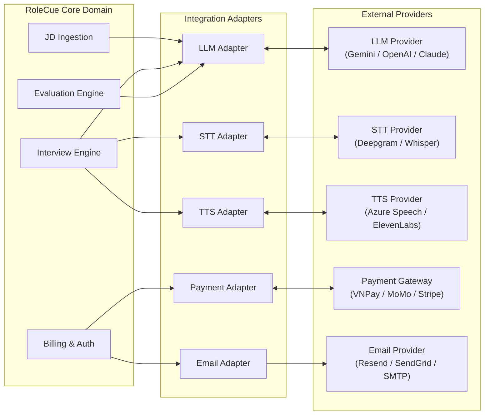

# External Service Integrations

This document specifies the integration architecture, operational requirements, and fault-tolerance policies for external third-party service providers connected to RoleCue.

---

## 1. Architectural Integration Principles

1. **Vendor Agnosticism:**
   Core domain entities and business workflows must never depend directly on vendor-specific SDKs or proprietary JSON schemas. All external integrations are encapsulated behind internal interface adapters.
2. **Deterministic Pre/Post Validation:**
   Outputs from external AI providers (LLM extractions, STT transcripts) are treated as untrusted data. They must undergo deterministic schema validation and sanitization before entering domain persistence.
3. **Graceful Fallback:**
   When an external service experiences transient latency spikes or network timeouts, the platform must degrade gracefully without corrupting persisted session state or dropping conversation history.

---

## 2. Integration Catalog

---

## 3. Provider Specifications

### 3.1. Large Language Model (LLM) Provider
* **Purpose:**
  * **Structured JD Extraction:** Parses unstructured job description text into validated JSON technical competencies (title, seniority, categorized skills, technologies).
  * **Interview Planning:** Autonomously builds the internal, hidden Interview Blueprint from approved requirements, refinement notes, and configuration parameters.
  * **Adaptive Conversational Probing:** Analyzes candidate speech turns in real time to generate contextual technical follow-up questions or transition between blueprint competency slots.
  * **Multi-Dimensional Evaluation:** Evaluates full session transcripts against blueprint rubrics across the 5 Core Competencies.
* **Latency Budget:**
  * Extraction & Evaluation: Asynchronous batch requests ($\le 10$ seconds).
  * Conversational Probing: Real-time turn generation ($\le 1.5$ seconds target).
* **Fault Handling:**
  * If extraction fails or outputs invalid schema, the system retries with temperature adjustment; surfaces `EXTRACTION_FAILED` if unresolvable.
  * If real-time probing times out during a live turn, the interview engine falls back to pre-budgeted default questions from the blueprint.

### 3.2. Speech-to-Text (STT) Provider
* **Purpose:**
  Transcribes incoming candidate audio stream chunks into clean text transcripts during live interview simulations.
* **Latency Budget:**
  Sub-second transcription latency ($\le 500$ ms target from speech boundary detection to final transcript).
* **Audio Format:**
  16 kHz / 48 kHz mono PCM or Opus audio streaming over secure WebSocket.
* **Fault Handling:**
  In the event of partial packet loss or STT dropouts, the system requests the candidate to repeat their response or prompts them via visual chat cues.

### 3.3. Text-to-Speech (TTS) Provider
* **Purpose:**
  Synthesizes realistic spoken interviewer audio from generated question text and produces synchronized phoneme/viseme timing arrays.
* **Requirements:**
  * Must support returning speech audio paired with **viseme timestamp metadata** (compatible with the 15 standard Oculus blend-shapes).
  * Must support multiple voice styles (configured as Admin-managed Voice Profiles).
* **Latency Budget:**
  Time-to-first-audio-chunk $\le 800$ ms over streaming audio connections.
* **Fault Handling:**
  If the TTS stream fails, the session displays the question as text while attempting audio reconnection, avoiding session abort.

### 3.4. Payment Gateway
* **Purpose:**
  Facilitates secure electronic payment processing for candidate practice credit packages and recruiter corporate subscriptions.
* **Provider Flexibility:**
  Supports localized Vietnamese payment rails (e.g., VNPay, MoMo, PayOS) and international credit/debit card processors (e.g., Stripe).
* **Security & Invariants:**
  * Webhook callbacks must be cryptographically signed by the gateway.
  * Webhook handlers must verify signatures and maintain strictly idempotent processing to prevent duplicate account crediting.
  * Credit adjustments must execute within database transactions.

### 3.5. Email Provider
* **Purpose:**
  Dispatches transactional system emails:
  * Account registration verification tokens.
  * Password recovery links.
  * Application submission confirmations and status change notices (Approved/Rejected).
  * Security alerts and billing receipts.
* **Operational Invariants:**
  Asynchronous queue-based dispatch; failures in email delivery must never block core HTTP transactional API flows.
