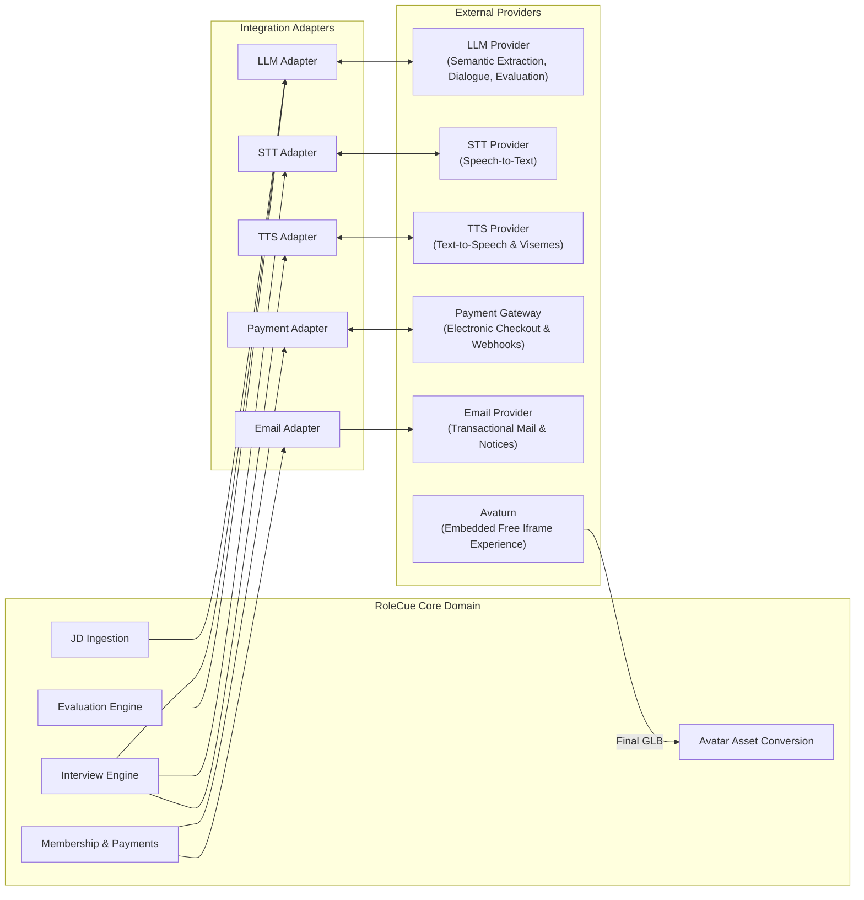

# External Service Integrations

This document specifies the integration architecture, operational requirements, and fault-tolerance policies for external third-party service providers connected to RoleCue.

---

## 1. Architectural Integration Principles

1. **Vendor Agnosticism:**
   Core domain entities and business workflows must never depend directly on vendor-specific SDKs or proprietary JSON schemas. Service-provider APIs are encapsulated behind internal interface adapters. The accepted Avaturn integration is a user-facing iframe embed, described separately below; RoleCue does not orchestrate Avaturn through backend APIs.
2. **Deterministic Pre/Post Validation:**
   Outputs from external AI providers (LLM extractions, STT transcripts) are treated as untrusted data. They must undergo deterministic schema validation and sanitization before entering domain persistence.
3. **Graceful Fallback:**
   When an external service experiences transient latency spikes or network timeouts, the platform must degrade gracefully without corrupting persisted session state or dropping conversation history.

---

## 2. Integration Catalog

The RoleCue browser embeds the free Avaturn iframe directly. Avaturn owns capture instructions, three-photo capture, validation and retakes, preview generation, customization, and final GLB generation. RoleCue receives the final GLB, converts it to VRM, and persists the Candidate-owned VRM asset. This is not an Avaturn Pro subscription, backend Avaturn API integration, or RoleCue-managed reconstruction pipeline.

---

## 3. Provider Specifications

### 3.1. Large Language Model (LLM) Provider
* **Purpose:**
  * **Structured JD Extraction:** Parses unstructured job description text into validated JSON technical competencies (title, seniority, categorized skills, technologies).
  * **Interview Planning:** Autonomously builds the internal, hidden Interview Blueprint from approved requirements, refinement notes, and configuration parameters.
  * **Runtime Question Decision:** Analyzes each Candidate Answer with the immutable Interview Context and determines the next runtime Question.
  * **Multi-Dimensional Evaluation:** Evaluates full session transcripts against blueprint rubrics across the 5 Core Competencies.
* **Fault Handling:**
  * If extraction fails or outputs an invalid schema, the system retries with adjusted parameters; surfaces an extraction failure if unresolvable.
  * If next-Question determination times out during a live turn, the system retries or presents an interview recovery state without introducing a separate Decision Layer or decision service.

### 3.2. Speech-to-Text (STT) Provider
* **Purpose:**
  Transcribes incoming candidate audio stream chunks into clean text transcripts during live interview simulations.
* **Fault Handling:**
  In the event of partial packet loss or STT dropouts, the system prompts the candidate or allows speech retry to maintain conversational continuity.

### 3.3. Text-to-Speech (TTS) Provider
* **Purpose:**
  Synthesizes realistic spoken interviewer audio from generated question text and produces synchronized blend-shape viseme timing metadata.
* **Requirements:**
  * Must support returning speech audio paired with viseme timing metadata for facial blend-shape animation.
  * Must support multiple voice styles (cataloged and managed as Admin-governed Voice Profiles).
* **Fault Handling:**
  If the TTS stream fails, the session can display the question as text while attempting audio reconnection, avoiding an abrupt session abort.

### 3.4. Avaturn Embedded Avatar Experience
* **Purpose:**
  Provides the free iframe experience embedded by RoleCue for Personal 3D Avatar creation.
* **Ownership Boundary:**
  * Avaturn presents capture instructions, collects the three required photos, performs capture validation and retakes, generates the preview avatar, provides accessory/customization UI, and generates the final GLB.
  * RoleCue receives the final GLB, converts it to VRM, persists the VRM Personal 3D Avatar, and associates it with the owning Candidate.
* **Integration Constraint:**
  RoleCue does not use Avaturn Pro APIs or backend Avaturn API orchestration for capture, customization, or avatar generation.

### 3.5. Payment Gateway
* **Purpose:**
  Facilitates secure electronic payment processing for candidate membership subscriptions.
* **Provider Flexibility:**
  Supports localized payment rails and international card processors.
* **Security & Invariants:**
  * Webhook callbacks must be cryptographically signed by the gateway.
  * Webhook handlers must verify signatures and maintain strictly idempotent processing to prevent duplicate status changes or activations.
  * Subscription activations and transaction state updates must execute within database transactions.

### 3.6. Email Provider
* **Purpose:**
  Dispatches transactional system emails:
  * Account registration verification tokens.
  * Forgot Password recovery links.
  * Application submission confirmations and status change notices (Approved/Rejected).
  * Security alerts and account notifications.
* **Operational Invariants:**
  Asynchronous queue-based dispatch; failures in email delivery must never block core transactional API flows.
