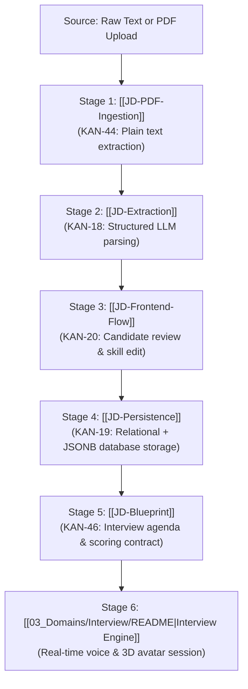

# Job Description (JD) Domain Overview

> **Domain Lead / Context:** Active Sprint Priority  
> **Core Mission:** Convert raw, unstructured employer job postings (text or PDF) into structured, editable technical profiles and generate authoritative interview blueprints.

---

## 1. End-to-End Processing Architecture

The JD pipeline flows through 6 distinct stages:

---

## 2. Key Principles & Boundaries

1. **Decoupled Ingestion Pipeline:** PDF byte parsing ([[JD-PDF-Ingestion]]) produces clean raw UTF-8 text. It must NOT directly call the LLM.
2. **Deterministic Schemas:** The LLM extraction ([[JD-Extraction]]) must return typed, validated JSON structures.
3. **Mandatory Candidate Review:** The candidate retains full authority to correct, add, or delete extracted skills before an interview starts ([[JD-Frontend-Flow]]).
4. **Authoritative Blueprint Contract:** The blueprint produced in [[JD-Blueprint]] freezes the scope, duration, question count, and scoring rubric for the subsequent live interview.
5. **Rigorous Quality Verification:** The extraction pipeline is continually evaluated against a ground-truth dataset ([[JD-Evaluation-Dataset]]).

---

## 3. Subsystem Index

| Component | Responsibility | Relevant Jira | Contract / Specs |
| :--- | :--- | :--- | :--- |
| **[[JD-Blueprint]]** | Define blueprint schema & parameters | [[KAN-46]] | [[JD-Contract]] |
| **[[JD-Extraction]]** | Domain entities & LLM prompt orchestration | [[KAN-18]] | [[JD-Contract]] |
| **[[JD-PDF-Ingestion]]**| Extract plain text from PDF documents | [[KAN-44]] | [[JD-Contract]] |
| **[[JD-Evaluation-Dataset]]**| Ground-truth benchmark samples for testing | [[KAN-45]] | - |
| **[[JD-Persistence]]** | Database schema, repository, and REST API | [[KAN-19]] | [[API-Contract]] |
| **[[JD-Frontend-Flow]]**| Upload, skill editor, and blueprint preview UI| [[KAN-20]] | [[Frontend-Contract]] |
| **[[JD-Open-Questions]]**| Active blockers and unresolved decisions | - | [[Open-Questions]] |
