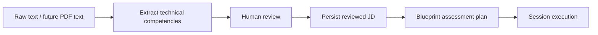

# Job Description Domain Overview

**MERGED IMPLEMENTATION:** raw-text normalization, Eino/Gemini structured extraction, and deterministic validation (KAN-18).

**MERGED IMPLEMENTATION:** PR #15 separates Analyze from Create/List/Get/Update/Delete, persists reviewed caller-owned JDs, and introduces the database table for blueprints (KAN-19).

**JIRA / DESIRED STATE:** KAN-46 is Done; KAN-20, KAN-44 and KAN-45 are In Progress. PDF ingestion, review UI, dataset, and runtime interview realization must not be inferred from the merged extraction code.

See [[JD-Contract]] for canonical boundaries; diagrams in `architecture/` remain useful target/reference artifacts, not proof of full database implementation.
