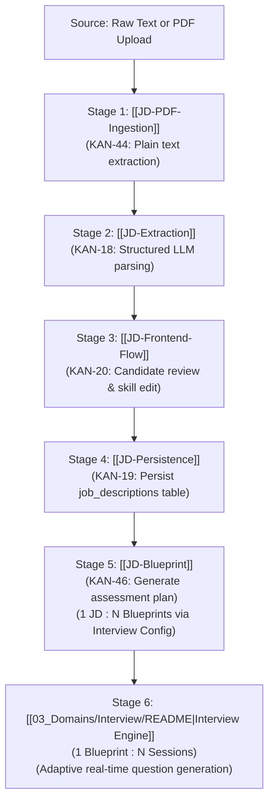

# Job Description (JD) Domain Overview

> **Domain Lead / Context:** Active Sprint Priority  
> **Core Mission:** Convert raw, unstructured employer job postings (text or PDF) into structured, editable technical profiles and generate authoritative interview blueprints.

---

## 1. End-to-End Processing Architecture

The JD pipeline flows through 6 distinct stages:

---

## 2. Key Principles & Boundaries (Proposed Team Contract)

1. **Decoupled Ingestion Pipeline:** PDF byte parsing ([[JD-PDF-Ingestion]]) produces clean raw UTF-8 text. It must NOT directly call the LLM.
2. **Deterministic Schemas:** The LLM extraction ([[JD-Extraction]]) must return typed, validated JSON structures.
3. **Mandatory Candidate Review:** The candidate retains full authority to correct, add, or delete extracted skills before an interview starts ([[JD-Frontend-Flow]]).
4. **Canonical Boundary Separation:**
   - **JD:** What the target job requires.
   - **Interview Config:** Candidate's requested parameters (difficulty, duration, question budget, avatar).
   - **Interview Blueprint:** Materialized assessment plan (stages, timing, question budget per stage, scoring rubric). It is **NOT** a static question list.
   - **Interview Session:** Runtime execution of a blueprint attempt (1 Blueprint : N Sessions).
   - **Runtime Questions:** Dynamically generated on-the-fly during session turns by the AI engine.
5. **Normalized Persistence:** Blueprints live in their own `interview_blueprints` table. `interview_sessions` references `blueprint_id` with `ON DELETE RESTRICT` and snapshots the blueprint JSONB for immutable evaluation reproducibility.
6. **Rigorous Quality Verification:** The extraction pipeline is continually evaluated against a ground-truth dataset ([[JD-Evaluation-Dataset]]).

---

## 3. Subsystem Index

| Component | Responsibility | Relevant Jira | Contract / Specs |
| :--- | :--- | :--- | :--- |
| **[[JD-Blueprint]]** | Define blueprint schema, stages, and rubrics | [[KAN-46]] | [[JD-Contract]] |
| **[[JD-Extraction]]** | Domain entities & LLM prompt orchestration | [[KAN-18]] | [[JD-Contract]] |
| **[[JD-PDF-Ingestion]]**| Extract plain text from PDF documents | [[KAN-44]] | [[JD-Contract]] |
| **[[JD-Evaluation-Dataset]]**| Ground-truth benchmark samples for testing | [[KAN-45]] | - |
| **[[JD-Persistence]]** | Database schema, repository, and REST API | [[KAN-19]] | [[API-Contract]] |
| **[[JD-Frontend-Flow]]**| Upload, skill editor, and blueprint preview UI| [[KAN-20]] | [[Frontend-Contract]] |
| **[[JD-Open-Questions]]**| Active blockers and unresolved decisions | - | [[Open-Questions]] |

---

## 4. Architectural Diagrams
- **Target Schema ERD (10 tables):** [Target-Database-ERD.drawio](file:///home/dorriss/Documents/SEP490/03_Domains/JD/architecture/target-database/Target-Database-ERD.drawio) | [Target-Database-ERD.md](file:///home/dorriss/Documents/SEP490/03_Domains/JD/architecture/target-database/Target-Database-ERD.md)
- **Data Flow Architecture:** [jd-to-blueprint-dataflow.html](file:///home/dorriss/Documents/SEP490/03_Domains/JD/architecture/blueprint-dataflow/jd-to-blueprint-dataflow.html)
- **Sequence Architecture:** [generate-preview-save-execute-sequence.html](file:///home/dorriss/Documents/SEP490/03_Domains/JD/architecture/blueprint-sequence/generate-preview-save-execute-sequence.html)
- **Lifecycle Architecture:** [interview-blueprint-lifecycle.html](file:///home/dorriss/Documents/SEP490/03_Domains/JD/architecture/blueprint-lifecycle/interview-blueprint-lifecycle.html)
- **PR #7 Baseline ERD (9 tables):** [PR7-Database-ERD.drawio](file:///home/dorriss/Documents/SEP490/03_Domains/JD/architecture/pr7-database/PR7-Database-ERD.drawio) | [PR7-Database-ERD.md](file:///home/dorriss/Documents/SEP490/03_Domains/JD/architecture/pr7-database/PR7-Database-ERD.md)
