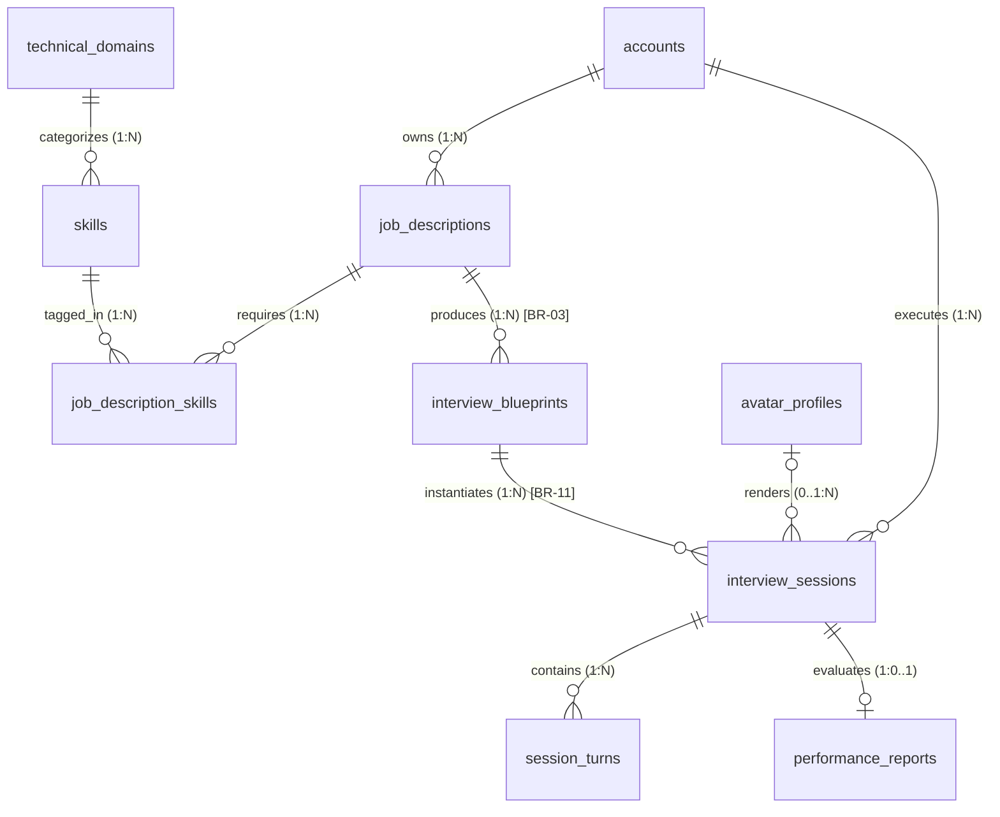

# KAN-46 Target Database Schema Specification

> [!IMPORTANT]
> **GOVERNANCE & AUTHORITY STATUS**
>
> - **PROPOSAL**: `KAN-46 Target Architecture`
> - **STATUS**: `LOCAL WORKING CONTRACT`
> - **GOVERNANCE LEVEL**: `PENDING BACKEND TEAM RATIFICATION`
> - **PR #7 RELATION**: `PROPOSED EXTENSION (NOT MERGED YET)`
>
> These business rules and schema designs are **confirmed for local project reasoning** and recorded as a **WORKING CONTRACT**. They do **not** represent merged code or database truth until reviewed and ratified by the backend engineering team.

---

## 1. Provenance & Evolution Context

| Attribute | Value |
| :--- | :--- |
| **Context / Epic** | [KAN-46: Generate Interview Blueprint from JD](file:///home/dorriss/Documents/SEP490/04_Execution/Jira/KAN-46.md) |
| **Baseline Input** | PR #7 (`feat/init-database-schema`, commit `b905dff`) physical schema |
| **Architecture Role** | Target normalized relational data model for JD assessment planning and execution |
| **Vector Diagram** | [Target-Database-ERD.drawio](file:///home/dorriss/Documents/SEP490/03_Domains/JD/architecture/target-database/Target-Database-ERD.drawio) |
| **Rendered Image** | [Target-Database-ERD.png](file:///home/dorriss/Documents/SEP490/03_Domains/JD/architecture/target-database/Target-Database-ERD.png) |
| **Interactive Online Viewer** | [Open Target-Database-ERD in Diagrams.net](https://viewer.diagrams.net/?tags=%7B%7D&lightbox=1&edit=_blank#R7V1rc%2BK40v4t74fUJqcqKduAgY8EnJmcyZwu%2FjMZQzYUH3%2F1MrlYm14nnkunCnwQGY9sdX5A3aeRNQ3weSQ991wOY%2F8RxxWYS%2BsklnUnE2dPykeKcUWEAWYDmn89DcETZmFfEpGAj30ELf%2BYGvALS0pCJhTJwvTmI%2Fb%2B0MB42AYco6q%2BkYNAd4dyhk5Of5gg6X%2BsRJ5Y1gXlQaAdv7Hvo0UlR9O2fEPvkm392cfDZy9wyTRvzJysHm5uUnpxond%2BH8MhzBTOMx0%2FD%2FsN3Yjj2B09fmS35aXj%2F9I3CAySh2%2BvdPw0eU9fWn9dnW3qvsBPO%2FdEUdMBC3bMPqzO5nCCeqrhESEF6wYelHsSH1coJSzJnyQhLU%2BXJinZIJxbrR3WDGyu1IlbIWffp8XMkVmhO%2BjP6HQ%2Bm1%2Fdfu7eDh%2F1Pdi%2Bxgbn%2BTmSOW2OzaFaAGdLSLnNmhcozK2gCVky1rFDlYbK9fC1LV0nZalRCtCCyEZAW2ShcKlFxyDBAAoKR5xJ55Gt%2Flsa%2FIInOVvkpIxl0xv6C9z3jA8xZPUYiHqnt0lBRu4E7RXMGehsUl7WgCniF0sxqfI5NlZpODV3XuUbT6XX%2Fpvt0t2SZZywXor1%2Fhh7T6sicW85a523SmNoFtRocy%2FWs4G1kU2frikb%2F6Y5HEMkyPGtBrYSL3HMf7wdqqjlxdUjm0ed5bL9Eb4w%2B2xiZ272xbGe0Wi1%2BZ9zCALUADzMV6thqTOzMnJ2lLIgZQrzCir6i%2B8r0VIP0FJhysUOpbB%2FR5IeFSLiwXUSG9IPh44OVB4z7NLTQY18wk0cj9AN3HhniVCZdiDywzxMEwXHzd%2Fv782psZ77%2BfWmyhlZOlakd5Xfb1ImrPhNAo47Z637vlnhPiCF9df%2F3liY0lB6ZwE4Yjd1XaUIXw8Cq0iyaOY0O16FySDuH9GNZ87mMSB0sIDRuXJrmuGRAaHc2ch4H%2B7OR%2BcJzcNkpbR%2FfWRNsvBnUiXTrPCPPQtSZxQ9Ar3Ke8ZQhR9MnT9AZnJpzdg2yDq%2BkCGveqtzTYLqHiYlEHVc0XwMRb9XCc82QhvvnIWFG0Roin7iz5pGRtbAR9WYhw3Np7D0xsSzsX7y%2FUllnHa9uzMUX10xV19TsAT3TCiVl9KKahj5z%2BCWFXhB3JfW7KigI8HwRbFP224wv8SFxGEbl1NaUs5TfUfnpu854hYN04WEfjFxaW%2BpmTB2OE2KXKzMLDCLPingaEyC%2B2TA92KKKsYeTeSeVa2xYEVdwVeWGXDfoxMK2uZ0XdESnmMQ%2F5mTdrcEMBt%2FpbH1zWuYKB24ZS3%2BJ%2FkIoJtsiOeXJjFPOisc4KzDoTCxvTutkE2KN%2FZb0YqSlNndbSrkZJ5SbIKLcRDgndzDkSWpiMiImnaC6dHpycTTW8b50GMc6XqHElAp4nGO3MkQUWexZuet%2Fguj0lhayjYE8bEr7OM6x2V6WjstOST9gU9EOaORAN5a1j28Hj%2F3hf2%2F7fy3LVM6n3B9eL0lZ3bzKy7iok0%2BZiFJpc7l5kXXLjbJqn%2B8944WKL9LHPu5Fw8hnNgcoXiucR59nyCOak%2B9WpFZy4mk9K2dCtJZrvt5nmEnHjN5KeA0ND6PgkE7DHm3DEcxNph61najHz53D7CRgTr7tvM9rv9Pe8MJF%2FAowqDxw55OmGGHk2W%2FL3sU10jBbKyKwQuPlD2II3rjU7O%2BBEMJriL1OwsZk0cq77M6STvc0l3aP%2FKyfqSTXviKw7WFm8ZZMJE%2FXzciGeIJhuDSodfvtC0mOL6aZ6JJ%2FYZlnu6nI%2FTuq8f%2FYIxN0amSzaigXF%2BtqMghtm031aD08UEQsA0IxUemlhesFO%2BqVOAGr2vvqRb0P0FVvrGL%2FKdFF0fzBmFk2nT2wup7efNlR9zy4NpmNKX1zulqglax8edim00F%2FZi1Sftzg6Y4Yujsr1zXyZ3hzwe7pRIlOpwvlSkVjTanKDAWUK0TXQkBZ%2FL3CnggxX6bI4K1886w5or3wBb9tzJwC733vv1n%2F%2FhuYqxILLX7%2FDmr89H3tG58cCzwO0VoWsC8RdUntvt6DwdpSZGX8SKbk%2BzGSy4arGvpvn5DDIrA7xggPsDFzSFuPTHcOIuVvOQHn5LPa6N7AFlUbK1a4cV6yVuuU4qaqSkxMpVdfWNd0I19enrLaaDabfLJq6%2BoRvbqOO39jvQa%2BSFrKk9Z1WZIkLJtdkI%2BRciP4Ac4Ik%2FmGRm1VJ4AsyYSQAgwKZoM%2F1qLJrwkEqH68Q29uGMQZxd8Aea%2FYHEbrhMnTYNjdEW8fezQ%2FwyxMQcG4hbLcIbqGm8vJ1o0OHk%2BKE2MT4c7EWB4cDhAoLB3qgWn5AeeuBTmnbuJ34SkjsYrZbCOVK7TUUFyrwhNutMlNxljcm%2BdujOZdZHyEVomJ27qc251L5dLIXioLeA6E2TwP8iAFG4FewODxx6Pn5unZtjgekoXwVzOYlf9L0JvqxhTbVHe9WHMIC8EKe2TmLl25dE8Bha88i2OA6bmLaFMDdmHh0tgblK1Fagnt2lMuWrRCPfiupt%2FhhyT3goyR0bgGb0Twgv1gjZ%2BKqe5lpdzZAvFcTbLFCPBOv7imVwrwdJOKrSGfLLUrCjkxMstBPirCPkBPDcXqgP5pcPv9qb9s20qsC4j1VkdIrGdomAXIZ%2B8dG%2B6c2C0hwSYg2DpNIcFm%2BSPCrHkuEWLMJN2HFhzD3k6VNH0DL5SYFBKTvHWHIoCSRfBGqESsNpt2L8apNYfOBx9p8G8l0em4L3IuKig8G7qQ8AwXZml4ZtNKeEp4igRPXUxf0QR4Gdz9IbeKgmSXNTZ13EZr9%2Baw0tBwLATJHnm3X7vDHyRA2v9B2UOER0EYKYm%2F5ZS4mNYuxKsGeuimVuT%2FNhC6ziFB4UVWDi35nbKek%2BYBY5V0r%2BBtA5Txw7uPSsY5y1CkDEWWD0U2O2Wnao3OAbVNJNwy%2Fijjj3UxKlNFceRBRwbtyID4EMKTbRqLMn1TGuGZctQA6LRdClZcZCMrve5Dr3vdl4AXBvBCRB4Z4DdRC2oW%2FSfbMhGiPGHLP30%2FzQxDPXZYiNS84gBRiKgkAyIcM4CnbvzODBiTGx%2FGGuz8YMCisVNV65zJyL8E1rGHFuPpqgzyyyD%2FccFPiNBhrNhkOF%2FGC48ViLpAvh0ZuJdAPFogdgTyuVQiRA9LPyiK%2BT4OKH%2BbbmRhvo6KrmEZoj%2BEjMNGTgLE5XNbSY8%2BFKdfldnu4%2Far3lSlOD7d0yeK4D9EJyUrf4aOQZeD1CiWf6m3G3Rztfx%2BW6rZwu2Dx%2FLbbSGWFfMFXsb2ZWy%2FLnbnauVy5LH%2BFdDPXz44CYBXoLqwAfInckgywJGMEEKQA1aMEPTP4ceFtBh1GQ2i9pdjwJGMAULwElZNEPyRh%2F8JLQ%2BbpeKpaeJ9RVQxcmRQVYJ01yAVg%2BOwAqUy6CpjPbUBqhBsiBVAlUFZCdTaAFUX2DtWraAtzzXWiyeKo2ieGEVwNXrom4lfsS8DtxXBgRALrPMeyN2EcH9H8LZqYVt3TI%2Biy%2BzrJ1dgH3wFdkvdvASbu0W7dqlURzvJgK0M2NbVJt19qJaPd71KcA%2FhINXDR2CSUtQlABOf%2FyRDMMLjnhOAFQD3JQ%2FCZMlqsFIbTiaS6BMPfZzQpwDoSw7SHNn4GdubcVh4YB%2BIXP2SQ4OTnMErj1AQHau8CKgAYPXQyyhSVptQmqasg8KUYBQajJwopwBghAbxIWQJgUtUwGP23ofR9tN3nXGF4DbE5GxselQrXbczjHhQc0zkFyI4V8NzRZOeIyGhqAvpOoqPc99ou64%2B9v3jKDWLp8pXxFhNHbx%2FhAvbRSY2%2F5DwFBGeHSE9PJKyJ5lAxw9O3iJ2EcIukqYnwXn84GwK6fCpBDWPcuwicJNNU1YHbhkvb4jn7jNMD%2BkTYyj0wrNoOfMTWUnVOwwW9LL%2BlkOS9CzSVsTRMEpEaFuiHj%2Br3ZP1%2BO%2BpEmHvS3dw3oTeV7q%2Bj32fuGzIEUYAhjoR9gDe6rjF2Walg9FEPzxhr6MKQdjjibsk7UnSXl0s1FVq5ciJe1zYyx1WxNlhBUI0IOPdgRwnRB0nhCD6cccJ05pMLCO0g7fN3qZs2n1ANy0g902HhjLI68SaRtUEcX2LlsHNsWmF8%2BgznHhhxgHXFpRY0SWkRYW0EOxBPqRDMDyJip1bThjgEmHY4hP7gveUOM8qhuiQbhmj2NiZQk%2FH8JXIFRW5YnAJudD9J4RWJ0CkS0A2Azefvh6wJe4xh2I2CD2HvpLWXiJXdOQKQTzkIjf5yOcfFpCbT78XBlTFeIpFHzeDbJPYym34pTYkeIUFry6ss4zERzw4jW0EjebTXRM2sqIKT%2BwDwPEpig3trJKe7j%2Be1T9ICUAlAxZcn%2BrkB2OG54hJuUSyiEjuCOvOksxGSZ6qB0jFYDdyQSoZjhKkNQFpU1hXVCWYjkMc%2BpTUtDRfVNWzDLdxYSODuKwVH3qfJv3z%2Btx9iRxEY9uVBMdqQEEIkmO8%2Bc6WxMb08d2TGdO8q0Rg7IY0ZgJXQIdGDz4B%2FdiXGw9WYOPBy8tlHqOmlVZHzQPqo1jSJXdRchfrYntmNceR8xUTeIOb0LK3RzjWgaetcGUaNq8uiXBWhhpsyvI0uP3%2B1JdbJYmKbSE4hgm2JyFsDk8O%2BN7s4skklXsjSfRVE31C0AET9C2Q77%2B4njmaIX%2B2GYG55PsMZapa50yiUaKxDhS%2FBI6eW2ZD3SjVPsDHCjLKvaF6uyGBpASWYS2QE8gNkYQCpBDMvdSx5I9s1%2FhV8lzROOm%2BThWtpCdogmxfnikqFAZ1obw%2FkqojWQBHDMaOUO4aScmRYDxeMIrBlUt9p1Wg3qRd7keQ%2Fja8%2Fdod%2FoBPX%2Frkd7SJAeHgJJGFUxpNOZOEm4MJemm%2B2UFJNs%2Bw5MkbLTwX%2BgRvzbXJ57IHyk3%2BFZVi3tDC5bg33dC03Fpyb0x9rLd0Ds4nE804APdGbbbFJN8sy7zk4EgOTm2MzaJGOXYqTg7s5QL2MlYvESgAAsUgzOQQOHdNbI9Cr8TBf5mkEosSi5XGohj0mRwWn13LwBsMYMZuSVJKJEokVhqJglBnclA08QTBdpAjA0xPr7i9Tu720e2c4wBFljpmJODEA5wY1Ji828cfwfY21jMuxZCJk%2B6LIYORU0lXTeCFEpMiYlIX0TsjGTMySH%2F80OyI6LaR%2FBkJzaOHpiA0mhw0RWLTSN7MYQVcCPpMujcP2U43On7wg8fwpRnt8xC%2B9C1V4tHcxuUjJ%2FK4HpY711Rw55pWWWQ29E4ldlKLZV3yZyR%2Fpn77J2b1SW1O30sgn5y%2FfNAD95JS1OWUvZhCnTtdT2JfROwLdQJenL13y0Wp0e7j4APAcqCqcwqA%2FfQc9gW9Xm0m9yG8o9V25cQz8kUK0X6x4Qv9eI9DuhfD6348kH45GvR764j5%2B6GzIr4o97pks65RJ6D9e1HPBRbLHvgr1x985t300gOQOEe598Fj2kH3eA05k1PuuYx%2B6e37pBvT%2FH74c6V3Qv0Nf%2BHf%2F7v8B) |

---

## 2. Confirmed KAN-46 Business Rules (BR-01 to BR-13)

These rules govern the Job Description extraction, customization, Blueprint generation, and Interview Session execution lifecycle:

* **BR-01 (Multiple JDs)**: A user can upload, extract, customize, and save multiple distinct Job Descriptions.
* **BR-02 (Requirement Review & Editing)**: After AI extraction, the candidate reviews and edits the extracted requirements, technical skills, and responsibilities before using the JD to create interview plans.
* **BR-03 (1:N Blueprints per JD)**: One reviewed/analyzed JD can produce multiple Interview Blueprints across different difficulty levels, time horizons, and competency focuses.
* **BR-04 (Generation Formula)**:
  $$	ext{Interview Blueprint} = 	ext{Reviewed JD Requirements} + 	ext{Interview Configuration} + 	ext{Interview Policy}$$
* **BR-05 (Configuration Schema)**: Interview Configuration contains at minimum:
  * `difficulty` (`easy`, `medium`, `hard`)
  * `duration_minutes` (e.g., 30, 45, 60)
  * `question_count` (e.g., 5, 8, 10)
  * Optional focus areas and emphasized skills
* **BR-06 (Orthogonal Dimensions)**: Job Description `seniority_level` (`intern`, `junior`, `mid`, `senior`, `lead`) and Interview `difficulty` (`easy`, `medium`, `hard`) are **completely independent dimensions**. A candidate preparing for a `senior` JD can configure an `easy` diagnostic warm-up or a `hard` stress-test.
* **BR-07 (Materialized Assessment Plan, Not Fixed Questions)**:
  * An Interview Blueprint is **NOT** a static question list.
  * It describes **WHAT** the interview assesses: skill/topic coverage matrix, question slots, expected technical depth, evaluation rubrics, and criteria.
  * The runtime Interview Engine determines **HOW** exact questions are phrased based on conversational flow and generates contextual/adaptive follow-ups.
* **BR-08 (Plan Preview)**: The candidate previews the generated Blueprint / Interview Plan before committing to an interview session.
* **BR-09 (Decoupled Persistence)**: The user can generate and save an Interview Blueprint to their library without immediately starting an interview.
* **BR-10 (No Direct Raw Editing)**: Candidates do not directly edit the internal JSON structure of the Blueprint. Instead, they adjust business configuration parameters (difficulty, focus topics, question count) to regenerate or update the plan.
* **BR-11 (Reusable Plans across Sessions)**: A saved Interview Blueprint can be executed across multiple practice attempts over time:
  $$	ext{Interview Blueprint (1)} \longrightarrow 	ext{Interview Sessions (N)}$$
* **BR-12 (Immutable Execution Snapshot)**: Every `interview_sessions` record stores an immutable `blueprint_snapshot JSONB NOT NULL`. Historical evaluations, report generation, and session replay remain strictly reproducible even if the originating Blueprint is later updated.
* **BR-13 (Hybrid Planner Model)**:
  $$	ext{Reviewed JD} + 	ext{Config} + 	ext{Policy} \longrightarrow 	ext{LLM Semantic Planner} \longrightarrow 	ext{Structured Draft} \longrightarrow 	ext{Deterministic Validator} \longrightarrow 	ext{Valid Blueprint}$$
  * *Architectural Rule*: LLM proposes; domain code deterministically validates.

---

## 3. Canonical Domain Terminology

To avoid legacy confusion, the brain establishes these unambiguous distinctions:

| Term | Domain Scope | Purpose |
| :--- | :--- | :--- |
| **Job Description (JD)** | Ingestion & Extraction | Defines what the target job requires (skills, seniority, responsibilities). |
| **Interview Config** | User Preferences | Defines how the user wants this mock interview structured (difficulty, duration, question count). |
| **Interview Blueprint** | Planning & Assessment | The materialized assessment plan produced from reviewed JD + config + policy (what to evaluate). |
| **Interview Session** | Runtime Execution | One concrete practice attempt executing a specific Blueprint. |
| **Runtime Questions** | Adaptive Conversation | Concrete, spoken dialogue turns generated dynamically during the session. |

---

## 4. Proposed Database Model (10 Tables)

### Structural Changes from PR #7 Baseline:
1. **Removed `job_descriptions.blueprint`**: A JD is no longer constrained to a single 1:1 blueprint blob.
2. **Added `interview_blueprints` Table**: Dedicated first-class entity supporting the 1:N lifecycle.
3. **Re-parented `interview_sessions`**: Sessions reference `blueprint_id` (`interview_blueprints.id`) rather than directly referencing `jd_id`.
4. **Normalized Redundant Authority**: Removed redundant authoritative copies from `interview_sessions` (`jd_id`, `difficulty`, `duration_minutes`, `total_questions`) to eliminate contradictory states.
5. **Preserved Immutable Replay**: Retained `blueprint_snapshot JSONB NOT NULL` on `interview_sessions`.
6. **Deletion Protection (`ON DELETE RESTRICT`)**: `interview_sessions.blueprint_id` uses `ON DELETE RESTRICT` (not `CASCADE`). Deleting a reusable Blueprint must never cascade-delete historical sessions, turns, or performance reports.

### Table Inventory



#### 4.1. `interview_blueprints` (NEW - 8 columns)
*Purpose: First-class persistence of reusable assessment plans generated for a JD.*

| Column | Type | Nullable | Default | Constraints | Description |
| :--- | :--- | :--- | :--- | :--- | :--- |
| `id` | `uuid` | No | `uuid_generate_v4()` | `PRIMARY KEY` | Surrogate UUID |
| `job_description_id`| `uuid` | No | — | `FK` → `job_descriptions(id)` | `ON DELETE CASCADE` (1:N) |
| `difficulty` | `interview_difficulty`| No | — | — | Configured difficulty (`easy`, `medium`, `hard`) |
| `duration_minutes` | `integer` | No | — | — | Planned interview duration in minutes |
| `question_count` | `integer` | No | — | — | Planned number of question slots |
| `blueprint_data` | `jsonb` | No | — | — | Assessment matrix, competencies, rubrics |
| `contract_version` | `varchar(32)` | No | `'v1'` | — | Schema version of blueprint contract |
| `created_at` | `timestamptz` | No | `now()` | — | Creation timestamp |
| `updated_at` | `timestamptz` | No | `now()` | — | Last update timestamp |

#### 4.2. `job_descriptions` (Updated - 9 columns)
*Changes: `blueprint JSONB` removed. `parsed_data` stores candidate-reviewed requirements (BR-02).*

| Column | Type | Nullable | Default | Constraints | Description |
| :--- | :--- | :--- | :--- | :--- | :--- |
| `id` | `uuid` | No | `uuid_generate_v4()` | `PRIMARY KEY` | Surrogate UUID |
| `user_id` | `uuid` | No | — | `FK` → `accounts(id)` | `ON DELETE CASCADE` |
| `title` | `text` | No | — | — | Target job title |
| `seniority_level` | `seniority_level` | No | — | — | Target role seniority |
| `raw_text` | `text` | No | — | — | Raw ingested JD text |
| `parsed_data` | `jsonb` | **Yes** | — | — | Reviewed & edited requirements (BR-02) |
| `status` | `jd_status` | No | `'uploaded'::jd_status`| — | Extraction & lifecycle status |
| `created_at` | `timestamptz` | No | `now()` | — | Creation timestamp |
| `updated_at` | `timestamptz` | No | `now()` | — | Last update timestamp |

#### 4.3. `interview_sessions` (Updated & Normalized - 12 columns)
*Changes: Re-parented to `blueprint_id`. Redundant config fields normalized away. `blueprint_snapshot` preserved.*

| Column | Type | Nullable | Default | Constraints | Description |
| :--- | :--- | :--- | :--- | :--- | :--- |
| `id` | `uuid` | No | `uuid_generate_v4()` | `PRIMARY KEY` | Surrogate UUID |
| `user_id` | `uuid` | No | — | `FK` → `accounts(id)` | `ON DELETE CASCADE` |
| `blueprint_id` | `uuid` | No | — | `FK` → `interview_blueprints(id)` | `ON DELETE RESTRICT` (BR-11; preserves historical sessions/evaluations) |
| `avatar_id` | `uuid` | **Yes** | — | `FK` → `avatar_profiles(id)` | `ON DELETE SET NULL` |
| `status` | `interview_status`| No | `'created'::interview_status`| — | Live session state machine |
| `current_question_index`| `integer`| No | `0` | — | Runtime turn counter |
| `blueprint_snapshot`| `jsonb` | No | — | — | Immutable execution snapshot (BR-12) |
| `candidate_audio_url`| `text` | **Yes** | — | — | Full audio session recording URL |
| `started_at` | `timestamptz` | **Yes** | — | — | Session start time |
| `ended_at` | `timestamptz` | **Yes** | — | — | Session completion time |
| `created_at` | `timestamptz` | No | `now()` | — | Creation timestamp |
| `updated_at` | `timestamptz` | No | `now()` | — | Last update timestamp |

*(Unchanged PR #7 tables: `accounts`, `technical_domains`, `skills`, `job_description_skills`, `avatar_profiles`, `session_turns`, `performance_reports` are preserved as defined in the PR #7 baseline).*

---

## 5. Relationship Cardinality Matrix

| Parent Table | Child Table | Relationship | Nullable | Cardinality Rationale |
| :--- | :--- | :---: | :---: | :--- |
| `accounts` | `job_descriptions` | `1 : 0..*` | No | A user owns zero or more job descriptions (BR-01). |
| `technical_domains` | `skills` | `1 : 0..*` | No | Skills are categorized under technical domains. |
| `job_descriptions` | `job_description_skills`| `1 : 0..*` | No | Junction establishing skills required by a JD. |
| `skills` | `job_description_skills`| `1 : 0..*` | No | Junction associating skills across JDs. |
| `job_descriptions` | `interview_blueprints` | `1 : 0..*` | No | **BR-03**: One reviewed JD generates multiple blueprints. |
| `interview_blueprints`| `interview_sessions` | `1 : 0..*` | No | **BR-11**: A saved blueprint is reusable across sessions. |
| `accounts` | `interview_sessions` | `1 : 0..*` | No | Candidate executing the interview session. |
| `avatar_profiles` | `interview_sessions` | `0..1 : 0..*` | **Yes** | Optional 3D interviewer profile (`SET NULL`). |
| `interview_sessions` | `session_turns` | `1 : 0..*` | No | Dialogue turns generated during interview execution. |
| `interview_sessions` | `performance_reports` | `1 : 0..1` | No (`UQ`) | Strictly at most one final report per session. |

---

## 6. Structural Validation Report (`drawio-skill`)

The target ERD was verified using the skill's structural linter:

```bash
$ python3 .agents/skills/drawio-skill/scripts/validate.py     03_Domains/JD/architecture/target-database/Target-Database-ERD.drawio --strict --score

0 error(s), 0 warning(s)
score: 0 (0 through-vertex, 0 crossings, 0 overlaps)
```

* **Table Count**: 10 tables
* **Foreign Keys**: 10 relationships, zero dangling endpoints
* **Defect Score**: 0 (no edge-edge crossings, no through-vertex penetrations, no sibling overlaps)
* **Native Raster Export**: Successfully exported to [Target-Database-ERD.png](file:///home/dorriss/Documents/SEP490/03_Domains/JD/architecture/target-database/Target-Database-ERD.png) via native `drawio` CLI v30.2.4.
