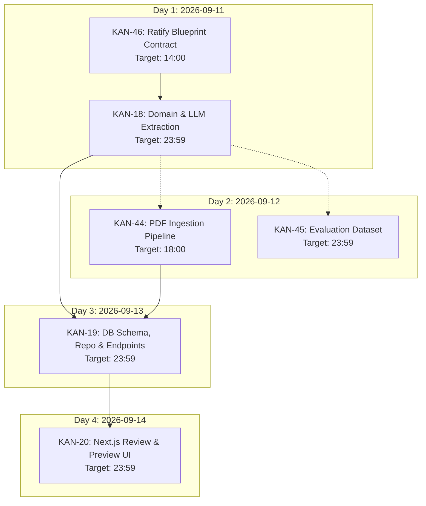

# Current Sprint: Job Description (JD) Processing

> **Sprint Goal:** Establish the full end-to-end Job Description parsing, skill review, and interview blueprint generation pipeline.  
> **Committed Sprint Window:** 2026-09-11 to 2026-09-14  
> **Execution Strategy:** Maximum throughput — complete upstream tasks as early as possible to unblock downstream integration.

---

## 1. Sprint Burndown & Task Tracking

| Jira Key | Summary | Committed Deadline | Status | Owner | Blockers |
| :--- | :--- | :--- | :--- | :--- | :--- |
| **[[KAN-46]]** | [Backend][JD] Define JD interview blueprint contract | 2026-09-11 14:00 | `IN PROGRESS` | Backend / Arch | None (Active priority) |
| **[[KAN-18]]** | Implement JD domain model and structured LLM extraction | 2026-09-11 23:59 | `BLOCKED BY KAN-46` | Backend / AI | Requires blueprint schema |
| **[[KAN-44]]** | [Backend][JD] Implement JD PDF extraction pipeline | 2026-09-12 18:00 | `QUEUED` | Backend | PDF library selection |
| **[[KAN-45]]** | [Testing][JD] Set up JD extraction evaluation dataset | 2026-09-12 23:59 | `QUEUED` | QA / Testing | Requires domain entity format |
| **[[KAN-19]]** | Implement JD repository, use cases and REST endpoints | 2026-09-13 23:59 | `QUEUED` | Backend | Blocked by KAN-18 |
| **[[KAN-20]]** | Build JD upload, editable skill review and blueprint preview UI | 2026-09-14 23:59 | `QUEUED` | Frontend | Blocked by KAN-19 |

---

## 2. Throughput Maximization Sequence

