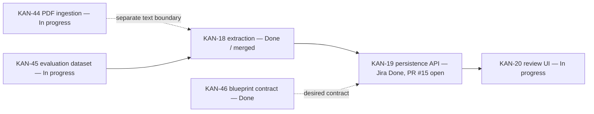

# Subsystem & Task Dependency Map

```mermaid
flowchart LR
  K18[KAN-18 extraction — Done / merged] --> K19[KAN-19 persistence API — Jira Done, PR #15 open]
  K19 --> K20[KAN-20 review UI — In progress]
  K44[KAN-44 PDF ingestion — In progress] -. separate text boundary .-> K18
  K45[KAN-45 evaluation dataset — In progress] --> K18
  K46[KAN-46 blueprint contract — Done] -. desired contract .-> K19
```

PDF extraction remains independent of LLM prompting. Blueprint contract completion does not prove all target database/session transformations.
