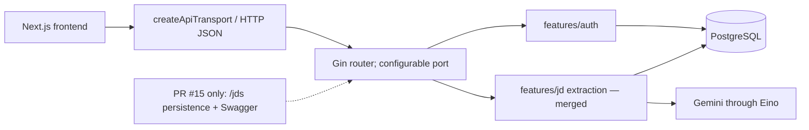

# System Integration Boundaries

Frontend does not access PostgreSQL, JWT secrets, or provider credentials. `response.Envelope` is the API transport boundary. The frontend fetch client must not assume null fields because envelope serialization uses `omitempty`.

`features/jd` extraction and external Gemini/Eino integration are merged. PR #15 persistence/API wiring is open; PDF, interview, speech, avatar, and payment integrations remain future or separate work.
