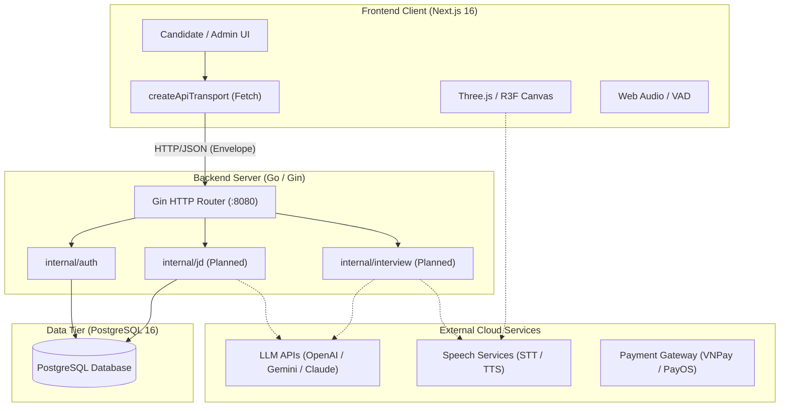

# System Integration Boundaries

## Boundary Rules
1. **Network Security:** Frontend never speaks directly to PostgreSQL or external payment secrets; all credentials pass through `api/`.
2. **Envelope Unpacking:** Frontend `createApiTransport` expects the `{ success, data, error }` response shape.
3. **Decoupled 3D Presentation:** WebGL canvas is driven purely by reactive props/state hooks; it does not handle HTTP requests directly.
