> [!WARNING]
> ⚠️ **LEGACY REFERENCE — DO NOT IMPLEMENT DIRECTLY**
> 
> This document contains historical, speculative, or unapproved implementation decisions.
> 
> Check:
> - [[Source-of-Truth]]
> - [[Decision-Registry]]
> - Current contracts in `01_Contracts/`
> - Jira acceptance criteria in `04_Execution/Jira/`
> - Current repository reality in [[Backend-Reality]] and [[Frontend-Reality]] first.

# Implementation Plan: AI-Powered Technical Interview Simulation Platform with 3D Virtual Interviewer

**Project Code:** `09_GFA26SE84`  
**Document Version:** `2.1.0` (Production Hardened — Explicit WebSocket FSM, Degraded Modes, Observable ACs & Task-Level Architecture Diagrams)  
**Status:** `Ready for Review (Phase 2: Plan & Task Breakdown)`  
**Derived From:** [`SPECIFICATION.md`](file:///C:/Users/Admin/Desktop/Graduation%20Thesis/SPECIFICATION.md) and [`09_GFA26SE84_AI_Virtual_Technical_Interview_Capstone_Register.md`](file:///C:/Users/Admin/Desktop/Graduation%20Thesis/09_GFA26SE84_AI_Virtual_Technical_Interview_Capstone_Register.md)  
**Authors:** Capstone Group 09  

---

## 1. Architectural Strategy & Slicing Overview

The implementation decomposes the full platform into **8 sequential, vertically sliced phases** containing **26 focused, verifiable tasks**. 

### Key Architectural Principles
1. **Explicit State Machines:** Network, audio, and UI states are managed via explicit finite-state machine (FSM) models with deterministic state transition tables, separating networking from rendering.
2. **First-Class Error & Degraded States:** Every task specifies concrete acceptance criteria for edge cases (network drops, mic permission denials, asset loading failures, silence timeouts, and WebGL context loss).
3. **Decoupled 3D Presentation & Socket Logic:** The Three.js 3D avatar canvas is purely a reactive presentation layer driven by an external state hook, isolating visual bugs from networking and audio pipeline errors.
4. **Risk-Aware Task Sizing:** Tasks are classified by both file count and implementation uncertainty/risk (Low, Medium, High).
5. **Task-Level Architectural & Flow Diagrams:** Complex tasks embed dedicated Mermaid diagrams (state machines, control flows, sequence handshakes, and ER schemas) directly within task definitions to guarantee implementation clarity.

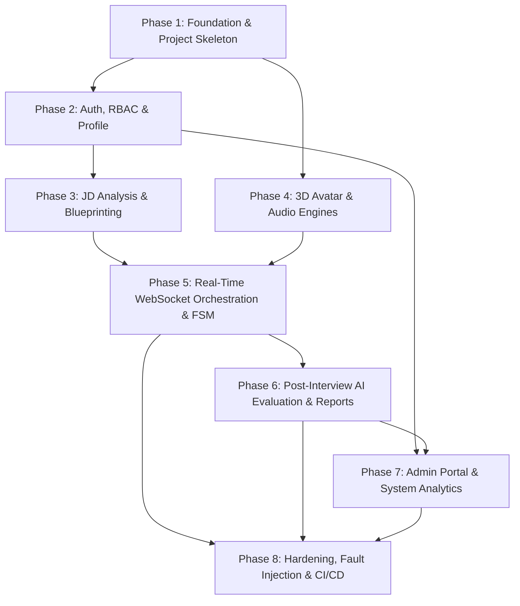
```mermaid
flowchart TD
    P1["Phase 1: Foundation & Project Skeleton"] --> P2["Phase 2: Auth, RBAC & Profile"]
    P2 --> P3["Phase 3: JD Analysis & Blueprinting"]
    P1 --> P4["Phase 4: 3D Avatar & Audio Engines"]
    P3 & P4 --> P5["Phase 5: Real-Time WebSocket Orchestration & FSM"]
    P5 --> P6["Phase 6: Post-Interview AI Evaluation & Reports"]
    P2 & P6 --> P7["Phase 7: Admin Portal & System Analytics"]
    P5 & P6 & P7 --> P8["Phase 8: Hardening, Fault Injection & CI/CD"]
```

---

## 2. Real-Time Interview WebSocket Finite-State Machine (FSM) Specification

To ensure unambiguous implementation across backend and frontend, the real-time interview subsystem operates under the following explicit state and event contract:

### 2.1 Finite States
- `IDLE`: Room initialized, awaiting user confirmation and audio permissions.
- `CONNECTING`: WebSocket handshake and JWT verification in progress.
- `ASSET_LOADING`: 3D Avatar GLTF model and audio contexts being loaded.
- `INTERVIEWER_SPEAKING`: Avatar active, audio stream playing, viseme morph targets interpolating.
- `LISTENING`: Candidate microphone active, VAD detecting speech, partial transcript updating.
- `PROCESSING_ANSWER`: Candidate stopped speaking; backend running STT/LLM response generation.
- `TRANSITIONING`: Question completed, HUD updating question index counter.
- `PAUSED`: Interview temporarily paused by user or browser tab visibility loss.
- `RECONNECTING`: WebSocket dropped; exponential backoff active with 5-minute session preservation.
- `DEGRADED_2D`: WebGL failed/unsupported; system running in lightweight audio-only waveform mode.
- `COMPLETED`: All questions finished; session finalized and transitioning to evaluation report.
- `TERMINATED_EARLY`: Candidate chose to end interview early; partial evaluation triggered.
- `FATAL_ERROR`: Unrecoverable error (session expired, invalid token, mic permanently blocked).

### 2.2 WebSocket Message & Event Contract

| Event Name | Direction | Payload Schema | Description |
|---|---|---|---|
| `JOIN_ROOM` | Client -> Server | `{ token: string, sessionId: string }` | Client initiates connection with session token |
| `SESSION_INITIALIZED` | Server -> Client | `{ sessionId: string, totalQuestions: number, currentQuestionIndex: number, avatarModelUrl: string, voiceId: string, durationMinutes: number }` | Server confirms handshake and sends session metadata |
| `QUESTION_STARTED` | Server -> Client | `{ turnId: string, questionIndex: number, questionTopic: string, questionText: string, audioBase64: string, visemes: VisemeFrame[], isFollowUp: boolean }` | Server delivers interviewer audio + blend-shape timings |
| `AUDIO_CHUNK` | Client -> Server | `{ chunkIndex: number, data: string, isFinal: boolean }` | Client streams candidate WebM/Opus audio chunks |
| `SPEECH_FINISHED` | Client -> Server | `{ finalAudioLengthMs: number }` | Client VAD signals candidate has finished speaking |
| `TRANSCRIPT_PARTIAL` | Server -> Client | `{ partialText: string }` | Live candidate transcription update |
| `TRANSCRIPT_FINAL` | Server -> Client | `{ turnId: string, fullTranscript: string }` | Confirmed speech transcription for current turn |
| `PROCESSING_STATUS` | Server -> Client | `{ step: "TRANSCRIBING" \| "EVALUATING" \| "SYNTHESIZING" }` | Real-time feedback for backend pipeline status |
| `RECONNECTED_SYNC` | Server -> Client | `{ currentQuestionIndex: number, remainingSeconds: number, pastTurns: TurnSummary[] }` | State recovery sync packet after reconnection |
| `SILENCE_WARNING` | Server -> Client | `{ timeoutSeconds: number, message: string }` | Prompt triggered after 25s of candidate silence |
| `INTERRUPT_SPEECH` | Client -> Server | `{}` | Candidate speaks or clicks to interrupt avatar speech |
| `END_SESSION_EARLY` | Client -> Server | `{ reason: string }` | Candidate triggers graceful early termination |
| `SESSION_COMPLETED` | Server -> Client | `{ reportId: string, totalTurns: number, completedAt: string }` | Signals clean conclusion of interview |
| `WS_ERROR` | Server -> Client | `{ code: string, message: string, fatal: boolean }` | Structured error packet |

### 2.3 Deterministic State Transition Matrix

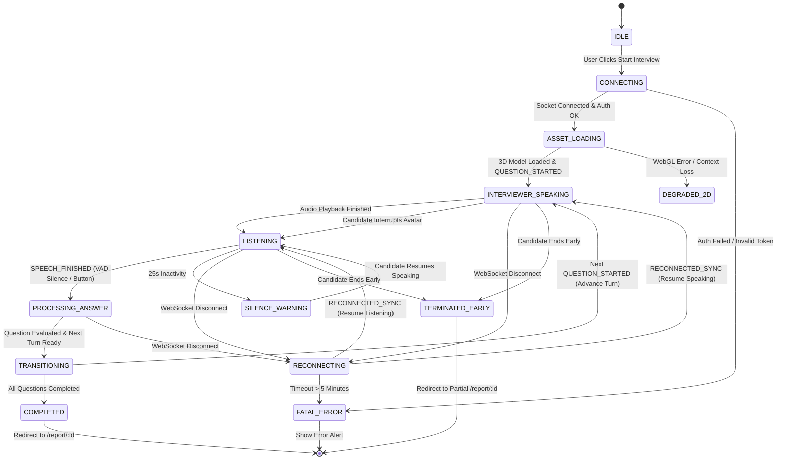
```mermaid
stateDiagram-v2
    [*] --> IDLE
    IDLE --> CONNECTING : User Clicks Start Interview
    CONNECTING --> ASSET_LOADING : Socket Connected & Auth OK
    CONNECTING --> FATAL_ERROR : Auth Failed / Invalid Token
    
    ASSET_LOADING --> INTERVIEWER_SPEAKING : 3D Model Loaded & QUESTION_STARTED
    ASSET_LOADING --> DEGRADED_2D : WebGL Error / Context Loss
    
    INTERVIEWER_SPEAKING --> LISTENING : Audio Playback Finished
    INTERVIEWER_SPEAKING --> LISTENING : Candidate Interrupts Avatar
    
    LISTENING --> PROCESSING_ANSWER : SPEECH_FINISHED (VAD Silence / Button)
    LISTENING --> SILENCE_WARNING : 25s Inactivity
    SILENCE_WARNING --> LISTENING : Candidate Resumes Speaking
    
    PROCESSING_ANSWER --> TRANSITIONING : Question Evaluated & Next Turn Ready
    TRANSITIONING --> INTERVIEWER_SPEAKING : Next QUESTION_STARTED (Advance Turn)
    TRANSITIONING --> COMPLETED : All Questions Completed
    
    INTERVIEWER_SPEAKING --> RECONNECTING : WebSocket Disconnect
    LISTENING --> RECONNECTING : WebSocket Disconnect
    PROCESSING_ANSWER --> RECONNECTING : WebSocket Disconnect
    
    RECONNECTING --> INTERVIEWER_SPEAKING : RECONNECTED_SYNC (Resume Speaking)
    RECONNECTING --> LISTENING : RECONNECTED_SYNC (Resume Listening)
    RECONNECTING --> FATAL_ERROR : Timeout > 5 Minutes
    
    LISTENING --> TERMINATED_EARLY : Candidate Ends Early
    INTERVIEWER_SPEAKING --> TERMINATED_EARLY : Candidate Ends Early
    
    COMPLETED --> [*] : Redirect to /report/:id
    TERMINATED_EARLY --> [*] : Redirect to Partial /report/:id
    FATAL_ERROR --> [*] : Show Error Alert
```

---

## 3. Detailed Task Breakdown by Phase

---

### Phase 1: Project Setup & Infrastructure Foundation

#### Task 1.1: Backend Go Skeleton, Clean Architecture Layout & Config Loader
- **Description:** Initialize Golang 1.23+ module with clean architecture directories (`internal/domain`, `usecase`, `repository`, `delivery`, `platform`, `pkg`), strongly-typed environment config loader (`pkg/config`), structured logger (`pkg/logger` with Zap), and basic HTTP server with graceful shutdown.
- **Task Architecture & Layering Diagram:**
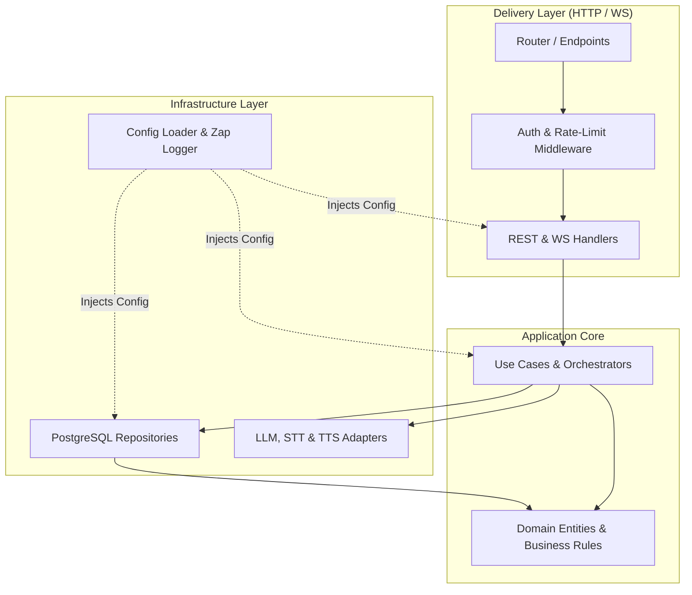
```mermaid
flowchart TD
    subgraph HTTP ["Delivery Layer (HTTP / WS)"]
        Router["Router / Endpoints"]
        AuthMW["Auth & Rate-Limit Middleware"]
        Handler["REST & WS Handlers"]
    end

    subgraph Core ["Application Core"]
        Usecase["Use Cases & Orchestrators"]
        Domain["Domain Entities & Business Rules"]
    end

    subgraph DataInfra ["Infrastructure Layer"]
        Repo["PostgreSQL Repositories"]
        LLMAdapters["LLM, STT & TTS Adapters"]
        ConfigPkg["Config Loader & Zap Logger"]
    end

    Router --> AuthMW --> Handler
    Handler --> Usecase
    Usecase --> Domain
    Usecase --> Repo
    Usecase --> LLMAdapters
    Repo --> Domain
    ConfigPkg -. Injects Config .-> Handler & Usecase & Repo
```
- **Observable Acceptance Criteria:**
  - [ ] `pkg/config.LoadConfig()` parses environment variables (`PORT`, `DATABASE_URL`, `REDIS_URL`, `JWT_SECRET`, `AI_API_KEY`) and fails fast with descriptive errors if required keys are missing.
  - [ ] `GET /health` endpoint responds with status `200 OK` and JSON `{ "status": "healthy", "service": "interview-backend", "uptime": "..." }`.
  - [ ] Process intercepts `SIGINT`/`SIGTERM` and shuts down open connections gracefully within 5 seconds.
- **Edge Cases & Error Handling:**
  - [ ] Malformed or unreachable database URL logs fatal error and exits cleanly without hanging.
- **Verification:**
  - [ ] Unit test: `go test -v ./pkg/config/... ./pkg/logger/...`
  - [ ] Build binary: `go build -o bin/server cmd/server/main.go`
- **Dependencies:** None
- **Files touched:** `backend/go.mod`, `backend/cmd/server/main.go`, `backend/pkg/config/config.go`, `backend/pkg/logger/logger.go`, `backend/internal/delivery/http/router.go`
- **Scope & Risk:** Medium (4 files) | **Risk:** Low

#### Task 1.2: PostgreSQL Schema Migrations (Goose) & Connection Pooling
- **Description:** Implement PostgreSQL `pgxpool` connection manager (`pkg/postgres`) and create Goose SQL migration `00001_initial_schema.sql` establishing the 7 core tables (`users`, `technical_domains`, `skills`, `job_descriptions`, `avatar_profiles`, `interview_sessions`, `session_turns`, `performance_reports`).
- **Entity Relationship (ER) Schema Diagram:**
```mermaid
erDiagram
    USERS ||--o{ JOB_DESCRIPTIONS : creates
    USERS ||--o{ INTERVIEW_SESSIONS : attends
    JOB_DESCRIPTIONS ||--o{ INTERVIEW_SESSIONS : configures
    INTERVIEW_SESSIONS ||--|{ SESSION_TURNS : contains
    INTERVIEW_SESSIONS ||--o| PERFORMANCE_REPORTS : produces
    AVATAR_PROFILES ||--o{ INTERVIEW_SESSIONS : renders
    TECHNICAL_DOMAINS ||--|{ SKILLS : categorizes

    USERS {
        uuid id PK
        string email UK
        string password_hash
        string full_name
        string role
        boolean is_locked
        datetime created_at
    }
    JOB_DESCRIPTIONS {
        uuid id PK
        uuid user_id FK
        string title
        string seniority_level
        text raw_text
        jsonb parsed_skills
        jsonb blueprint
        string status
        datetime created_at
    }
    AVATAR_PROFILES {
        uuid id PK
        string name
        string model_url
        string voice_id
        jsonb default_camera
        boolean is_active
    }
    INTERVIEW_SESSIONS {
        uuid id PK
        uuid user_id FK
        uuid jd_id FK
        uuid avatar_id FK
        string status
        int total_questions
        int duration_minutes
        datetime started_at
        datetime ended_at
    }
    SESSION_TURNS {
        uuid id PK
        uuid session_id FK
        int turn_index
        string topic
        text question_text
        text candidate_transcript
        string candidate_audio_url
        boolean is_follow_up
        datetime created_at
    }
    PERFORMANCE_REPORTS {
        uuid id PK
        uuid session_id FK UK
        decimal overall_score
        jsonb competency_scores
        jsonb domain_scores
        jsonb strengths
        jsonb weaknesses
        jsonb roadmap
        datetime generated_at
    }
    TECHNICAL_DOMAINS {
        uuid id PK
        string name UK
        string description
    }
    SKILLS {
        uuid id PK
        uuid domain_id FK
        string name
        string category
    }
```
- **Observable Acceptance Criteria:**
  - [ ] Database pool connects with maximum 25 open connections, 5 idle connections, and 30-minute max lifetime.
  - [ ] Migration creates all tables with UUID primary keys, foreign key constraints (`ON DELETE CASCADE` / `RESTRICT`), and composite indexes on `(candidate_id, created_at)` and `(session_id, turn_index)`.
  - [ ] Seed script inserts standard default technical domains (Backend, Frontend, DevOps, System Design) and avatar profiles.
- **Edge Cases & Error Handling:**
  - [ ] Database downtime causes automatic retry with exponential backoff (up to 5 attempts) before failing.
- **Verification:**
  - [ ] Migration up/down: `goose -dir ./migrations postgres "$DATABASE_URL" up && goose -dir ./migrations postgres "$DATABASE_URL" down`
  - [ ] Integration test: `go test -v ./pkg/postgres/...`
- **Dependencies:** Task 1.1
- **Files touched:** `backend/migrations/00001_initial_schema.sql`, `backend/migrations/00002_seed_initial_data.sql`, `backend/pkg/postgres/postgres.go`, `backend/Makefile`
- **Scope & Risk:** Small (4 files) | **Risk:** Low

#### Task 1.3: Frontend Next.js 15 App Shell, Tailwind CSS v4 & shadcn/ui Foundation
- **Description:** Initialize Next.js 15 (App Router, TypeScript, React 19), configure Tailwind CSS v4 design tokens, install core shadcn/ui components (Button, Input, Card, Dialog, Toast, Dropdown, Progress, Skeleton), and configure standard API client with automatic bearer token injection and error toast handlers.
- **API Client Pipeline Flowchart:**
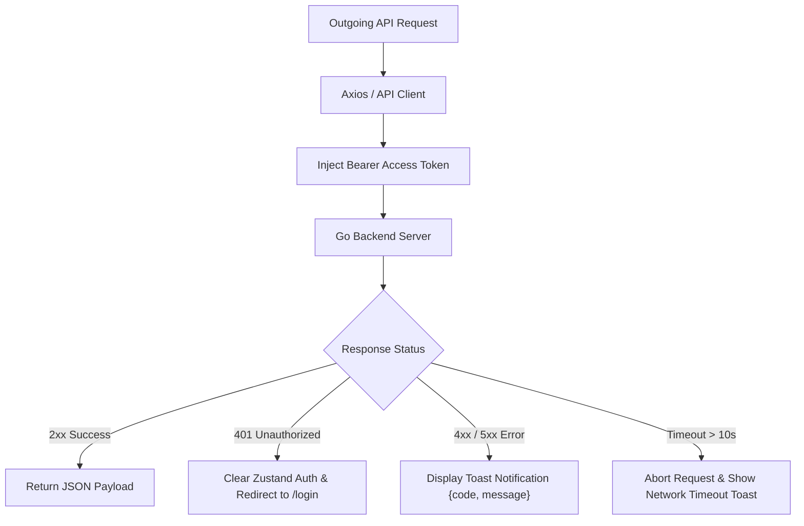
```mermaid
flowchart TD
    Request["Outgoing API Request"] --> Client["Axios / API Client"]
    Client --> TokenInject["Inject Bearer Access Token"]
    TokenInject --> Backend["Go Backend Server"]
    Backend --> Response{"Response Status"}
    
    Response -- 2xx Success --> Resolve["Return JSON Payload"]
    Response -- 401 Unauthorized --> ClearAuth["Clear Zustand Auth & Redirect to /login"]
    Response -- 4xx / 5xx Error --> Toast["Display Toast Notification {code, message}"]
    Response -- Timeout > 10s --> Abort["Abort Request & Show Network Timeout Toast"]
```
- **Observable Acceptance Criteria:**
  - [ ] Root layout (`src/app/layout.tsx`) renders responsive navigation header with dark/light theme support.
  - [ ] API client wrapper (`src/lib/api-client.ts`) transparently handles 401 Unauthorized responses by clearing auth state and redirecting to `/login`.
  - [ ] Toast notification appears when API errors return structured `{ code, message }` JSON.
- **Edge Cases & Error Handling:**
  - [ ] Network timeout (default 10s) aborts pending requests and displays a "Network connection timeout" toast.
- **Verification:**
  - [ ] Type check: `pnpm typecheck`
  - [ ] Lint: `pnpm lint`
  - [ ] Build: `pnpm build`
- **Dependencies:** None
- **Files touched:** `frontend/package.json`, `frontend/src/app/layout.tsx`, `frontend/src/lib/api-client.ts`, `frontend/src/components/ui/*`
- **Scope & Risk:** Medium (5 files) | **Risk:** Low

#### Task 1.4: Docker Compose Multi-Service Development Environment
- **Description:** Create `docker-compose.dev.yml` provisioning PostgreSQL 16, Redis 7, backend service with hot-reload via Air, and Next.js frontend with shared volume mounts and health check dependencies.
- **Multi-Container Topology Diagram:**
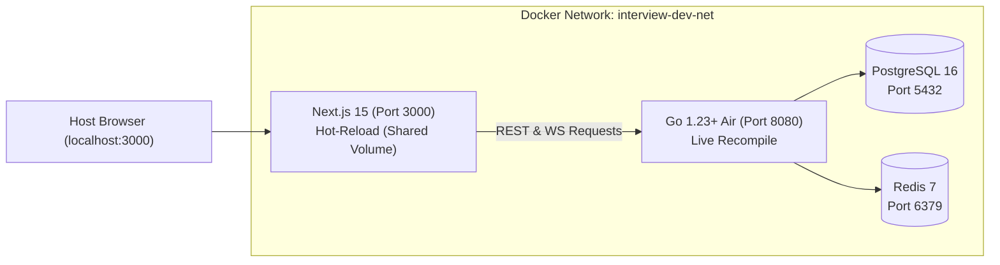
```mermaid
flowchart LR
    HostBrowser["Host Browser (localhost:3000)"]
    
    subgraph DockerDevNetwork ["Docker Network: interview-dev-net"]
        Frontend["Next.js 15 (Port 3000)<br/>Hot-Reload (Shared Volume)"]
        Backend["Go 1.23+ Air (Port 8080)<br/>Live Recompile"]
        Postgres[("PostgreSQL 16<br/>Port 5432")]
        Redis[("Redis 7<br/>Port 6379")]
    end

    HostBrowser --> Frontend
    Frontend -->|REST & WS Requests| Backend
    Backend --> Postgres
    Backend --> Redis
```
- **Observable Acceptance Criteria:**
  - [ ] Single command `docker compose -f docker-compose.dev.yml up -d` boots all services in healthy state.
  - [ ] Backend auto-recompiles when Go files change; Next.js Hot Module Replacement (HMR) functions inside container.
- **Verification:**
  - [ ] `docker compose -f docker-compose.dev.yml ps` shows all 4 containers in `healthy` or `running` state.
- **Dependencies:** Tasks 1.1, 1.2, 1.3
- **Files touched:** `docker-compose.dev.yml`, `backend/Dockerfile.dev`, `frontend/Dockerfile.dev`, `.env.example`
- **Scope & Risk:** Small (4 files) | **Risk:** Low

---

### 🛑 Checkpoint 1: Foundation Ready
- [ ] PostgreSQL and Redis up and healthy via Docker.
- [ ] Goose migrations execute cleanly with seed data.
- [ ] Backend `/health` responds with 200 OK.
- [ ] Frontend compiles and renders shell UI.

---

### Phase 2: Authentication, RBAC & Profile Management (Vertical Slice)

#### Task 2.1: User Domain, Bcrypt Password Security & JWT Token Service
- **Description:** Implement User domain model, Bcrypt password hashing (cost factor 12), dual-token JWT manager (Access Token 15m, Refresh Token 7d), and PostgreSQL repository (`internal/repository/postgres/user_repository.go`).
- **Security & Token Generation Flow:**
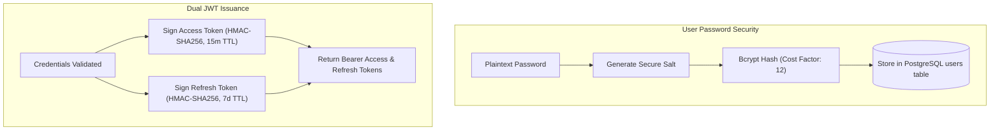
```mermaid
flowchart TD
    subgraph Registration ["User Password Security"]
        PlainPwd["Plaintext Password"] --> SaltGen["Generate Secure Salt"]
        SaltGen --> Bcrypt["Bcrypt Hash (Cost Factor: 12)"]
        Bcrypt --> StoreUser[("Store in PostgreSQL users table")]
    end

    subgraph TokenIssuance ["Dual JWT Issuance"]
        AuthSuccess["Credentials Validated"] --> GenAT["Sign Access Token (HMAC-SHA256, 15m TTL)"]
        AuthSuccess --> GenRT["Sign Refresh Token (HMAC-SHA256, 7d TTL)"]
        GenAT --> ResponseToken["Return Bearer Access & Refresh Tokens"]
        GenRT --> ResponseToken
    end
```
- **Observable Acceptance Criteria:**
  - [ ] Passwords hashed with secure salt; plaintext passwords never logged or stored.
  - [ ] JWT tokens signed with HMAC-SHA256 containing `userId`, `email`, and `role` (`CANDIDATE` or `ADMIN`).
  - [ ] Repository methods: `CreateUser`, `GetUserByEmail`, `GetUserByID`, `UpdateUserProfile`, `SetUserLockStatus`.
- **Edge Cases & Error Handling:**
  - [ ] Duplicate email registration returns `domain.ErrDuplicateEmail`.
  - [ ] Attempt to authenticate a locked account (`is_locked = true`) returns `domain.ErrAccountLocked`.
- **Verification:**
  - [ ] Unit tests pass: `go test -v ./internal/domain/... ./pkg/security/...`
- **Dependencies:** Tasks 1.1, 1.2
- **Files touched:** `backend/internal/domain/user.go`, `backend/pkg/security/password.go`, `backend/pkg/security/jwt.go`, `backend/internal/repository/postgres/user_repository.go`
- **Scope & Risk:** Medium (4 files) | **Risk:** Low

#### Task 2.2: Auth Delivery Handlers, RBAC Middleware & Router
- **Description:** Implement Authentication HTTP endpoints (`POST /api/v1/auth/register`, `POST /login`, `POST /refresh`, `GET /me`, `PUT /profile`) and RBAC middleware enforcing authentication and role permissions.
- **RBAC Middleware Decision Flowchart:**
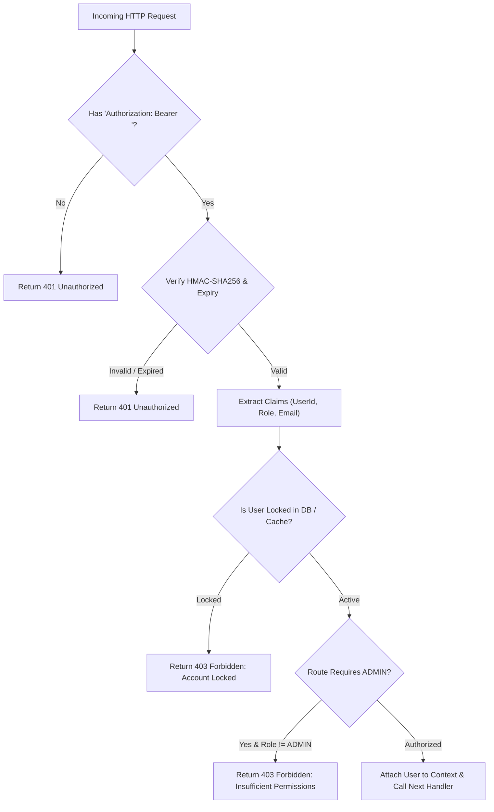
```mermaid
flowchart TD
    InReq["Incoming HTTP Request"] --> ExtHeader{"Has 'Authorization: Bearer <token>'?"}
    ExtHeader -- No --> Ret401A["Return 401 Unauthorized"]
    ExtHeader -- Yes --> VerifyJWT{"Verify HMAC-SHA256 & Expiry"}
    VerifyJWT -- Invalid / Expired --> Ret401B["Return 401 Unauthorized"]
    VerifyJWT -- Valid --> ExtractClaims["Extract Claims (UserId, Role, Email)"]
    ExtractClaims --> CheckLock{"Is User Locked in DB / Cache?"}
    CheckLock -- Locked --> Ret403Lock["Return 403 Forbidden: Account Locked"]
    CheckLock -- Active --> CheckRouteRole{"Route Requires ADMIN?"}
    CheckRouteRole -- Yes & Role != ADMIN --> Ret403Role["Return 403 Forbidden: Insufficient Permissions"]
    CheckRouteRole -- Authorized --> AttachCtx["Attach User to Context & Call Next Handler"]
```
- **Observable Acceptance Criteria:**
  - [ ] `POST /register` creates account and returns 201 Created with user summary.
  - [ ] `POST /login` validates credentials and returns Access Token, Refresh Token, and User profile.
  - [ ] Auth middleware rejects missing/tampered tokens with `401 Unauthorized` and rejects Candidate tokens accessing Admin routes with `403 Forbidden`.
- **Edge Cases & Error Handling:**
  - [ ] Rate-limiter restricts login attempts to 5 per minute per IP to prevent brute-force attacks.
- **Verification:**
  - [ ] Integration tests pass: `go test -v ./internal/delivery/http/...`
- **Dependencies:** Task 2.1
- **Files touched:** `backend/internal/usecase/auth_usecase.go`, `backend/internal/delivery/http/auth_handler.go`, `backend/internal/middleware/auth_middleware.go`, `backend/internal/delivery/http/router.go`
- **Scope & Risk:** Medium (4 files) | **Risk:** Low

#### Task 2.3: Frontend Auth Flow, Token Refresh Interceptor & Route Guards
- **Description:** Build Next.js authentication pages (`/login`, `/register`), Zustand auth store with secure cookie storage, automatic token refresh interceptor in Axios, and protected route wrapper.
- **Silent Token Refresh Sequence Diagram:**
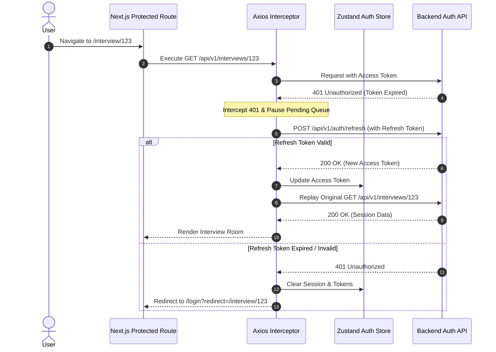
```mermaid
sequenceDiagram
    autonumber
    actor User
    participant App as Next.js Protected Route
    participant Interceptor as Axios Interceptor
    participant AuthStore as Zustand Auth Store
    participant API as Backend Auth API

    User->>App: Navigate to /interview/123
    App->>Interceptor: Execute GET /api/v1/interviews/123
    Interceptor->>API: Request with Access Token
    API-->>Interceptor: 401 Unauthorized (Token Expired)
    
    Note over Interceptor: Intercept 401 & Pause Pending Queue
    Interceptor->>API: POST /api/v1/auth/refresh (with Refresh Token)
    alt Refresh Token Valid
        API-->>Interceptor: 200 OK (New Access Token)
        Interceptor->>AuthStore: Update Access Token
        Interceptor->>API: Replay Original GET /api/v1/interviews/123
        API-->>Interceptor: 200 OK (Session Data)
        Interceptor-->>App: Render Interview Room
    else Refresh Token Expired / Invalid
        API-->>Interceptor: 401 Unauthorized
        Interceptor->>AuthStore: Clear Session & Tokens
        Interceptor-->>App: Redirect to /login?redirect=/interview/123
    end
```
- **Observable Acceptance Criteria:**
  - [ ] Form validation displays inline error messages for invalid emails, weak passwords (<8 chars), or mismatched confirmations.
  - [ ] Authenticated user visiting `/login` is redirected to `/dashboard`.
  - [ ] Unauthenticated user accessing `/interview/*` or `/admin/*` is redirected to `/login?redirect=...`.
  - [ ] Expired access token triggers silent `/refresh` call before replaying original request.
- **Edge Cases & Error Handling:**
  - [ ] Locked account displays prominent alert: *"Your account has been locked. Please contact support."*
- **Verification:**
  - [ ] Unit & hook tests pass: `pnpm test src/hooks/useAuth.test.ts`
- **Dependencies:** Tasks 1.3, 2.2
- **Files touched:** `frontend/src/app/(auth)/login/page.tsx`, `frontend/src/app/(auth)/register/page.tsx`, `frontend/src/hooks/useAuth.ts`, `frontend/src/lib/auth-storage.ts`, `frontend/src/components/auth/ProtectedRoute.tsx`
- **Scope & Risk:** Medium (5 files) | **Risk:** Low

---

### 🛑 Checkpoint 2: Authentication Working End-to-End
- [ ] User can register and log in with JWT tokens.
- [ ] Token refreshes automatically without interrupting user actions.
- [ ] Protected routes restrict unauthorized access.

---

### Phase 3: Job Description (JD) Analysis & Blueprint Generator (Vertical Slice)

#### Task 3.1: JD Domain Entity & LLM Structured Extraction Client
- **Description:** Define Job Description domain entity and build LLM platform adapter (`internal/platform/llm`) using OpenAI/Gemini structured JSON Schema outputs to extract technical skills, domain categories, and difficulty levels from raw text.
- **JD Parsing & Structured Extraction Pipeline:**
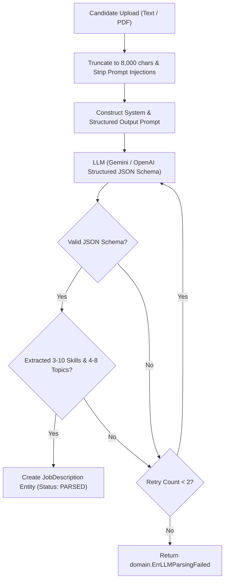
```mermaid
flowchart TD
    RawInput["Candidate Upload (Text / PDF)"] --> Sanitize["Truncate to 8,000 chars & Strip Prompt Injections"]
    Sanitize --> PromptEngine["Construct System & Structured Output Prompt"]
    PromptEngine --> LLM["LLM (Gemini / OpenAI Structured JSON Schema)"]
    
    LLM --> ParseJSON{"Valid JSON Schema?"}
    ParseJSON -- Yes --> ValidateContent{"Extracted 3-10 Skills & 4-8 Topics?"}
    ValidateContent -- Yes --> Entity["Create JobDescription Entity (Status: PARSED)"]
    
    ParseJSON -- No --> RetryCheck{"Retry Count < 2?"}
    ValidateContent -- No --> RetryCheck
    RetryCheck -- Yes --> LLM
    RetryCheck -- No --> Fail["Return domain.ErrLLMParsingFailed"]
```
- **Observable Acceptance Criteria:**
  - [ ] LLM prompt enforces strict JSON schema output (`{ title: string, seniority: string, coreDomains: string[], skills: string[], blueprint: [...] }`).
  - [ ] Truncates and sanitizes raw JD input to 8,000 characters to prevent token overflow and prompt injection.
  - [ ] Extracts at least 3-10 distinct technical skills and 4-8 planned interview blueprint topics.
- **Edge Cases & Error Handling:**
  - [ ] Malformed LLM response triggers automatic retry (up to 2 retries) before returning `domain.ErrLLMParsingFailed`.
  - [ ] Unintelligible or too short JD (<50 chars) returns `400 Bad Request: JD content too brief for analysis`.
- **Verification:**
  - [ ] Unit test with mocked LLM responses: `go test -v ./internal/platform/llm/...`
- **Dependencies:** Tasks 1.1, 2.1
- **Files touched:** `backend/internal/domain/job_description.go`, `backend/internal/platform/llm/client.go`, `backend/internal/platform/llm/jd_parser.go`
- **Scope & Risk:** Small (3 files) | **Risk:** Medium (Needs structured output prompt validation)

#### Task 3.2: JD Repository, Usecase & REST Endpoints
- **Description:** Implement PostgreSQL repository for `job_descriptions`, business usecase, and HTTP handlers (`POST /api/v1/jd/upload`, `GET /api/v1/jd`, `GET /:id`, `PUT /:id`).
- **JD Entity Lifecycle State Machine:**
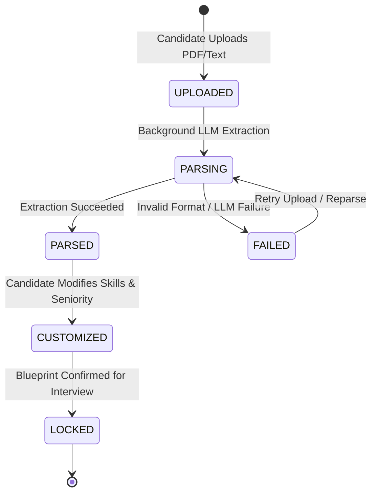
```mermaid
stateDiagram-v2
    [*] --> UPLOADED : Candidate Uploads PDF/Text
    UPLOADED --> PARSING : Background LLM Extraction
    PARSING --> PARSED : Extraction Succeeded
    PARSING --> FAILED : Invalid Format / LLM Failure
    FAILED --> PARSING : Retry Upload / Reparse
    PARSED --> CUSTOMIZED : Candidate Modifies Skills & Seniority
    CUSTOMIZED --> LOCKED : Blueprint Confirmed for Interview
    LOCKED --> [*]
```
- **Observable Acceptance Criteria:**
  - [ ] `POST /upload` accepts multipart text or PDF files, extracts text, calls LLM parser, and stores record with status `PARSED`.
  - [ ] `PUT /:id` allows candidate to manually add/remove extracted skills and adjust target seniority level.
  - [ ] Candidate can only view, edit, or delete their own JDs.
- **Edge Cases & Error Handling:**
  - [ ] Corrupted PDF upload returns `422 Unprocessable Entity: Unable to extract text from PDF`.
- **Verification:**
  - [ ] Integration tests pass: `go test -v ./internal/usecase/jd_usecase_test.go`
- **Dependencies:** Tasks 3.1, 2.2
- **Files touched:** `backend/internal/usecase/jd_usecase.go`, `backend/internal/repository/postgres/jd_repository.go`, `backend/internal/delivery/http/jd_handler.go`, `backend/internal/delivery/http/router.go`
- **Scope & Risk:** Small (4 files) | **Risk:** Low

#### Task 3.3: Frontend JD Upload, Skill Editor & Blueprint Preview UI
- **Description:** Build candidate JD portal (`/jd/upload`, `/jd/[id]/edit`) featuring drag-and-drop file upload, text paste tab, animated AI extraction progress indicator, interactive skill tag badges (add/remove skills), and blueprint preview card.
- **Candidate Setup Interaction Flowchart:**
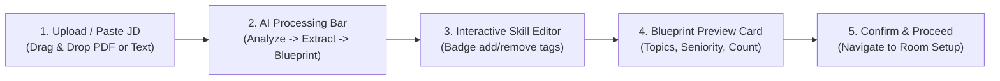
```mermaid
flowchart LR
    Step1["1. Upload / Paste JD<br/>(Drag & Drop PDF or Text)"] --> Step2["2. AI Processing Bar<br/>(Analyze -> Extract -> Blueprint)"]
    Step2 --> Step3["3. Interactive Skill Editor<br/>(Badge add/remove tags)"]
    Step3 --> Step4["4. Blueprint Preview Card<br/>(Topics, Seniority, Count)"]
    Step4 --> Step5["5. Confirm & Proceed<br/>(Navigate to Room Setup)"]
```
- **Observable Acceptance Criteria:**
  - [ ] Progress bar displays extraction steps (Analyzing requirements -> Extracting skills -> Generating blueprint) completing in <5s.
  - [ ] Candidate can click "X" on any extracted skill badge to remove it, or type to add custom skills.
  - [ ] "Proceed to Interview Setup" button passes validated `jdId` into the interview configuration flow.
- **Edge Cases & Error Handling:**
  - [ ] Display error alert with retry button if backend extraction fails.
- **Verification:**
  - [ ] Component tests: `pnpm test src/app/(candidate)/jd/`
- **Dependencies:** Tasks 1.3, 3.2
- **Files touched:** `frontend/src/app/(candidate)/jd/upload/page.tsx`, `frontend/src/app/(candidate)/jd/[id]/edit/page.tsx`, `frontend/src/components/jd/SkillTagEditor.tsx`, `frontend/src/components/jd/BlueprintPreview.tsx`
- **Scope & Risk:** Medium (4 files) | **Risk:** Low

---

### 🛑 Checkpoint 3: JD Analysis Working End-to-End
- [ ] Candidate uploads JD text/PDF.
- [ ] AI extracts skills and formats interview blueprint.
- [ ] Candidate customizes skills and saves final blueprint.

---

### Phase 4: 3D Avatar & Audio Engine Subsystems (Decoupled Foundation)

#### Task 4.1: Three.js 3D Avatar Viewport & Asset Loader Component
- **Description:** Build isolated Three.js viewport component using `@react-three/fiber` and `@react-three/drei` to load, light, and render Ready Player Me `.glb` avatars with ambient lighting, shadow maps, and idle breathing animations.
- **3D Asset Loading & Degraded Fallback Flowchart:**
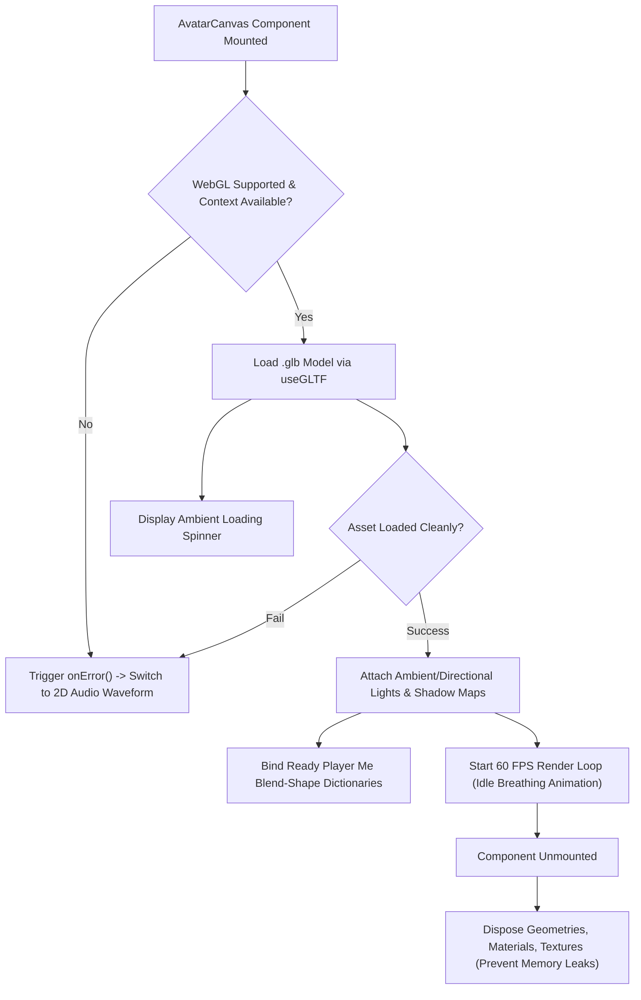
```mermaid
flowchart TD
    Init["AvatarCanvas Component Mounted"] --> CheckWebGL{"WebGL Supported & Context Available?"}
    CheckWebGL -- No --> TriggerDegraded["Trigger onError() -> Switch to 2D Audio Waveform"]
    
    CheckWebGL -- Yes --> LoadAssets["Load .glb Model via useGLTF"]
    LoadAssets --> ShowSpinner["Display Ambient Loading Spinner"]
    
    LoadAssets --> AssetReady{"Asset Loaded Cleanly?"}
    AssetReady -- Fail --> TriggerDegraded
    AssetReady -- Success --> SetupScene["Attach Ambient/Directional Lights & Shadow Maps"]
    SetupScene --> BindBlendshapes["Bind Ready Player Me Blend-Shape Dictionaries"]
    SetupScene --> Loop["Start 60 FPS Render Loop (Idle Breathing Animation)"]
    
    Loop --> Unmount["Component Unmounted"]
    Unmount --> Dispose["Dispose Geometries, Materials, Textures (Prevent Memory Leaks)"]
```
- **Observable Acceptance Criteria:**
  - [ ] Renders `.glb` avatar centered in canvas with smooth 60 FPS performance on standard GPUs.
  - [ ] Provides fallback loading spinner while downloading model assets (<5MB).
  - [ ] Exposes a clean reference handle (`AvatarHandle`) for controlling facial blend-shape morph target dictionaries.
  - [ ] Clean unmounting disposes geometries, materials, and textures without WebGL memory leaks.
- **Edge Cases & Error Handling:**
  - [ ] WebGL context loss or asset load failure triggers `onError` callback to switch parent into 2D Degraded Audio Mode.
- **Verification:**
  - [ ] Component render test: `pnpm test src/components/3d/AvatarCanvas.test.tsx`
- **Dependencies:** Task 1.3
- **Files touched:** `frontend/src/components/3d/AvatarCanvas.tsx`, `frontend/src/components/3d/AvatarModel.tsx`, `frontend/src/components/3d/SceneLighting.tsx`, `frontend/src/types/avatar.ts`, `frontend/public/models/interviewer_default.glb`
- **Scope & Risk:** Medium (5 files) | **Risk:** Medium (3D asset management & memory disposal)

#### Task 4.2: Blendshape Morph Target Lip-Sync Engine (`useAvatarLipSync`)
- **Description:** Implement `useAvatarLipSync` hook that accepts viseme timing frames (`{ timeOffsetMs, viseme, weight }`) and smoothly interpolates (`THREE.MathUtils.lerp`) mouth blendshapes (`viseme_aa`, `viseme_O`, `viseme_E`, `viseme_I`, `viseme_sil`) against Web Audio playback time.
- **Lip-Sync Interpolation Clock Flowchart:**
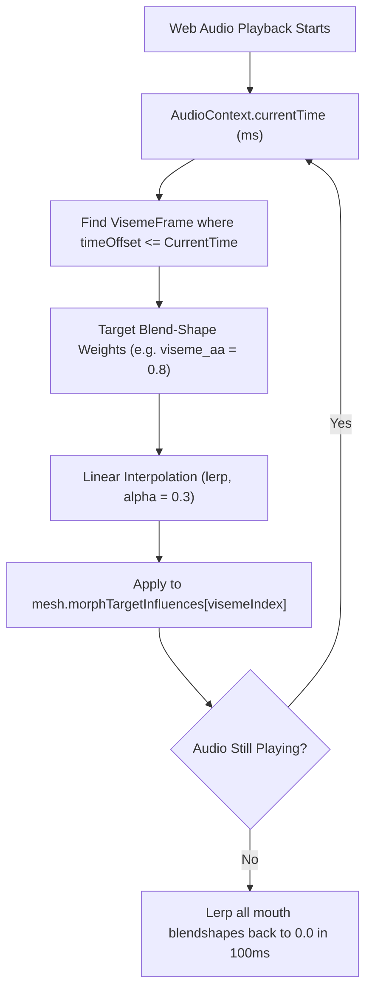
```mermaid
flowchart TD
    AudioStart["Web Audio Playback Starts"] --> Clock["AudioContext.currentTime (ms)"]
    Clock --> SeekFrame["Find VisemeFrame where timeOffset <= CurrentTime"]
    
    SeekFrame --> Morph["Target Blend-Shape Weights (e.g. viseme_aa = 0.8)"]
    Morph --> Interpolate["Linear Interpolation (lerp, alpha = 0.3)"]
    Interpolate --> ApplyTarget["Apply to mesh.morphTargetInfluences[visemeIndex]"]
    
    ApplyTarget --> CheckPlaying{"Audio Still Playing?"}
    CheckPlaying -- Yes --> Clock
    CheckPlaying -- No --> ResetToNeutral["Lerp all mouth blendshapes back to 0.0 in 100ms"]
```
- **Observable Acceptance Criteria:**
  - [ ] Mouth shapes change synchronously with audio playback with <50ms perceptible drift.
  - [ ] Smooth transition back to neutral mouth pose (`weight: 0.0`) within 100ms when audio playback ends.
  - [ ] Interpolation weight transitions use linear interpolation factor (alpha 0.3) to prevent jarring mouth jitter.
- **Edge Cases & Error Handling:**
  - [ ] Empty or missing viseme array defaults to subtle audio-volume-driven mouth movement (fallback amplitude lip-sync).
- **Verification:**
  - [ ] Hook unit test with synthetic viseme stream: `pnpm test src/hooks/useAvatarLipSync.test.ts`
- **Dependencies:** Task 4.1
- **Files touched:** `frontend/src/hooks/useAvatarLipSync.ts`, `frontend/src/types/avatar.ts`
- **Scope & Risk:** Small (2 files) | **Risk:** Medium (Sync precision)

#### Task 4.3: Web Audio API Microphone Streamer, VAD & Audio Visualizer
- **Description:** Implement candidate audio capture module with microphone permission modal, Web Audio API frequency visualizer, MediaRecorder WebM/Opus chunk streamer, and client-side Voice Activity Detection (VAD) silence detector (1.5s silence threshold).
- **Candidate Microphone & VAD Capture Pipeline:**
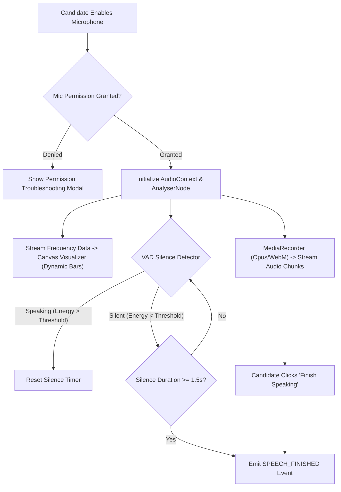
```mermaid
flowchart TD
    Start["Candidate Enables Microphone"] --> PermReq{"Mic Permission Granted?"}
    PermReq -- Denied --> ShowHelp["Show Permission Troubleshooting Modal"]
    PermReq -- Granted --> InitWebAudio["Initialize AudioContext & AnalyserNode"]
    
    InitWebAudio --> Viz["Stream Frequency Data -> Canvas Visualizer (Dynamic Bars)"]
    InitWebAudio --> ChunkStream["MediaRecorder (Opus/WebM) -> Stream Audio Chunks"]
    
    InitWebAudio --> VAD{"VAD Silence Detector"}
    VAD -- "Speaking (Energy > Threshold)" --> ResetTimer["Reset Silence Timer"]
    VAD -- "Silent (Energy < Threshold)" --> TimerCheck{"Silence Duration >= 1.5s?"}
    
    TimerCheck -- No --> VAD
    TimerCheck -- Yes --> EmitFinished["Emit SPEECH_FINISHED Event"]
    
    ChunkStream --> StopManual["Candidate Clicks 'Finish Speaking'"]
    StopManual --> EmitFinished
```
- **Observable Acceptance Criteria:**
  - [ ] Microphone permission request displays clear instructions and browser troubleshooting hints if denied.
  - [ ] Real-time frequency bar visualizer animates dynamically with candidate vocal amplitude.
  - [ ] Emits `SPEECH_FINISHED` event automatically after 1.5s of silence following candidate speech.
  - [ ] Provides manual "Finish Speaking" button allowing candidate to submit answer immediately without waiting for VAD silence.
- **Edge Cases & Error Handling:**
  - [ ] Mic disconnected mid-session displays immediate warning banner and pauses audio recording.
- **Verification:**
  - [ ] Component unit tests: `pnpm test src/components/audio/`
- **Dependencies:** Task 1.3
- **Files touched:** `frontend/src/hooks/useAudioRecorder.ts`, `frontend/src/components/audio/AudioVisualizer.tsx`, `frontend/src/components/audio/MicPermissionModal.tsx`
- **Scope & Risk:** Small (3 files) | **Risk:** Medium (Browser audio permission edge cases)

#### Task 4.4: Backend Speech-to-Text (STT) & Text-to-Speech (TTS + Visemes) Platform Adapters
- **Description:** Build backend platform adapters for STT (Whisper API / Deepgram) to convert audio chunks to text, and TTS (Azure Speech / ElevenLabs + Rhubarb) to generate synthesized speech audio along with timestamped phoneme/viseme arrays.
- **Bidirectional Speech Processing Architecture:**
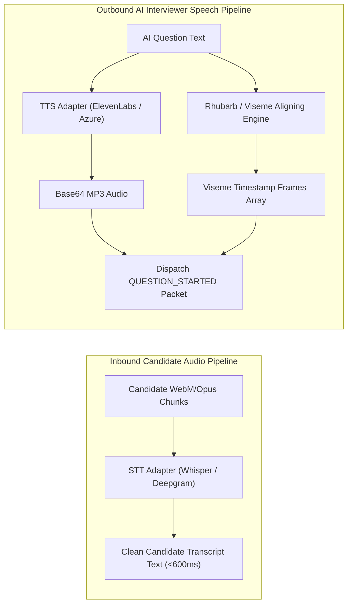
```mermaid
flowchart LR
    subgraph InboundSpeech ["Inbound Candidate Audio Pipeline"]
        CandidateAudio["Candidate WebM/Opus Chunks"] --> STTClient["STT Adapter (Whisper / Deepgram)"]
        STTClient --> TranscriptText["Clean Candidate Transcript Text (<600ms)"]
    end

    subgraph OutboundSpeech ["Outbound AI Interviewer Speech Pipeline"]
        QuestionText["AI Question Text"] --> TTSClient["TTS Adapter (ElevenLabs / Azure)"]
        QuestionText --> VisemeMapper["Rhubarb / Viseme Aligning Engine"]
        TTSClient --> SynthesizedAudio["Base64 MP3 Audio"]
        VisemeMapper --> VisemeJSON["Viseme Timestamp Frames Array"]
        SynthesizedAudio & VisemeJSON --> DispatchWS["Dispatch QUESTION_STARTED Packet"]
    end
```
- **Observable Acceptance Criteria:**
  - [ ] STT transcription turnaround < 600ms for candidate answer chunks.
  - [ ] TTS generates base64 audio and JSON viseme array mapped to standard RPM viseme blend-shapes.
  - [ ] Mock STT/TTS mode enabled via `MOCK_SPEECH_SERVICES=true` for offline development and CI test suites.
- **Edge Cases & Error Handling:**
  - [ ] External TTS API rate-limit returns cached fallback speech audio and visemes.
- **Verification:**
  - [ ] Unit tests pass: `go test -v ./internal/platform/stt/... ./internal/platform/tts/...`
- **Dependencies:** Task 1.1
- **Files touched:** `backend/internal/platform/stt/stt_client.go`, `backend/internal/platform/tts/tts_client.go`, `backend/internal/platform/tts/viseme_mapper.go`
- **Scope & Risk:** Medium (3 files) | **Risk:** Medium (Third-party speech latency)

---

### 🛑 Checkpoint 4: 3D & Audio Subsystems Ready
- [ ] 3D avatar renders at 60 FPS in isolation.
- [ ] Lip-sync hook moves avatar mouth in exact sync with synthesized audio and visemes.
- [ ] Candidate microphone captures voice, animates waveform, and triggers VAD silence detection.
- [ ] Backend STT/TTS adapters convert audio and generate viseme frame arrays.

---

### Phase 5: Real-Time Interview Session Orchestrator & State Management (Core Vertical Slice)

#### Task 5.1: Interview Session Domain, State Machine & Repository
- **Description:** Implement Interview Session and Turn entities, session state machine (`CREATED` -> `IN_PROGRESS` -> `COMPLETED` / `INTERRUPTED` / `FAILED`), and PostgreSQL repository.
- **Interview Session Lifecycle State Machine:**
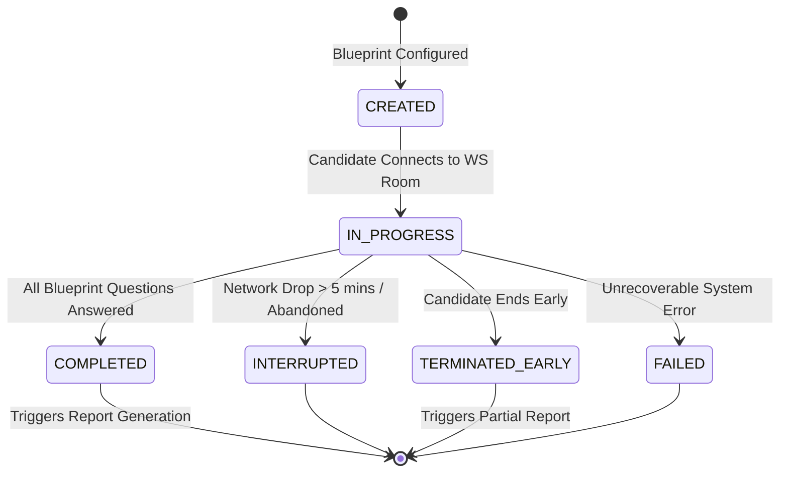
```mermaid
stateDiagram-v2
    [*] --> CREATED : Blueprint Configured
    CREATED --> IN_PROGRESS : Candidate Connects to WS Room
    IN_PROGRESS --> COMPLETED : All Blueprint Questions Answered
    IN_PROGRESS --> INTERRUPTED : Network Drop > 5 mins / Abandoned
    IN_PROGRESS --> TERMINATED_EARLY : Candidate Ends Early
    IN_PROGRESS --> FAILED : Unrecoverable System Error
    COMPLETED --> [*] : Triggers Report Generation
    INTERRUPTED --> [*]
    TERMINATED_EARLY --> [*] : Triggers Partial Report
    FAILED --> [*]
```
- **Observable Acceptance Criteria:**
  - [ ] `interview_sessions` table records difficulty, target duration, blueprint JSON, started/ended timestamps, and status.
  - [ ] `session_turns` table stores question index, topic, interviewer question text, candidate audio URL, transcript, and follow-up flag.
  - [ ] State transition helper enforces valid state progressions (cannot transition from `COMPLETED` to `IN_PROGRESS`).
- **Edge Cases & Error Handling:**
  - [ ] Attempting to modify a finalized session returns `domain.ErrSessionAlreadyCompleted`.
- **Verification:**
  - [ ] Integration tests pass: `go test -v ./internal/repository/postgres/session_repository_test.go`
- **Dependencies:** Tasks 1.2, 2.1, 3.1
- **Files touched:** `backend/internal/domain/interview_session.go`, `backend/internal/repository/postgres/session_repository.go`
- **Scope & Risk:** Small (2 files) | **Risk:** Low

#### Task 5.2: WebSocket Hub, Connection Manager & Reconnection Protocol
- **Description:** Build high-concurrency WebSocket Hub (`internal/delivery/ws`) with client connection pools, ping/pong heartbeats, JWT authentication on `JOIN_ROOM`, and thread-safe read/write pumps.
- **WebSocket Handshake & Reconnection Sequence Diagram:**
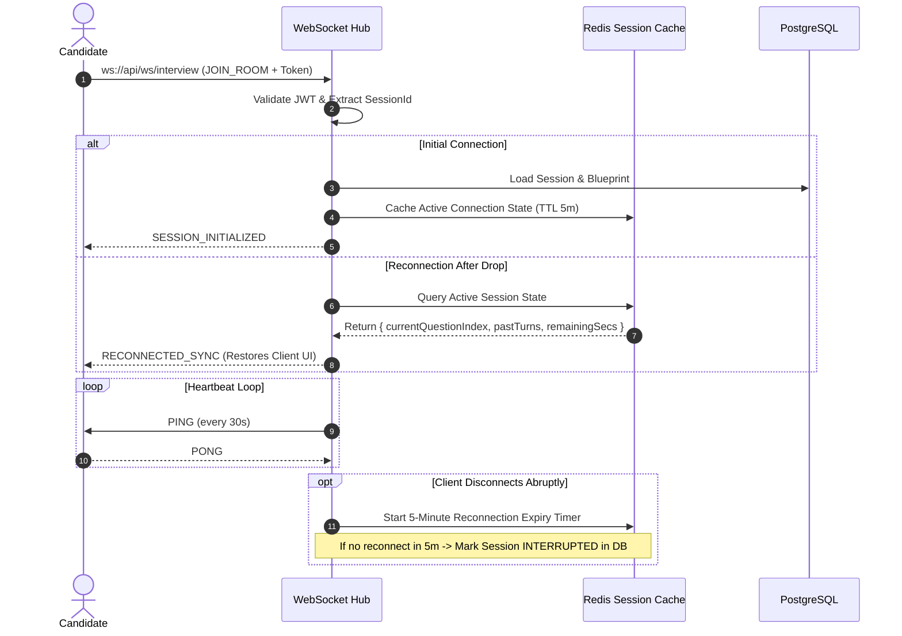
```mermaid
sequenceDiagram
    autonumber
    actor Candidate
    participant WS as WebSocket Hub
    participant Redis as Redis Session Cache
    participant DB as PostgreSQL

    Candidate->>WS: ws://api/ws/interview (JOIN_ROOM + Token)
    WS->>WS: Validate JWT & Extract SessionId
    alt Initial Connection
        WS->>DB: Load Session & Blueprint
        WS->>Redis: Cache Active Connection State (TTL 5m)
        WS-->>Candidate: SESSION_INITIALIZED
    else Reconnection After Drop
        WS->>Redis: Query Active Session State
        Redis-->>WS: Return { currentQuestionIndex, pastTurns, remainingSecs }
        WS-->>Candidate: RECONNECTED_SYNC (Restores Client UI)
    end

    loop Heartbeat Loop
        WS->>Candidate: PING (every 30s)
        Candidate-->>WS: PONG
    end

    opt Client Disconnects Abruptly
        WS->>Redis: Start 5-Minute Reconnection Expiry Timer
        Note over Redis,WS: If no reconnect in 5m -> Mark Session INTERRUPTED in DB
    end
```
- **Observable Acceptance Criteria:**
  - [ ] Authenticates candidate token on connection; rejects invalid/expired tokens with `4001 Unauthorized` WS close code.
  - [ ] Maintains active session state in Redis for 5 minutes during client disconnects.
  - [ ] Upon reconnecting with matching session token, sends `RECONNECTED_SYNC` packet restoring current question index and completed turns.
- **Edge Cases & Error Handling:**
  - [ ] Broken socket or client crash automatically marks session as `INTERRUPTED` if client does not reconnect within 5 minutes.
- **Verification:**
  - [ ] WebSocket harness test: `go test -v -race ./internal/delivery/ws/...`
- **Dependencies:** Tasks 5.1, 2.1
- **Files touched:** `backend/internal/delivery/ws/hub.go`, `backend/internal/delivery/ws/client.go`, `backend/internal/delivery/ws/interview_socket.go`, `backend/internal/delivery/http/router.go`
- **Scope & Risk:** Medium (4 files) | **Risk:** High (Concurrent connection & state synchronization)

#### Task 5.3: Adaptive Dialog Engine & AI Interview Orchestrator
- **Description:** Implement backend interview orchestrator (`internal/usecase/interview_orchestrator.go`). Coordinates: candidate audio -> STT transcription -> LLM answer evaluation (evaluating technical depth and deciding follow-up vs next question) -> TTS + Viseme generation -> WebSocket message dispatch.
- **Multi-Turn Adaptive Dialog Decision Flowchart:**
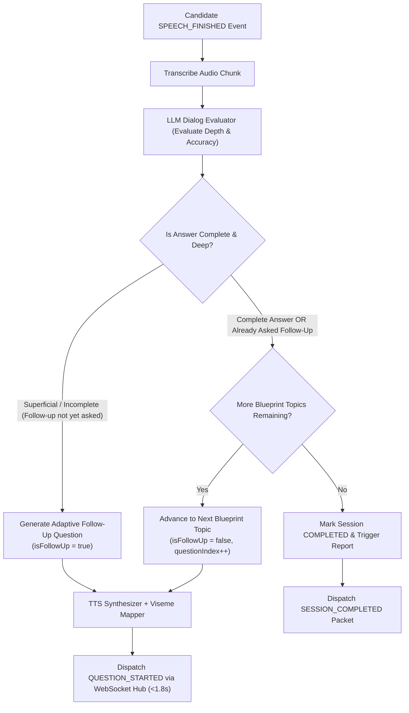
```mermaid
flowchart TD
    CandidateFinished["Candidate SPEECH_FINISHED Event"] --> STT["Transcribe Audio Chunk"]
    STT --> LLMEval["LLM Dialog Evaluator (Evaluate Depth & Accuracy)"]
    
    LLMEval --> AnswerCheck{"Is Answer Complete & Deep?"}
    
    AnswerCheck -- "Superficial / Incomplete (Follow-up not yet asked)" --> GenFollowUp["Generate Adaptive Follow-Up Question<br/>(isFollowUp = true)"]
    AnswerCheck -- "Complete Answer OR Already Asked Follow-Up" --> CheckRemaining{"More Blueprint Topics Remaining?"}
    
    CheckRemaining -- Yes --> AdvanceTopic["Advance to Next Blueprint Topic<br/>(isFollowUp = false, questionIndex++)"]
    CheckRemaining -- No --> CompleteSession["Mark Session COMPLETED & Trigger Report"]
    
    GenFollowUp --> Synthesize["TTS Synthesizer + Viseme Mapper"]
    AdvanceTopic --> Synthesize
    Synthesize --> Dispatch["Dispatch QUESTION_STARTED via WebSocket Hub (<1.8s)"]
    
    CompleteSession --> DispatchComplete["Dispatch SESSION_COMPLETED Packet"]
```
- **Observable Acceptance Criteria:**
  - [ ] Asks follow-up question when candidate gives an incomplete or superficial response (max 1 follow-up per blueprint topic).
  - [ ] Advances to next planned blueprint topic when candidate gives a complete answer or after follow-up turn.
  - [ ] Total turnaround latency from `SPEECH_FINISHED` to `QUESTION_STARTED` dispatch is < 1.8s.
  - [ ] Enforces target question count (4–8 questions); transitions to `COMPLETED` when last question is answered.
- **Edge Cases & Error Handling:**
  - [ ] If candidate stays silent for 25s, orchestrator dispatches `SILENCE_WARNING` offering a hint.
  - [ ] LLM timeout (>4s) gracefully falls back to pre-configured blueprint question without breaking session flow.
- **Verification:**
  - [ ] Unit tests with mocked AI services: `go test -v ./internal/usecase/interview_orchestrator_test.go`
- **Dependencies:** Tasks 5.2, 4.4, 3.1
- **Files touched:** `backend/internal/usecase/interview_orchestrator.go`, `backend/internal/platform/llm/interview_dialog.go`
- **Scope & Risk:** Medium (3 files) | **Risk:** High (Turnaround latency & AI prompt steering)

#### Task 5.4: Frontend WebSocket Finite-State Client Hook (`useInterviewSocket`)
- **Description:** Build specialized `useInterviewSocket` hook that manages the full interview FSM (connecting, interviewer speaking, listening, processing, reconnecting, completed, error) and handles incoming WebSocket packets.
- **Client FSM State Machine Diagram:**
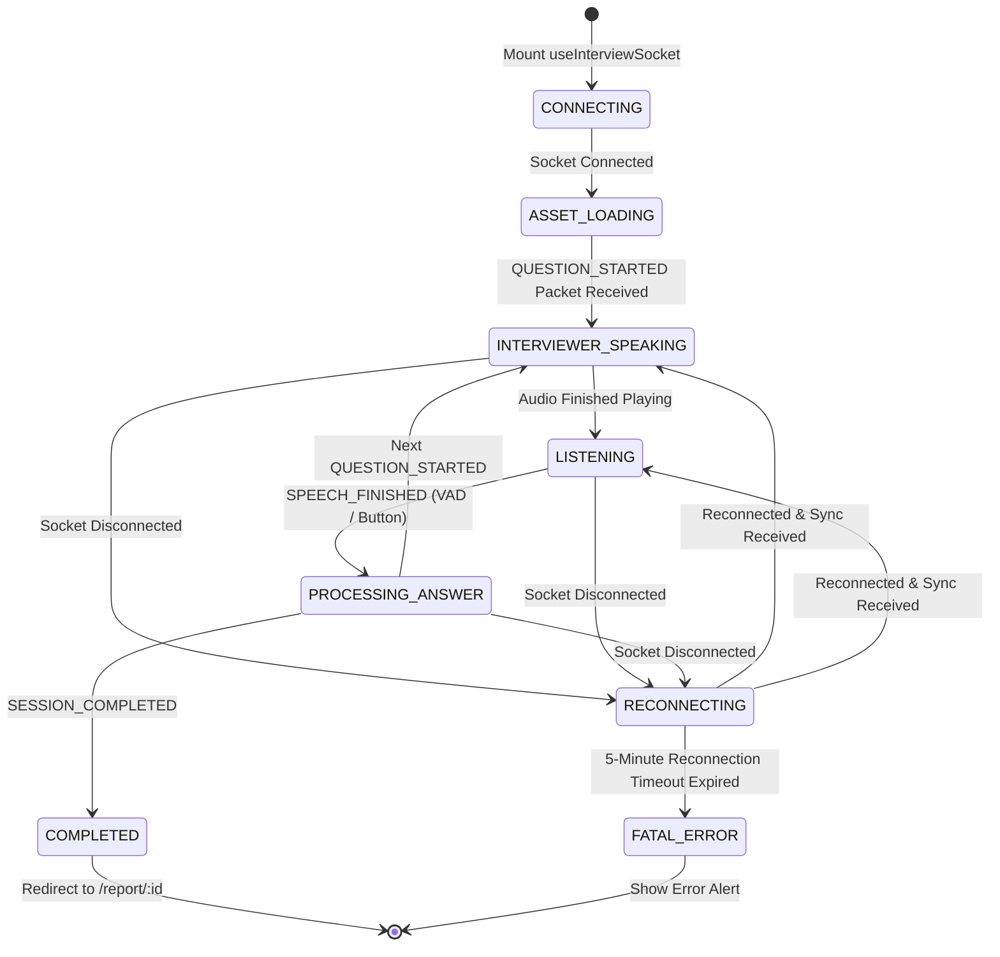
```mermaid
stateDiagram-v2
    [*] --> CONNECTING : Mount useInterviewSocket
    CONNECTING --> ASSET_LOADING : Socket Connected
    ASSET_LOADING --> INTERVIEWER_SPEAKING : QUESTION_STARTED Packet Received
    INTERVIEWER_SPEAKING --> LISTENING : Audio Finished Playing
    LISTENING --> PROCESSING_ANSWER : SPEECH_FINISHED (VAD / Button)
    PROCESSING_ANSWER --> INTERVIEWER_SPEAKING : Next QUESTION_STARTED
    PROCESSING_ANSWER --> COMPLETED : SESSION_COMPLETED
    
    INTERVIEWER_SPEAKING --> RECONNECTING : Socket Disconnected
    LISTENING --> RECONNECTING : Socket Disconnected
    PROCESSING_ANSWER --> RECONNECTING : Socket Disconnected
    
    RECONNECTING --> INTERVIEWER_SPEAKING : Reconnected & Sync Received
    RECONNECTING --> LISTENING : Reconnected & Sync Received
    RECONNECTING --> FATAL_ERROR : 5-Minute Reconnection Timeout Expired
    
    COMPLETED --> [*] : Redirect to /report/:id
    FATAL_ERROR --> [*] : Show Error Alert
```
- **Observable Acceptance Criteria:**
  - [ ] When `QUESTION_STARTED` arrives, transitions state to `INTERVIEWER_SPEAKING`, triggers audio playback, and passes visemes to the lip-sync controller.
  - [ ] When interviewer audio finishes playing, automatically transitions state to `LISTENING` and activates microphone capture.
  - [ ] When candidate stops speaking, sends `SPEECH_FINISHED` and transitions state to `PROCESSING_ANSWER`.
  - [ ] When `SESSION_COMPLETED` arrives, transitions state to `COMPLETED` and redirects to `/report/[id]`.
- **Edge Cases & Error Handling:**
  - [ ] WebSocket disconnect triggers automatic exponential backoff reconnection attempts (up to 5 attempts) and transitions state to `RECONNECTING`.
  - [ ] If WebGL context fails, cleanly emits degraded mode event allowing UI to switch to 2D voice mode without crashing the socket.
- **Verification:**
  - [ ] Hook unit test with mocked WebSocket: `pnpm test src/hooks/useInterviewSocket.test.ts`
- **Dependencies:** Tasks 5.2, 5.3, 4.2, 4.3
- **Files touched:** `frontend/src/hooks/useInterviewSocket.ts`, `frontend/src/types/websocket.ts`
- **Scope & Risk:** Medium (3 files) | **Risk:** High (Needs rigorous design pass for state transitions)

#### Task 5.5: Build 3D Interview Room UI & HUD Integration
- **Description:** Assemble the complete 3D interview room page (`/interview/[id]/room`) integrating the `AvatarCanvas`, `AudioVisualizer`, live transcript streamer, question progress bar, timer, pause/end controls, and degraded 2D audio-only fallback mode.
- **Interview Room Reactive Component Topology:**
```mermaid
flowchart TD
    subgraph Hook ["useInterviewSocket (FSM Engine)"]
        FSMState["Current State (SPEAKING | LISTENING | THINKING)"]
        AudioStream["Audio & Viseme Streams"]
        TranscriptData["Live Streaming Transcript"]
    end

    subgraph VisualPresentation ["3D / 2D Presentation Layer"]
        AvatarCanvas["AvatarCanvas (3D WebGL Avatar)"]
        AudioViz["AudioVisualizer (2D Fallback / Mic Waveform)"]
    end

    subgraph HUDControls ["HUD Overlay Layer"]
        StatusBadge["State Status Badge (Pulse Animation)"]
        ProgressBar["Question Progress Bar (Q 2/5)"]
        LiveTranscript["TranscriptStreamer Component"]
        Controls["Mute Mic / Finish Speaking / End Interview"]
        ReconModal["Reconnecting Modal (5m Countdown)"]
    end

    FSMState --> StatusBadge
    FSMState --> Controls
    AudioStream --> AvatarCanvas
    AudioStream --> AudioViz
    TranscriptData --> LiveTranscript
    FSMState -- "RECONNECTING" --> ReconModal
```
- **Observable Acceptance Criteria:**
  - [ ] HUD displays status badge matching current state: "Interviewer Speaking" (blue pulse), "Listening to You..." (green waveform), "Thinking..." (amber spinner).
  - [ ] Question counter shows progress (e.g. "Question 2 of 5").
  - [ ] Live transcript box shows streaming partial text and scrolls automatically to latest sentence.
  - [ ] "End Interview" button opens a confirmation modal before triggering `END_SESSION_EARLY`.
  - [ ] "Mute / Unmute" toggle controls local microphone track cleanly.
- **Edge Cases & Error Handling:**
  - [ ] Degraded mode toggle allows candidate on low-end hardware to switch from 3D avatar to 2D audio visualizer seamlessly mid-interview.
  - [ ] Reconnecting overlay displays animated spinner and 5-minute countdown during temporary network drops.
- **Verification:**
  - [ ] Component & room integration tests: `pnpm test src/app/(candidate)/interview/`
  - [ ] Manual test: Complete a 3-question mock interview in browser with forced network disconnect test.
- **Dependencies:** Tasks 5.4, 4.1, 4.3
- **Files touched:** `frontend/src/app/(candidate)/interview/[id]/room/page.tsx`, `frontend/src/components/interview/InterviewHUD.tsx`, `frontend/src/components/interview/TranscriptStreamer.tsx`, `frontend/src/components/interview/ReconnectingModal.tsx`
- **Scope & Risk:** Medium (4 files) | **Risk:** Medium

---

### 🛑 Checkpoint 5: Real-Time 3D Voice Interview Fully Functional
- [ ] Candidate starts interview session from configured JD.
- [ ] 3D Avatar speaks opening question with real-time lip sync.
- [ ] Candidate answers by voice; audio is transcribed and evaluated in <1.8s turnaround.
- [ ] AI asks contextual follow-up questions before advancing to next topic.
- [ ] Reconnection protocol gracefully resumes session if connection drops.
- [ ] Session completes cleanly and navigates to report view.

---

### Phase 6: Post-Interview AI Evaluation & Performance Reporting (Vertical Slice)

#### Task 6.1: Multi-Dimensional AI Evaluation Engine
- **Description:** Implement evaluation engine (`internal/usecase/evaluation_usecase.go`) that analyzes the full interview transcript against the original JD requirements across 5 rubric competencies (Technical Accuracy 30%, Depth 25%, Problem-Solving 20%, Relevance 15%, Clarity 10%) and calculates domain sub-scores.
- **Weighted Rubric Evaluation Pipeline:**
```mermaid
flowchart TD
    Inputs["Full Session Transcript + Blueprint JD Requirements"] --> LLMEvalEngine["LLM Multi-Rubric Evaluation Engine"]
    
    subgraph Rubrics ["Weighted Competency Rubric (100% Total)"]
        R1["1. Technical Accuracy (30%)"]
        R2["2. Technical Depth & Nuance (25%)"]
        R3["3. Problem-Solving & Architecture (20%)"]
        R4["4. Relevance & Precision (15%)"]
        R5["5. Communication & Clarity (10%)"]
    end

    LLMEvalEngine --> Rubrics
    Rubrics --> Aggregator["Score Aggregator & Feedback Synthesizer (<15s)"]
    
    Aggregator --> OutputScores["1. Overall Score (0-100) & Domain Scores"]
    Aggregator --> OutputFeedback["2. Top 3 Strengths & Top 3 Weaknesses"]
    Aggregator --> OutputCritique["3. Question-by-Question Detailed Critique"]
    Aggregator --> OutputRoadmap["4. Personalized Actionable Learning Roadmap"]
    
    OutputScores & OutputFeedback & OutputCritique & OutputRoadmap --> PersistReport[("Save to performance_reports Table")]
```
- **Observable Acceptance Criteria:**
  - [ ] Computes overall score (0.00 to 100.00) based on weighted rubric.
  - [ ] Produces JSON domain scores (e.g. `{"Golang Concurrency": 85, "Database Design": 70}`), top 3 strengths, top 3 weaknesses, and question-level feedback.
  - [ ] Generates concrete, actionable learning roadmap (study topics, documentation links).
  - [ ] Entire evaluation completes in < 15 seconds.
- **Edge Cases & Error Handling:**
  - [ ] Early terminated session produces partial evaluation with explicit notice: *"Evaluation generated based on partial interview completion."*
- **Verification:**
  - [ ] Unit tests pass: `go test -v ./internal/usecase/evaluation_usecase_test.go`
- **Dependencies:** Tasks 5.1, 3.1
- **Files touched:** `backend/internal/domain/evaluation.go`, `backend/internal/usecase/evaluation_usecase.go`, `backend/internal/platform/llm/evaluator.go`
- **Scope & Risk:** Small (3 files) | **Risk:** Medium (LLM scoring consistency)

#### Task 6.2: Evaluation Repository & REST Endpoints
- **Description:** Implement PostgreSQL repository for `performance_reports` and HTTP endpoints (`GET /api/v1/interviews/:id/report`, `GET /api/v1/interviews/history`).
- **Report Retrieval & Ownership Check Flow:**
```mermaid
flowchart TD
    CandidateReq["Candidate GET /api/v1/interviews/:id/report"] --> AuthCheck{"Authenticated & Session Owner?"}
    AuthCheck -- No --> Err403["Return 403 Forbidden"]
    AuthCheck -- Yes --> QueryRepo["Query performance_reports Table"]
    
    QueryRepo --> ReportExists{"Report Generated?"}
    ReportExists -- Yes --> Ret200["Return 200 OK with Full Rubric JSON"]
    ReportExists -- No --> CheckStatus{"Session Status"}
    CheckStatus -- IN_PROGRESS --> Ret400["Return 400 Bad Request: Interview Still In Progress"]
    CheckStatus -- COMPLETED --> Ret202["Return 202 Accepted: Evaluation Generating"]
```
- **Observable Acceptance Criteria:**
  - [ ] `GET /interviews/:id/report` returns full evaluation payload with domain scores and question critique.
  - [ ] `GET /interviews/history` returns paginated list of candidate's past sessions with status, date, JD title, and overall score.
- **Edge Cases & Error Handling:**
  - [ ] Requesting report for an ongoing or incomplete session returns `400 Bad Request: Evaluation not ready`.
- **Verification:**
  - [ ] Integration tests pass: `go test -v ./internal/delivery/http/interview_handler_test.go`
- **Dependencies:** Task 6.1
- **Files touched:** `backend/internal/repository/postgres/evaluation_repository.go`, `backend/internal/delivery/http/interview_handler.go`, `backend/internal/delivery/http/router.go`
- **Scope & Risk:** Small (3 files) | **Risk:** Low

#### Task 6.3: Frontend Evaluation Report & Radar Chart Dashboard
- **Description:** Build report page (`/report/[id]`) and history page (`/history`) with Recharts Radar chart, competency scorecards, collapsible question-by-question transcript critique, and PDF download button.
- **Report Visualization Data Flow:**
```mermaid
flowchart LR
    ReportData["Evaluation JSON Payload"] --> RadarChart["Recharts Radar Chart<br/>(Multi-Axis Domain Competencies)"]
    ReportData --> ScoreCards["Competency Score Cards<br/>(Percentage & Badges)"]
    ReportData --> Accordion["Collapsible Question Feedback<br/>(What you said vs How to improve)"]
    ReportData --> RoadmapList["Learning Roadmap<br/>(Targeted study topics & resources)"]
    ReportData --> PDFExport["Print / Save PDF Export<br/>(Clean printable stylesheet)"]
```
- **Observable Acceptance Criteria:**
  - [ ] Radar chart displays multi-axis domain competencies with tooltips.
  - [ ] Scorecards display percentage score, badge (Excellent / Good / Needs Improvement), and summary comment.
  - [ ] Accordion view allows candidate to expand each question to see what they said vs how to improve.
  - [ ] "Print / Save PDF" triggers clean print stylesheet format without navigation bars.
- **Verification:**
  - [ ] Component tests pass: `pnpm test src/app/(candidate)/report/`
- **Dependencies:** Tasks 1.3, 6.2
- **Files touched:** `frontend/src/app/(candidate)/report/[id]/page.tsx`, `frontend/src/app/(candidate)/history/page.tsx`, `frontend/src/components/report/DomainRadarChart.tsx`, `frontend/src/components/report/CompetencyCard.tsx`, `frontend/src/components/report/QuestionFeedbackList.tsx`
- **Scope & Risk:** Medium (5 files) | **Risk:** Low

---

### 🛑 Checkpoint 6: AI Evaluation & Reports Working End-to-End
- [ ] Completed session automatically generates comprehensive evaluation report in <15s.
- [ ] Radar chart renders domain competencies accurately.
- [ ] Candidate can review past sessions in history dashboard and export reports to PDF.

---

### Phase 7: Admin Management Portal & System Analytics (Vertical Slice)

#### Task 7.1: Admin Management API Endpoints & Usecases
- **Description:** Implement Admin usecases and endpoints (`GET /api/v1/admin/users`, `PUT /users/:id/lock`, `GET /admin/sessions`, `CRUD /admin/domains`, `CRUD /admin/avatars`).
- **Admin User Lock & Session Termination Flowchart:**
```mermaid
flowchart TD
    AdminAction["Admin PUT /api/v1/admin/users/:id/lock"] --> VerifyAdmin{"Role == ADMIN?"}
    VerifyAdmin -- No --> Ret403["Return 403 Forbidden"]
    VerifyAdmin -- Yes --> UpdateDB["Set is_locked = true in PostgreSQL"]
    
    UpdateDB --> ActiveSessionCheck{"User has Active WebSocket Session in Redis?"}
    ActiveSessionCheck -- Yes --> ForceDisconnect["Send WS_ERROR (Fatal: Account Locked) & Close Socket"]
    ForceDisconnect --> MarkInterrupted["Mark Active Session as INTERRUPTED"]
    ActiveSessionCheck -- No --> Done["Return 200 OK"]
    MarkInterrupted --> Done
```
- **Observable Acceptance Criteria:**
  - [ ] Enforces `ADMIN` role access on all routes; unauthorized requests receive `403 Forbidden`.
  - [ ] Admin can view paginated candidate list and toggle account lock status.
  - [ ] Admin can inspect any session's full transcripts and audio playback links.
- **Edge Cases & Error Handling:**
  - [ ] Locking an account with an active live session immediately triggers WebSocket disconnection and forces session termination.
- **Verification:**
  - [ ] Integration tests pass: `go test -v ./internal/delivery/http/admin_handler_test.go`
- **Dependencies:** Tasks 2.2, 5.1
- **Files touched:** `backend/internal/usecase/admin_usecase.go`, `backend/internal/delivery/http/admin_handler.go`, `backend/internal/delivery/http/router.go`
- **Scope & Risk:** Small (3 files) | **Risk:** Low

#### Task 7.2: Platform Analytics & Skill Weakness Aggregator
- **Description:** Build backend aggregation queries and usecase for system metrics: total sessions, completion rates, average scores, and top candidate skill weaknesses across all completed sessions.
- **Analytics Caching & Aggregation Pipeline:**
```mermaid
flowchart LR
    Query["Admin Requests Platform Analytics"] --> CacheCheck{"Redis Cache Hit? (15m TTL)"}
    CacheCheck -- Yes --> ServeCache["Return Cached Metrics JSON"]
    CacheCheck -- No --> PostgresAgg["Execute Aggregate SQL on performance_reports & session_turns"]
    PostgresAgg --> Calc["Calculate: Total Sessions, Avg Scores, Top 10 Skill Weaknesses"]
    Calc --> CacheSet["Cache in Redis (TTL: 15m)"]
    CacheSet --> ReturnResponse["Return 200 OK Analytics Data"]
```
- **Observable Acceptance Criteria:**
  - [ ] Computes aggregate statistics using optimized PostgreSQL group queries and Redis caching (15-minute TTL).
  - [ ] Returns top 10 most common technical skill gaps identified across all candidates.
- **Verification:**
  - [ ] Query performance test: `go test -v ./internal/repository/postgres/analytics_test.go`
- **Dependencies:** Tasks 6.1, 7.1
- **Files touched:** `backend/internal/repository/postgres/analytics_repository.go`, `backend/internal/delivery/http/admin_handler.go`
- **Scope & Risk:** Small (2 files) | **Risk:** Low

#### Task 7.3: Frontend Admin Dashboard & Analytics UI
- **Description:** Build Admin portal (`/admin/dashboard`, `/admin/users`, `/admin/sessions`, `/admin/domains`) with KPI metric cards, user lock toggles, session inspection modals, and skill weakness bar charts.
- **Admin Portal Component Structure:**
```mermaid
flowchart TD
    AdminRoot["Admin Layout (/admin/*)"] --> KPICards["KPI Metric Cards (Total Users, Active Rooms, Avg Score)"]
    AdminRoot --> UsersTable["Users Management Table (Search, Lock/Unlock Toggle)"]
    AdminRoot --> SessionViewer["Session Audit Modal (Live inspection, transcripts, audio)"]
    AdminRoot --> WeaknessBarChart["Skill Weakness Bar Chart (Top 10 Global Candidate Gaps)"]
```
- **Observable Acceptance Criteria:**
  - [ ] Dashboard displays KPI cards: Total Registered Users, Active Live Sessions, Average Interview Score.
  - [ ] Users table provides instant search by email/name and one-click account lock/unlock with confirmation.
  - [ ] Bar chart displays most frequent technical weaknesses (e.g. "Go Channel Buffering: 45% error rate").
- **Verification:**
  - [ ] Component tests pass: `pnpm test src/app/(admin)/`
- **Dependencies:** Tasks 1.3, 7.2
- **Files touched:** `frontend/src/app/(admin)/dashboard/page.tsx`, `frontend/src/app/(admin)/users/page.tsx`, `frontend/src/app/(admin)/sessions/page.tsx`, `frontend/src/components/admin/AdminSidebar.tsx`
- **Scope & Risk:** Medium (4 files) | **Risk:** Low

---

### 🛑 Checkpoint 7: Admin Governance & Analytics Operational
- [ ] Admin dashboard displays platform KPIs and candidate metrics.
- [ ] Locking candidate account restricts login and terminates active WebSocket sessions.
- [ ] System analytics bar chart surfaces aggregate technical weaknesses.

---

### Phase 8: End-to-End Integration, Fault Injection, CI/CD & Launch

#### Task 8.1: Backend Integration & WebSocket Concurrency Test Harness
- **Description:** Build automated integration test suite using `testcontainers-go` (real PostgreSQL + Redis) and a simulated multi-client WebSocket test harness (simulating 20 concurrent voice interview sessions).
- **Concurrency Test Architecture Diagram:**
```mermaid
flowchart TD
    TestRunner["Go Test Runner (testcontainers-go)"] --> SpinContainers["Provision Clean PostgreSQL 16 & Redis 7"]
    SpinContainers --> MockAI["Spin Mock STT / TTS / LLM Servers"]
    MockAI --> WSLoadHarness["Spawn 20 Concurrent Goroutine WS Clients"]
    
    subgraph ConcurrencyExecution ["Simultaneous Session Simulation"]
        WSLoadHarness --> C1["Client 1: Full Voice Turn Stream"]
        WSLoadHarness --> C2["Client 2: Mid-Session Disconnect & Reconnect"]
        WSLoadHarness --> CN["Client N: Silence Timeout & Early Termination"]
    end

    ConcurrencyExecution --> Assert["Verify Zero Deadlocks, Zero Race Conditions (-race), Clean DB Finalization"]
```
- **Observable Acceptance Criteria:**
  - [ ] 100% pass on all API endpoint contract tests.
  - [ ] 20 simulated concurrent WebSocket sessions complete without race conditions, deadlocks, or memory leaks.
- **Verification:**
  - [ ] `go test -v -race ./tests/integration/...`
- **Dependencies:** Tasks 5.2, 7.2
- **Files touched:** `backend/tests/integration/api_test.go`, `backend/tests/integration/ws_concurrency_test.go`, `backend/tests/integration/setup_test.go`
- **Scope & Risk:** Small (3 files) | **Risk:** Medium

#### Task 8.2: Playwright End-to-End Automated Test Suite & Fault Injection
- **Description:** Implement Playwright E2E browser tests covering:
  1. Candidate registration -> Login -> Protected route access.
  2. JD upload -> Skill adjustment -> Blueprint confirmation.
  3. Real-time interview session with simulated audio chunks -> Adaptive follow-up -> Report generation.
  4. Network fault injection: Simulate abrupt WebSocket disconnect mid-interview and verify automatic reconnection and state restoration.
  5. Admin login -> User lock -> Verify candidate barred.
- **End-to-End Network Fault Injection Flow:**
```mermaid
sequenceDiagram
    autonumber
    actor TestRunner as Playwright Test Runner
    participant Browser as Headless Chromium
    participant WS as WebSocket Server
    participant Redis as Redis Cache

    TestRunner->>Browser: Start Interview at /interview/123/room
    Browser->>WS: Connect WebSocket
    WS-->>Browser: QUESTION_STARTED (Question 1)
    TestRunner->>Browser: Inject Simulated Audio Stream
    Browser->>WS: SPEECH_FINISHED
    WS-->>Browser: QUESTION_STARTED (Question 2)
    
    Note over TestRunner,Browser: Fault Injection: Abruptly kill WebSocket connection
    TestRunner->>Browser: Simulate Network Interface Drop
    Browser->>Browser: Transition UI to RECONNECTING state (Display Modal)
    TestRunner->>Browser: Restore Network Interface
    Browser->>WS: Reconnect with JWT Session Token
    WS->>Redis: Fetch Turn 2 State
    WS-->>Browser: RECONNECTED_SYNC (Question 2, Remaining Time)
    Browser->>Browser: Resume Interview at Question 2 without Data Loss
```
- **Observable Acceptance Criteria:**
  - [ ] All E2E test specs pass headlessly in CI.
  - [ ] Reconnection fault test proves session resumes at correct question index without lost data.
- **Verification:**
  - [ ] `pnpm test:e2e`
- **Dependencies:** Tasks 2.3, 3.3, 5.5, 6.3, 7.3
- **Files touched:** `frontend/e2e/auth.spec.ts`, `frontend/e2e/interview-fsm.spec.ts`, `frontend/e2e/admin.spec.ts`, `frontend/playwright.config.ts`
- **Scope & Risk:** Medium (4 files) | **Risk:** Medium

#### Task 8.3: Multi-Stage Production Dockerfiles, Nginx Reverse Proxy & CI/CD Pipelines
- **Description:** Create multi-stage production Dockerfiles (`CGO_ENABLED=0` Go binary <25MB, standalone Next.js build), Nginx reverse proxy configuration with WebSocket upgrade headers and SSL termination, and GitHub Actions CI workflow.
- **Production Ingress & Container Topology:**
```mermaid
flowchart TD
    Client["Browser Client HTTPS / WSS Traffic"] --> Nginx["Nginx Reverse Proxy (SSL Termination & Rate-Limit)"]
    
    Nginx -- "Path: /api/*" --> GoBackend["Go Production Container (Scratch/Alpine <25MB Binary)"]
    Nginx -- "Path: /ws/*" --> GoBackend
    Nginx -- "Path: /*" --> NextFrontend["Next.js 15 Standalone Production Container"]
    
    GoBackend --> PostgresDB[("PostgreSQL 16 Database")]
    GoBackend --> RedisCache[("Redis 7 In-Memory Cache")]
```
- **Observable Acceptance Criteria:**
  - [ ] GitHub Actions workflow executes linting, unit tests, integration tests, and docker build on PRs.
  - [ ] Production Docker Compose boots all services with zero configuration drift.
  - [ ] Nginx proxies HTTP and WebSocket traffic seamlessly with `Upgrade` and `Connection: upgrade` headers.
- **Verification:**
  - [ ] `docker compose -f docker-compose.prod.yml build`
  - [ ] CI pipeline dry-run passes.
- **Dependencies:** All previous tasks
- **Files touched:** `backend/Dockerfile`, `frontend/Dockerfile`, `nginx/nginx.conf`, `docker-compose.prod.yml`, `.github/workflows/ci.yml`
- **Scope & Risk:** Medium (5 files) | **Risk:** Low

---

### 🛑 Checkpoint 8: Final Quality Gate & Capstone Delivery
- [ ] All unit, integration, concurrency, and E2E fault-injection tests pass.
- [ ] Production container build succeeds and runs with Nginx proxy.
- [ ] Capstone deliverables and documentation aligned with working implementation.

---

## 4. Task Sizing, Risk & Parallelization Matrix

| Phase | Small (1–3 files) | Medium (4–5 files) | High-Risk Tasks | Total Tasks | Parallelizable? |
|---|---|---|---|---|---|
| **Phase 1: Foundation** | 2 | 2 | 0 | 4 | Backend (1.1, 1.2) & Frontend (1.3) in parallel |
| **Phase 2: Auth & RBAC** | 1 | 2 | 0 | 3 | Go Auth (2.1, 2.2) & Next.js Auth UI (2.3) |
| **Phase 3: JD Analysis** | 2 | 1 | 1 (3.1) | 3 | LLM/API (3.1, 3.2) & Frontend UI (3.3) |
| **Phase 4: 3D & Audio** | 2 | 2 | 2 (4.2, 4.4) | 4 | Three.js (4.1, 4.2) & Audio/STT/TTS (4.3, 4.4) |
| **Phase 5: Real-Time Interview** | 2 | 3 | 3 (5.2, 5.3, 5.4) | 5 | Sequential (FSM contract -> WS Hub -> AI -> Hook -> HUD) |
| **Phase 6: Evaluation & Reports** | 2 | 1 | 1 (6.1) | 3 | Go Evaluation API (6.1, 6.2) & Radar Chart UI (6.3) |
| **Phase 7: Admin & Analytics** | 2 | 1 | 0 | 3 | Admin API (7.1, 7.2) & Admin Portal UI (7.3) |
| **Phase 8: Hardening & CI/CD** | 1 | 2 | 1 (8.2) | 3 | Backend harness (8.1) & Playwright (8.2) & Docker/CI (8.3) |
| **Total** | **14 Tasks** | **12 Tasks** | **8 High-Risk** | **26 Tasks** | — |
