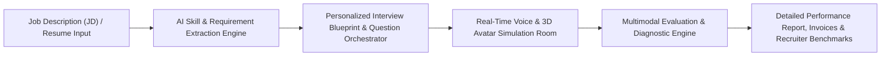
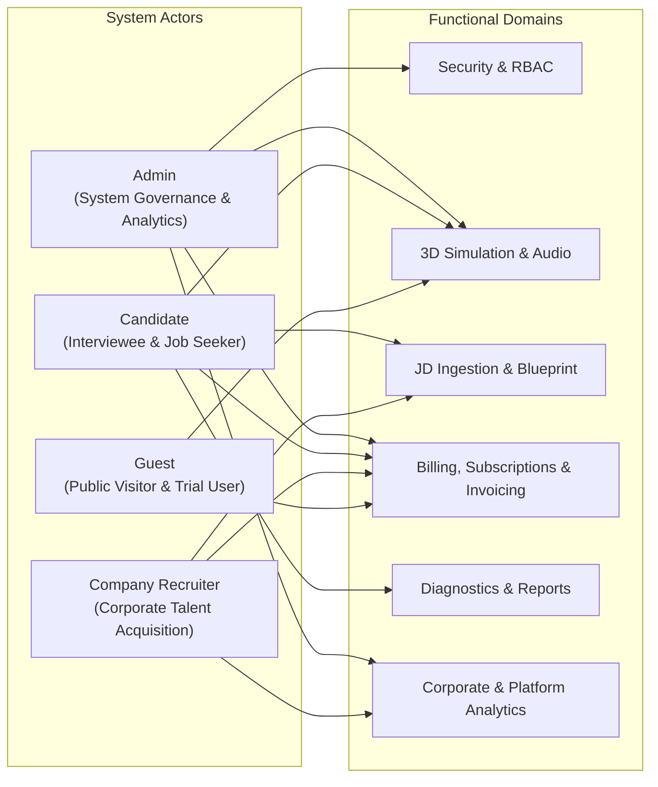
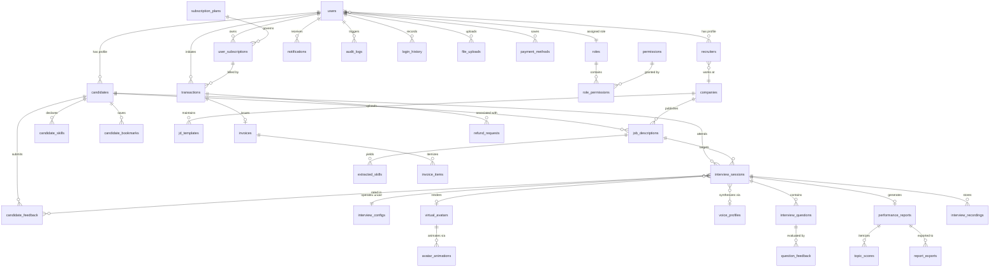
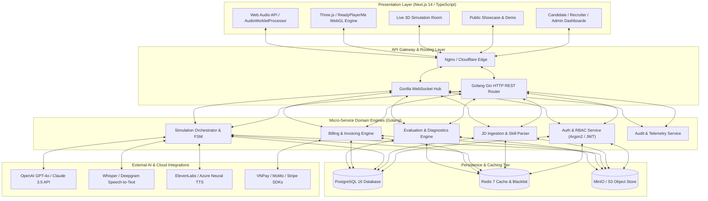
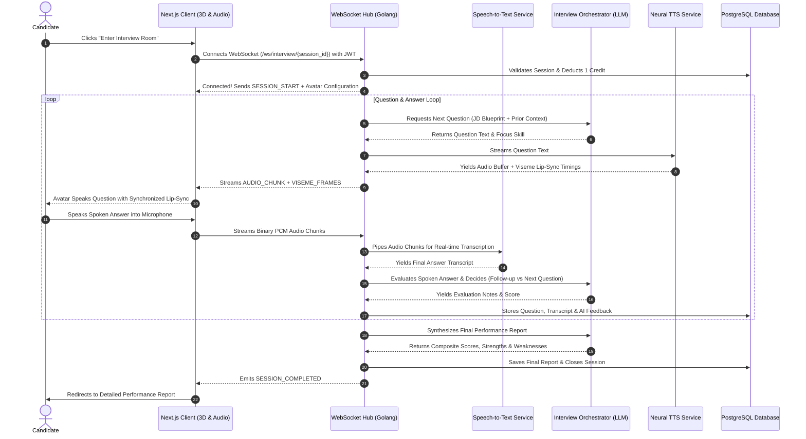
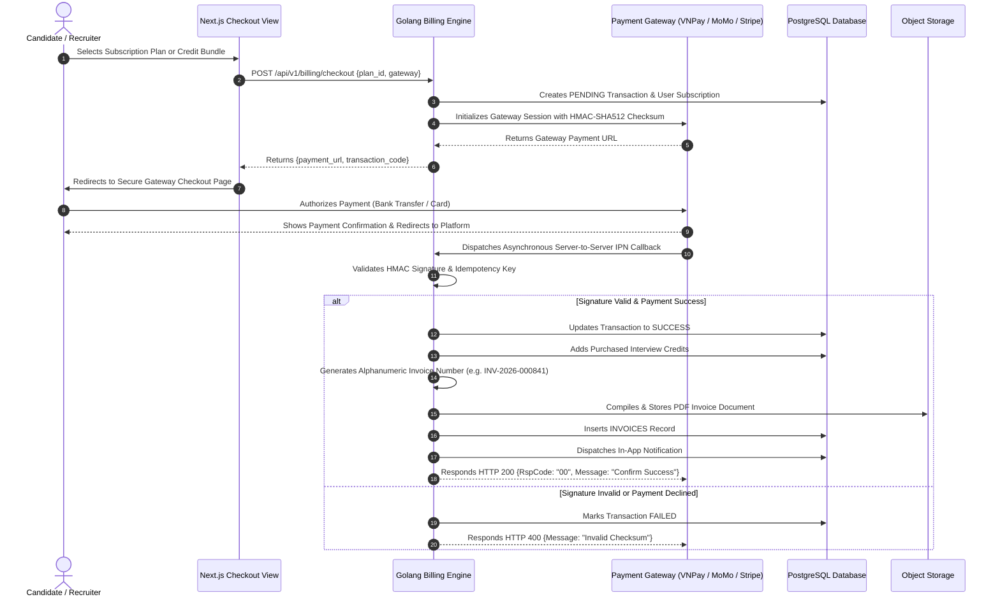
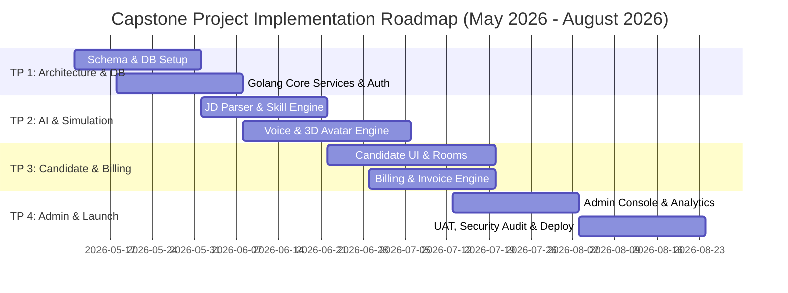

# CAPSTONE PROJECT REGISTER (COMPREHENSIVE EXPANDED PROPOSAL)

**Class:** SE1900-CAPSTONE  
**Duration time:** From 11/05/2026 to 25/08/2026  
**Profession:** Software Engineer  
**Specialty:** Golang - NextJS - AI Integration  
**Kinds of person make registers:** Lecturer & Students  

---

## 1. Register Information for the Supervisor

| No. | Full name | Phone | E-Mail | Title |
|---|---|---|---|---|
| Supervisor 1 | Nguyễn Thế Hoàng | 0986 628 525 | hoangnt20@fe.edu.vn | Mr. |

---

## 2. Register Information for Students

| No. | Full name | Student code | Phone | Email | Role in Group |
|---|---|---|---|---|---|
| 1 | Tô Chí Bảo | SE190084 | 0901 234 567 | baotcse190084@fpt.edu.vn | Full Stack Engineer |
| 2 | Huỳnh Minh Khang | SE192197 | 0912 345 678 | khanghmse192197@fpt.edu.vn | Full Stack Engineer |
| 3 | Nguyễn Huỳnh Nhật Anh | SE190291 | 0923 456 789 | anhnhnse190291@fpt.edu.vn | Team Leader / Full Stack Engineer |
| 4 | Nguyễn Tấn Trọng | SE190353 | 0934 567 890 | trongntse190353@fpt.edu.vn | Full Stack Engineer |
| 5 | Đặng Phương Nam | SE192107 | 0945 678 901 | namdpse192107@fpt.edu.vn | Full Stack Engineer |

---

## 3. Register Content of the Capstone Project

### 3.1. Capstone Project Name

- **English:** Design and Development of an AI-Powered Virtual Technical Interview Simulation Platform with a 3D Virtual Interviewer
- **Vietnamese:** Xây dựng nền tảng mô phỏng phỏng vấn kỹ thuật trực tuyến ứng dụng trí tuệ nhân tạo và nhân vật 3D ảo

---

### A. Context and Problem Statement

Technical interviews represent the decisive gateway for computing students, junior software developers, and experienced engineers transitioning into high-growth software engineering roles. In the contemporary software recruitment ecosystem, candidates face systemic barriers:

1. **Generic, Static Question Banks:** Industry standard portals (LeetCode, HackerRank, GeeksforGeeks) present isolated algorithmic puzzles or memorization-heavy trivia. They completely detach candidate preparation from the holistic technical stack, architecture, and engineering philosophy required in real-world corporate Job Descriptions (JDs).
2. **Exorbitant Cost and Limited Availability of Mock Interviews:** One-on-one technical mock sessions with human Lead/Principal Engineers range from $80 to $250+ per hour. Scheduling logistics across corporate time zones make continuous, iterative interview practice practically unattainable for college seniors and entry-level developers.
3. **Absence of Real-Time Adaptive Dialogue:** Traditional automated interview practice tools use rigid, predefined question sequences. They cannot detect candidate misconceptions, parse spoken technical explanations, or dynamically pose contextual follow-up questions to probe the depth of candidate reasoning.
4. **Superficial and Non-Actionable Diagnostics:** Conventional testing platforms provide binary pass/fail ratings or generic numerical scores. They fail to deliver multi-dimensional diagnostic breakdowns across technical accuracy, architectural trade-off reasoning, communication structure, and targeted learning roadmaps aligned with the specific JD.
5. **Corporate Hiring Inefficiencies:** Enterprise employers and engineering talent acquisition teams spend hundreds of senior engineering hours conducting first-round technical screenings. They lack automated, objective, JD-tailored simulation solutions to benchmark applicant pools prior to live human rounds.

---

### B. Proposed Solution & Core Value Pillars

The project designs and builds an enterprise-grade, full-stack AI-Powered Virtual Technical Interview Simulation Platform. The platform bridges the gap between individual technical preparation and corporate hiring standards through four interconnected technological pillars:

1. **Intelligent JD Deconstruction & Competency Blueprinting:** Automated ingestion of raw text or PDF/DOCX Job Descriptions using Large Language Models (LLMs) to isolate required languages, backend/frontend frameworks, database paradigms, architectural patterns, and expected seniority tiers.
2. **Adaptive Real-Time Conversational Orchestration:** Context-aware dialogue management featuring dynamic follow-up questioning based on candidate answers, evaluating theoretical grasp, code comprehension, and trade-off justification.
3. **Immersive WebGL 3D Virtual Interviewer:** High-fidelity 3D avatar rendering in modern web browsers with real-time Speech-to-Text (STT), low-latency neural Text-to-Speech (TTS), and synchronized blendshape phoneme/viseme lip-sync animation.
4. **Enterprise Monetization, Invoicing & Corporate Talent Analytics:** Robust commercial billing architecture supporting subscription tiers, credit-based interview packages, automated tax invoice generation, and recruiter dashboards for anonymized candidate competency benchmarking.

---

## 4. System Actors & Access Control (4 Actors)

The platform models **4 primary actors** with distinct operational roles, permission boundaries, and functional journeys:

| Actor | Role Definition | Access Scope & Responsibilities |
|---|---|---|
| **Admin** | System Administrator | Oversees platform health, candidate and corporate accounts, interview session auditing, 3D avatar and voice catalogs, global system configurations, revenue analytics, invoice logs, and refund adjudications. |
| **Candidate** | Student / Software Engineer | Ingests target JDs, customizes and undertakes real-time voice-based virtual interviews, reviews diagnostic performance reports, manages subscription credits, inspects transaction ledgers, and downloads tax invoices. |
| **Company Recruiter** | Corporate Employer / HR Representative | Registers verified corporate accounts, maintains company branding, publishes organizational JDs, inspects anonymized talent pool competency analytics, and purchases enterprise recruiter subscription tiers. |
| **Guest** | Unauthenticated Public Visitor | Discovers platform value propositions, reviews subscription pricing matrices, explores public showcase JDs, and experiences an interactive demo interview session. |

---

## 5. Comprehensive Use Case Specification (60 Use Cases)

To provide the capstone team with abundant architectural depth, rich feature selection, and clear individual ownership, the project defines **60 fully structured use cases**. Each of the **5 team members is assigned exactly 12 use cases** (exceeding the 10 use case minimum requirement).

```mermaid
graph TB
    subgraph "Actors"
        ADM[Admin]
        CND[Candidate]
        REC[Company Recruiter]
        GST[Guest]
    end

    subgraph "Member 1: Nguyễn Huỳnh Nhật Anh - Admin Core & Governance (12 UCs)"
        UC01[UC-01: View & Search User Accounts]
        UC02[UC-02: Lock / Unlock User Account]
        UC03[UC-03: View System Executive Dashboard]
        UC04[UC-04: View & Filter Interview Sessions]
        UC05[UC-05: View Session Diagnostics & Transcript]
        UC06[UC-06: Manage Virtual 3D Avatars Catalog]
        UC07[UC-07: Manage Voice Synthesizer Profiles]
        UC08[UC-08: Broadcast System Notifications]
        UC09[UC-09: Review & Process Refund Requests]
        UC10[UC-10: Approve / Reject Company Registrations]
        UC11[UC-11: Manage Role-Based Permissions]
        UC12[UC-12: Terminate Live Abandoned Sessions]
    end

    subgraph "Member 2: Tô Chí Bảo - Candidate Interview Core & AI (12 UCs)"
        UC13[UC-13: Register Candidate Account]
        UC14[UC-14: User Authentication & JWT Session]
        UC15[UC-15: Manage Candidate Profile & Resume]
        UC16[UC-16: Upload & Parse Job Description]
        UC17[UC-17: View Extracted Competencies & Skills]
        UC18[UC-18: Edit & Confirm Skill Blueprint]
        UC19[UC-19: Configure Simulation Parameters]
        UC20[UC-20: Test Audio Input & Microphone Readiness]
        UC21[UC-21: Conduct AI Virtual Interview Room]
        UC22[UC-22: Resume Interrupted Interview Session]
        UC23[UC-23: View Historical Interview Attempts]
        UC24[UC-24: View Comprehensive Performance Report]
    end

    subgraph "Member 3: Huỳnh Minh Khang - Billing, Invoicing & Account (12 UCs)"
        UC25[UC-25: View Subscription Plans & Credit Bundles]
        UC26[UC-26: Subscribe to Plan / Purchase Credits]
        UC27[UC-27: Process Payment via Gateway Webhook]
        UC28[UC-28: Cancel / Toggle Auto-Renewal]
        UC29[UC-29: View User Billing & Transaction History]
        UC30[UC-30: View & Download Digital Tax Invoice PDF]
        UC31[UC-31: Submit Refund Dispute Request]
        UC32[UC-32: View Refund Dispute Status & Notes]
        UC33[UC-33: Rate Simulation & Submit Feedback]
        UC34[UC-34: Export Performance Report to PDF]
        UC35[UC-35: View Tailored Learning Recommendations]
        UC36[UC-36: Reset & Change User Account Password]
    end

    subgraph "Member 4: Nguyễn Tấn Trọng - Recruiter & Guest Portal (12 UCs)"
        UC37[UC-37: Register Enterprise Recruiter Account]
        UC38[UC-38: Manage Company Profile & Branding]
        UC39[UC-39: Post Corporate Job Description]
        UC40[UC-40: Edit & Archive Corporate JDs]
        UC41[UC-41: View Posted JD Status & Candidate Metrics]
        UC42[UC-42: View Anonymized Talent Pool Benchmarks]
        UC43[UC-43: Subscribe to Corporate Recruiter Tier]
        UC44[UC-44: View Recruiter Corporate Invoices]
        UC45[UC-45: Manage JD Boilerplate Templates]
        UC46[UC-46: View Public Landing Page & Showcase]
        UC47[UC-47: View Public Pricing & Feature Comparison]
        UC48[UC-48: Experience Interactive Demo Interview]
    end

    subgraph "Member 5: Đặng Phương Nam - Admin Config, Revenue & Telemetry (12 UCs)"
        UC49[UC-49: Configure LLM Prompts & Evaluator Rubrics]
        UC50[UC-50: Manage Commercial Subscription Plans]
        UC51[UC-51: View System Security Audit Logs]
        UC52[UC-52: View Financial Revenue Dashboard & MRR]
        UC53[UC-53: View Platform-Wide Transaction Ledger]
        UC54[UC-54: Generate & Export Comprehensive Invoice Reports]
        UC55[UC-55: Analyze Platform Interview Volume & Skill Gaps]
        UC56[UC-56: Manage Dynamic Global System Settings]
        UC57[UC-57: View & Moderate Candidate Reviews]
        UC58[UC-58: Export Aggregated System Analytics Data]
        UC59[UC-59: Monitor Real-Time API Health & Latencies]
        UC60[UC-60: Manage File Uploads & Object Storage Quota]
    end

    ADM --> UC01 & UC02 & UC03 & UC04 & UC05 & UC06 & UC07 & UC08 & UC09 & UC10 & UC11 & UC12
    CND --> UC13 & UC14 & UC15 & UC16 & UC17 & UC18 & UC19 & UC20 & UC21 & UC22 & UC23 & UC24
    CND --> UC25 & UC26 & UC27 & UC28 & UC29 & UC30 & UC31 & UC32 & UC33 & UC34 & UC35 & UC36
    REC --> UC37 & UC38 & UC39 & UC40 & UC41 & UC42 & UC43 & UC44 & UC45
    GST --> UC46 & UC47 & UC48
    ADM --> UC49 & UC50 & UC51 & UC52 & UC53 & UC54 & UC55 & UC56 & UC57 & UC58 & UC59 & UC60
```

---

### 5.1. Member 1: Nguyễn Huỳnh Nhật Anh (12 Use Cases) - Admin Core & Governance

#### UC-01: View & Search User Accounts
- **Actor:** Admin
- **Description:** Search, filter, and view candidate, recruiter, and administrator accounts across the platform by role, registration date, status, or keyword.
- **Preconditions:** Admin is logged into the management console.
- **Main Flow:** Admin navigates to User Management, submits search query, views paginated accounts table, and inspects summary metadata.
- **Exceptions:** No records match filter criteria; displays empty state with reset filter button.
- **Postconditions:** Matching user records rendered.

#### UC-02: Lock / Unlock User Account
- **Actor:** Admin
- **Description:** Suspend an abusive or compromised user account, or restore an account to active status.
- **Preconditions:** Admin has identified target user account.
- **Main Flow:** Admin opens user detail modal, selects "Lock Account" or "Unlock Account", inputs administrative justification, and commits action.
- **Exceptions:** Admin cannot lock their own currently active administrative session.
- **Postconditions:** User status transitioned; user active sessions revoked via Redis token blacklist.

#### UC-03: View System Executive Dashboard
- **Actor:** Admin
- **Description:** Access real-time executive dashboard presenting platform health metrics: active sessions, total registered users, Monthly Recurring Revenue (MRR), and external AI API latencies.
- **Preconditions:** Admin is authenticated with root governance rights.
- **Main Flow:** Admin accesses dashboard; backend queries aggregated telemetry cache and renders metric cards with real-time charting.
- **Exceptions:** Telemetry pipeline cache missing; triggers asynchronous cache rebuild.
- **Postconditions:** Executive metrics displayed.

#### UC-04: View & Filter Interview Sessions
- **Actor:** Admin
- **Description:** Audit all interview sessions conducted across the platform with filtering by candidate ID, completion status (`IN_PROGRESS`, `COMPLETED`, `ABORTED`), date boundaries, and score brackets.
- **Preconditions:** Admin accesses Session Auditing module.
- **Main Flow:** Admin enters filter parameters; system executes indexed query and returns session records with durations and scores.
- **Exceptions:** Date range exceeds 365 days; system prompts to export via background reporting worker.
- **Postconditions:** Paginated interview sessions displayed.

#### UC-05: View Session Diagnostics & Transcript
- **Actor:** Admin
- **Description:** Inspect granular diagnostic timeline of any completed or interrupted interview: full conversation transcript, STT confidence scores, audio references, and LLM reasoning steps.
- **Preconditions:** Selected session exists in database.
- **Main Flow:** Admin selects session ID; system renders full chronological interaction tree of questions, candidate answers, and AI grading logs.
- **Exceptions:** Media recording missing in object storage; system renders textual transcripts with placeholder warning.
- **Postconditions:** Full audit trace rendered.

#### UC-06: Manage Virtual 3D Avatars Catalog
- **Actor:** Admin
- **Description:** Create, update, preview, and toggle availability of 3D virtual interviewer models (.glb/.gltf assets) and animation blendshape mappings.
- **Preconditions:** Admin has avatar configuration privileges.
- **Main Flow:** Admin uploads 3D model asset, sets avatar name, gender, thumbnail, and tests WebGL rendering preview before activating for public sessions.
- **Exceptions:** Asset format unsupported or file exceeds 25MB threshold; error returned.
- **Postconditions:** Avatar model registered in object storage and catalog table.

#### UC-07: Manage Voice Synthesizer Profiles
- **Actor:** Admin
- **Description:** Manage text-to-speech voice profiles (provider, voice ID, gender, language, speech rate, pitch) used during live interviews.
- **Preconditions:** Admin accesses Voice Catalog settings.
- **Main Flow:** Admin registers voice profile, configures provider credentials (ElevenLabs / Azure Speech), plays test synthesized phrase, and toggles active status.
- **Exceptions:** Provider API connection failure or voice ID invalid; returns verification error.
- **Postconditions:** Voice profile saved and available for interview configurations.

#### UC-08: Broadcast System Notifications
- **Actor:** Admin
- **Description:** Compose and dispatch system-wide or targeted in-app announcements (maintenance alerts, feature releases, promotional notices).
- **Preconditions:** Admin accesses Communication Center.
- **Main Flow:** Admin inputs notification title, markdown body, target audience (`ALL`, `CANDIDATES`, `RECRUITERS`), schedules/dispatches notice.
- **Exceptions:** Empty body or subject; input validation error flagged.
- **Postconditions:** Notification entries batch inserted into user inbox queues.

#### UC-09: Review & Process Refund Requests
- **Actor:** Admin
- **Description:** Evaluate candidate refund claims for failed or disrupted interview sessions, approve or deny requests, and initiate payment adjustments.
- **Preconditions:** Candidate submitted refund request with transaction reference.
- **Main Flow:** Admin inspects incident logs (session drop-out, service degradation), records approval/rejection decision with justification notes, and executes refund action.
- **Exceptions:** Transaction already refunded or chargeback initiated; action prohibited.
- **Postconditions:** Refund request resolved; transaction status adjusted to `REFUNDED`; candidate notified.

#### UC-10: Approve / Reject Company Registrations
- **Actor:** Admin
- **Description:** Verify legitimacy of incoming enterprise company registrations before allowing recruiter accounts to post JDs.
- **Preconditions:** Recruiter has submitted company registration application with business details.
- **Main Flow:** Admin inspects tax ID, domain email, and company website; marks registration `APPROVED` or `REJECTED` with feedback.
- **Exceptions:** Business credentials unverifiable; admin requests supplementary documentation.
- **Postconditions:** Company record transitioned to active state; recruiter access unlocked.

#### UC-11: Manage Role-Based Permissions
- **Actor:** Admin
- **Description:** Configure fine-grained operational permissions assigned to system roles.
- **Preconditions:** Admin accesses Security & Permissions module.
- **Main Flow:** Admin selects role, toggles permission switches (e.g., `manage_avatars`, `view_invoices`), and saves role definition.
- **Exceptions:** Admin attempts to strip master privileges from super-admin role; system aborts.
- **Postconditions:** RBAC permission mapping updated in cache and database.

#### UC-12: Terminate Live Abandoned Sessions
- **Actor:** Admin
- **Description:** Force-terminate stalled or orphaned WebSocket interview sessions that failed to close gracefully due to client browser crashes.
- **Preconditions:** Session status has been `IN_PROGRESS` without heartbeat for >15 minutes.
- **Main Flow:** Admin inspects live session monitor, triggers "Force Terminate", system closes orphaned socket and marks session `ABORTED`.
- **Exceptions:** Session is currently actively receiving candidate voice streams; termination blocked.
- **Postconditions:** Stale session terminated and resources freed.

---

### 5.2. Member 2: Tô Chí Bảo (12 Use Cases) - Candidate Interview Core & AI

#### UC-13: Register Candidate Account
- **Actor:** Candidate
- **Description:** Create a new candidate user account using email/password or OAuth2 (Google/GitHub).
- **Preconditions:** User is an unauthenticated visitor.
- **Main Flow:** Candidate provides full name, email, password, and contact details; verifies email address via activation token.
- **Exceptions:** Email already registered; system prompts password recovery or alternative login.
- **Postconditions:** Candidate account created with default free interview tier.

#### UC-14: User Authentication & JWT Session
- **Actor:** Candidate
- **Description:** Authenticate securely into the platform to obtain JWT access/refresh tokens, and terminate session securely on logout.
- **Preconditions:** Registered user account exists.
- **Main Flow:** Candidate inputs credentials; system verifies Argon2/Bcrypt hash, returns HTTP-only cookies with JWT tokens; logout revokes session.
- **Exceptions:** Invalid credentials; rate limiting triggered after 5 failed attempts.
- **Postconditions:** Secure session established or terminated.

#### UC-15: Manage Candidate Profile & Resume
- **Actor:** Candidate
- **Description:** Update biographical information, professional headline, years of experience, resume document, and target technical stacks.
- **Preconditions:** Candidate is authenticated.
- **Main Flow:** Candidate navigates to profile dashboard, updates career attributes, uploads optional CV file, and saves changes.
- **Exceptions:** Uploaded resume file exceeds 5MB or invalid MIME type; error displayed.
- **Postconditions:** Profile information updated in database.

#### UC-16: Upload & Parse Job Description
- **Actor:** Candidate
- **Description:** Provide a target Job Description by uploading a document (.pdf, .docx, .txt) or pasting raw text for AI-powered requirement decomposition.
- **Preconditions:** Candidate is logged in and possesses active interview credits.
- **Main Flow:** Candidate pastes JD text or uploads file; system triggers asynchronous parsing worker to extract structure and role title.
- **Exceptions:** Content text too short (<100 characters) or unrecognizable language; system prompts for complete JD.
- **Postconditions:** Job description record stored with raw and parsed payload.

#### UC-17: View Extracted Competencies & Skills
- **Actor:** Candidate
- **Description:** Review the skills, programming languages, architectural competencies, and frameworks identified by the AI extractor.
- **Preconditions:** JD deconstruction completed successfully.
- **Main Flow:** Candidate views categorized skill cards with detected seniority levels (Junior, Mid, Senior, Lead).
- **Exceptions:** Complex JD with ambiguous requirements; displays general software engineering fallback tags.
- **Postconditions:** Skill taxonomy presented for user inspection.

#### UC-18: Edit & Confirm Skill Blueprint
- **Actor:** Candidate
- **Description:** Add missing technical tags, remove irrelevant parsed competencies, or adjust seniority focus prior to interview session generation.
- **Preconditions:** Candidate is reviewing extracted skills page.
- **Main Flow:** Candidate toggles tags, adds custom skills (e.g., "Golang Channels", "Kafka Streams"), and clicks "Confirm Blueprint".
- **Exceptions:** Candidate removes all skills; system requires at least one primary technical topic.
- **Postconditions:** Verified skill blueprint persisted and linked to interview initialization pipeline.

#### UC-19: Configure Simulation Parameters
- **Actor:** Candidate
- **Description:** Personalize interview conditions: difficulty preset, target duration (15m, 30m, 45m), number of questions, 3D avatar selection, and voice profile.
- **Preconditions:** Verified skill blueprint established.
- **Main Flow:** Candidate chooses preferred 3D interviewer avatar, selects voice persona, defines pacing, and confirms interview setup.
- **Exceptions:** Selected avatar or voice inactive; defaults to primary platform persona.
- **Postconditions:** Interview session configuration record created.

#### UC-20: Test Audio Input & Microphone Readiness
- **Actor:** Candidate
- **Description:** Test microphone capture, inspect visual audio visualizer bar, and verify speaker output prior to entering the live simulation room.
- **Preconditions:** Candidate reaches pre-interview lobby.
- **Main Flow:** Candidate speaks into microphone, verifies audio wave activity, clicks "Play Test Sound", and confirms audio hardware is functional.
- **Exceptions:** Browser microphone access blocked; system provides step-by-step unblock instructions.
- **Postconditions:** Audio hardware validated; "Enter Interview Room" button unlocked.

#### UC-21: Conduct AI Virtual Interview Room
- **Actor:** Candidate
- **Description:** Enter the live 3D simulation room, communicate via bi-directional voice streaming with the 3D avatar, receive adaptive questions, and answer in real time.
- **Preconditions:** Audio test passed; active interview credit deducted upon room entry.
- **Main Flow:** Avatar introduces context, speaks question via TTS with synchronized lip movements; candidate responds via voice; STT converts audio to text; LLM processes response and asks intelligent follow-up.
- **Exceptions:** Network disconnection; system automatically checkpoints current question index and permits session resumption within 10 minutes.
- **Postconditions:** Interview completed; audio transcript and answers recorded.

#### UC-22: Resume Interrupted Interview Session
- **Actor:** Candidate
- **Description:** Re-enter a disconnected interview room within the 10-minute grace period without losing answered questions or burning an additional credit.
- **Preconditions:** Session in `IN_PROGRESS` status with candidate disconnect event <10 minutes ago.
- **Main Flow:** Candidate visits dashboard, clicks "Resume Interrupted Session", reconnects to WebSocket room, and picks up at the active question.
- **Exceptions:** Grace period expired (>10 minutes); session auto-transitioned to `ABORTED`.
- **Postconditions:** WebSocket connection re-established with state synchronized.

#### UC-23: View Historical Interview Attempts
- **Actor:** Candidate
- **Description:** Browse historical interview attempts with summary badges: date, target role, duration, and overall composite score.
- **Preconditions:** Candidate has completed or attempted at least one session.
- **Main Flow:** Candidate opens Interview History tab; browses chronologically ordered sessions; filters by date or JD role.
- **Exceptions:** No previous sessions found; displays empty state with "Start First Interview" call-to-action.
- **Postconditions:** Paginated interview history presented.

#### UC-24: View Comprehensive Performance Report
- **Actor:** Candidate
- **Description:** Access exhaustive diagnostic report following a completed interview, including radar charts, domain scores, transcript review, and question-by-question feedback.
- **Preconditions:** Target interview session is in `COMPLETED` status.
- **Main Flow:** Candidate selects session report; views overall score, technical accuracy, depth, problem-solving, and communication clarity breakdowns.
- **Exceptions:** Report still generating; displays dynamic progress bar with estimated completion time.
- **Postconditions:** Performance report rendered with interactive drill-down cards.

---

### 5.3. Member 3: Huỳnh Minh Khang (12 Use Cases) - Billing, Invoicing & Account

#### UC-25: View Subscription Plans & Credit Bundles
- **Actor:** Candidate
- **Description:** Review available platform subscription tiers (Free, Pro, Premium) and pay-as-you-go credit packages detailing features, credit allotments, and pricing.
- **Preconditions:** User is logged in or browsing pricing catalog.
- **Main Flow:** User visits subscription page; system retrieves active plans with currency formatting and feature matrices.
- **Exceptions:** Pricing data cache expired; re-queries database transparently.
- **Postconditions:** Accurate plan details and pricing options displayed.

#### UC-26: Subscribe to Plan / Purchase Credits
- **Actor:** Candidate
- **Description:** Choose a subscription plan or credit bundle, select payment gateway (VNPay, MoMo, Stripe), complete transaction, and receive credited balance.
- **Preconditions:** Candidate is authenticated.
- **Main Flow:** Candidate selects plan, chooses payment gateway, is redirected to secure payment portal, executes payment; gateway callback confirms settlement; credits added to balance.
- **Exceptions:** Transaction failed or declined by issuing bank; user notified with failure code; no credits added.
- **Postconditions:** User subscription record activated; transaction marked `SUCCESS`; invoice generated automatically.

#### UC-27: Process Payment via Gateway Webhook
- **Actor:** System / Candidate
- **Description:** Asynchronously receive and cryptographically verify incoming payment gateway webhooks (VNPay/MoMo/Stripe HMAC SHA512 signatures) to settle transactions reliably.
- **Preconditions:** Payment gateway dispatches IPN callback to backend webhook route.
- **Main Flow:** Backend validates checksum, checks transaction code, marks transaction `SUCCESS`, updates user credits, and triggers invoice compilation.
- **Exceptions:** Checksum mismatch or duplicate callback; rejects with HTTP 400 or acknowledges idempotently.
- **Postconditions:** Ledger updated; credits allocated atomically.

#### UC-28: Cancel / Toggle Auto-Renewal
- **Actor:** Candidate
- **Description:** Manage recurring subscription renewal, cancel active auto-renewal, or reactivate renewal prior to billing cycle end.
- **Preconditions:** Candidate has an active recurring subscription.
- **Main Flow:** Candidate opens Subscription Settings, selects "Cancel Auto-Renewal", inputs cancellation survey response, and confirms.
- **Exceptions:** Plan is pay-as-you-go credit package without recurring renewal; option hidden.
- **Postconditions:** Subscription marked `CANCELLED_PENDING_EXPIRATION`; access preserved until cycle end.

#### UC-29: View User Billing & Transaction History
- **Actor:** Candidate
- **Description:** Review comprehensive list of all past monetary transactions, credit purchases, plan renewals, dates, amounts, and statuses.
- **Preconditions:** Candidate is logged in.
- **Main Flow:** Candidate navigates to Billing History; inspects chronological transaction entries with payment method and reference codes.
- **Exceptions:** No transactions recorded; displays zero-state billing view.
- **Postconditions:** Transaction ledger presented with individual invoice links.

#### UC-30: View & Download Digital Tax Invoice PDF
- **Actor:** Candidate
- **Description:** Inspect standardized digital invoice for any successful transaction and download formal PDF invoice containing tax, line items, and company billing info.
- **Preconditions:** Selected transaction has status `SUCCESS`.
- **Main Flow:** Candidate clicks "Download Invoice", system retrieves invoice entity and streams dynamically generated PDF document.
- **Exceptions:** Invoice PDF rendering worker encounters temporary timeout; system falls back to HTML printable view.
- **Postconditions:** PDF invoice downloaded to local client device.

#### UC-31: Submit Refund Dispute Request
- **Actor:** Candidate
- **Description:** Submit formal refund dispute for a specific transaction when platform outage or unresolvable technical disruption occurred during an interview.
- **Preconditions:** Transaction occurred within allowable refund window (e.g., within 7 days).
- **Main Flow:** Candidate selects transaction, enters detailed explanation of technical error, attaches optional screenshot, and submits claim.
- **Exceptions:** Refund request already submitted for this transaction; duplicate submission rejected.
- **Postconditions:** Refund request record created in `PENDING` state; administrative review ticket generated.

#### UC-32: View Refund Dispute Status & Notes
- **Actor:** Candidate
- **Description:** Track progress of pending refund dispute requests, view administrative resolution notes, and inspect refund receipt.
- **Preconditions:** Candidate has previously submitted a refund dispute.
- **Main Flow:** Candidate opens Refund Status tab; inspects review timeline and read administrative explanations upon adjudication.
- **Exceptions:** Dispute unresolved; shows estimated turnaround timeframe (24-48 hours).
- **Postconditions:** Current dispute status rendered.

#### UC-33: Rate Simulation & Submit Feedback
- **Actor:** Candidate
- **Description:** Rate the completed interview simulation across audio quality, 3D avatar responsiveness, question relevance, and submit textual commentary.
- **Preconditions:** Interview session marked `COMPLETED`.
- **Main Flow:** Candidate fills post-interview 5-star rating scale and feedback text box; submits review.
- **Exceptions:** Rating score missing; validation prompts selection of 1 to 5 stars.
- **Postconditions:** Feedback record stored and linked to interview session.

#### UC-34: Export Performance Report to PDF
- **Actor:** Candidate
- **Description:** Generate and download a formatted PDF resume-attachment report summarizing interview results, skill badges, and competency ratings.
- **Preconditions:** Performance report generated for session.
- **Main Flow:** Candidate triggers "Export PDF", backend compiles charts, scores, and recommendations into printable layout, and returns PDF stream.
- **Exceptions:** File generation fails; system retries and logs export error.
- **Postconditions:** Formatted performance report PDF saved locally.

#### UC-35: View Tailored Learning Recommendations
- **Actor:** Candidate
- **Description:** View tailored action plans, recommended technical documentation, coding exercises, and conceptual areas to study based on detected interview deficiencies.
- **Preconditions:** Candidate has completed an interview with evaluation generated.
- **Main Flow:** Candidate opens Recommendations tab; reviews curated learning resources matched directly to questions where candidate scored poorly.
- **Exceptions:** Perfect score attained; system outputs advanced architectural challenge materials.
- **Postconditions:** Personalized learning roadmap rendered.

#### UC-36: Reset & Change User Account Password
- **Actor:** Candidate
- **Description:** Change active password within settings or initiate email-based forgotten password recovery flow with secure one-time token.
- **Preconditions:** User initiates flow via profile or login screen.
- **Main Flow:** User requests reset token via email, receives secure URL, enters new strong password satisfying complexity constraints, and confirms update.
- **Exceptions:** Reset token expired or invalid; system requires new request.
- **Postconditions:** Password hash updated; existing login sessions revoked.

---

### 5.4. Member 4: Nguyễn Tấn Trọng (12 Use Cases) - Recruiter & Guest Portal

#### UC-37: Register Enterprise Recruiter Account
- **Actor:** Company Recruiter
- **Description:** Apply for an enterprise recruiter account by specifying company name, business registration code, official corporate email, and HR position.
- **Preconditions:** User is an unauthenticated enterprise representative.
- **Main Flow:** Recruiter submits company details; system creates unverified recruiter account and queues company profile for administrative verification.
- **Exceptions:** Non-business email domain used; system requests official company domain address.
- **Postconditions:** Company record created in `PENDING` status; verification email dispatched.

#### UC-38: Manage Company Profile & Branding
- **Actor:** Company Recruiter
- **Description:** Maintain company brand attributes, including official logo, website URL, company overview, industry classification, and office location.
- **Preconditions:** Company account is approved and recruiter is logged in.
- **Main Flow:** Recruiter navigates to Company Profile, updates branding assets and description, previews public company card, and saves changes.
- **Exceptions:** Uploaded logo format invalid; returns validation error.
- **Postconditions:** Company branding updated across posted JDs.

#### UC-39: Post Corporate Job Description
- **Actor:** Company Recruiter
- **Description:** Create, publish, update, and archive company technical Job Descriptions directly on the platform for candidate benchmarking.
- **Preconditions:** Recruiter account has active posting entitlements.
- **Main Flow:** Recruiter enters job title, seniority, description text, required skills, and publishes the listing.
- **Exceptions:** Required fields empty; system prevents publication until validated.
- **Postconditions:** JD record published with `source_type = 'RECRUITER'`.

#### UC-40: Edit & Archive Corporate JDs
- **Actor:** Company Recruiter
- **Description:** Modify live requirements or move filled job listings to archived status to prevent further candidate simulations.
- **Preconditions:** Recruiter owns target JD listing.
- **Main Flow:** Recruiter opens JD management, edits requirements or toggles status to `ARCHIVED`.
- **Exceptions:** Ongoing candidate simulations active; existing simulations complete normally.
- **Postconditions:** JD listing archived from public view.

#### UC-41: View Posted JD Status & Candidate Metrics
- **Actor:** Company Recruiter
- **Description:** Review dashboard of all company JDs with metrics: number of candidates who completed mock interviews against the JD, average candidate score, and completion rate.
- **Preconditions:** Recruiter has at least one posted JD.
- **Main Flow:** Recruiter navigates to Job Listings; views active/archived toggle and aggregate benchmark indicators.
- **Exceptions:** No candidate has taken an interview against JD; displays "Awaiting Benchmarks".
- **Postconditions:** Job listing telemetry presented.

#### UC-42: View Anonymized Talent Pool Benchmarks
- **Actor:** Company Recruiter
- **Description:** Inspect aggregated, anonymized talent pool competency distributions: common skill deficits, average domain proficiency, and score histograms for company JDs.
- **Preconditions:** At least 5 candidates have completed interviews under company JD (privacy threshold).
- **Main Flow:** Recruiter selects specific JD; inspects aggregated charts showing which technical topics candidates struggle with most.
- **Exceptions:** Insufficient sample size (<5); displays data privacy threshold notice.
- **Postconditions:** Anonymized hiring pipeline insights displayed.

#### UC-43: Subscribe to Corporate Recruiter Tier
- **Actor:** Company Recruiter
- **Description:** Upgrade corporate account to Recruiter Enterprise tier for unlimited JD postings, advanced benchmark analytics, and custom interview blueprints.
- **Preconditions:** Recruiter is authenticated.
- **Main Flow:** Recruiter selects Enterprise tier, inputs corporate billing details, completes payment via gateway, and obtains enterprise privileges.
- **Exceptions:** Payment declined; system offers alternative invoice-based bank transfer option.
- **Postconditions:** Company subscription activated; invoice issued to corporate account.

#### UC-44: View Recruiter Corporate Invoices
- **Actor:** Company Recruiter
- **Description:** Access corporate billing dashboard, view past payments for recruitment tiers, and download VAT-compliant corporate invoices.
- **Preconditions:** Recruiter is logged into an active company account.
- **Main Flow:** Recruiter opens Corporate Billing tab, reviews payments, and downloads official tax invoice PDFs.
- **Exceptions:** No invoices generated; empty state displayed.
- **Postconditions:** Corporate invoices accessible for accounting.

#### UC-45: Manage JD Boilerplate Templates
- **Actor:** Company Recruiter
- **Description:** Save and reuse standardized corporate job description templates (e.g., standard perks, core engineering expectations) to accelerate JD creation.
- **Preconditions:** Recruiter is logged in.
- **Main Flow:** Recruiter drafts reusable template, tags with seniority, and applies it when creating future job postings.
- **Exceptions:** Template title duplicate; prompts for unique title.
- **Postconditions:** Reusable template saved to company workspace.

#### UC-46: View Public Landing Page & Showcase
- **Actor:** Guest
- **Description:** Explore platform homepage introducing the 3D virtual interviewer, supported tech stacks, AI capabilities, and interactive screenshots.
- **Preconditions:** Guest visits platform domain.
- **Main Flow:** Guest browses hero section, views 3D interactive avatar demo snippet, inspects feature highlights and testimonials.
- **Exceptions:** WebGL unsupported on client browser; system falls back to high-resolution video presentation.
- **Postconditions:** Landing page content rendered smoothly.

#### UC-47: View Public Pricing & Feature Comparison
- **Actor:** Guest
- **Description:** Inspect transparent tier comparison matrix (Free vs Pro vs Enterprise) without logging in.
- **Preconditions:** Guest visits platform pricing URL.
- **Main Flow:** Guest views feature check-marks, interview credit allocations, pricing in local (VND) and international (USD) currency.
- **Exceptions:** Currency geolocation unavailable; defaults to VND with manual toggle.
- **Postconditions:** Plan comparison rendered.

#### UC-48: Experience Interactive Demo Interview
- **Actor:** Guest
- **Description:** Participate in a quick 2-question trial interview with the 3D avatar to experience voice latency and interaction before signing up.
- **Preconditions:** Guest grants microphone access on demo page.
- **Main Flow:** Guest clicks "Try Quick Demo", answers 2 standard technical warm-up questions via voice, and receives preview feedback teaser with prompt to register.
- **Exceptions:** Microphone blocked; guest prompted to enable permissions in browser.
- **Postconditions:** Demo completed; user encouraged to register candidate account.

---

### 5.5. Member 5: Đặng Phương Nam (12 Use Cases) - Admin Config, Revenue & Telemetry

#### UC-49: Configure LLM Prompts & Evaluator Rubrics
- **Actor:** Admin
- **Description:** Fine-tune LLM prompt templates, temperature, max tokens, strictness parameters, and evaluation rubrics for interview questions.
- **Preconditions:** Admin has configuration management permissions.
- **Main Flow:** Admin edits system prompt templates for Question Generator, Follow-up Evaluator, and Score Synthesizer; runs test evaluation against sample answer.
- **Exceptions:** Malformed prompt syntax missing required interpolation tags; system warns and prevents saving.
- **Postconditions:** Global interview configuration updated with version control.

#### UC-50: Manage Commercial Subscription Plans
- **Actor:** Admin
- **Description:** Create, update, deactivate, or re-price subscription plans and credit packages for both candidates and recruiters.
- **Preconditions:** Admin accesses Commercial Operations settings.
- **Main Flow:** Admin creates new plan tier, specifies name, price, billing cycle, credit quota, feature list, and activates publication.
- **Exceptions:** Plan has active subscribers; system forbids changing price for existing subscribers, applies changes only to new signups.
- **Postconditions:** Subscription plan table updated in database.

#### UC-51: View System Security Audit Logs
- **Actor:** Admin
- **Description:** Inspect immutable security audit trail recording all administrative actions, authentication anomalies, role modifications, and privilege escalations.
- **Preconditions:** Admin is authenticated.
- **Main Flow:** Admin accesses Audit Center; filters log entries by actor ID, target entity, action type (`LOCK_USER`, `CONFIG_UPDATED`, `REFUND`), and timestamp.
- **Exceptions:** High volume log queries; paginated streaming prevents performance degradation.
- **Postconditions:** Security audit logs rendered.

#### UC-52: View Financial Revenue Dashboard & MRR
- **Actor:** Admin
- **Description:** Access financial analytics dashboard tracking Gross Merchandise Volume (GMV), Monthly Recurring Revenue (MRR), refund ratios, and average transaction values.
- **Preconditions:** Admin possesses financial management access.
- **Main Flow:** Admin selects reporting interval (daily, weekly, monthly, annual); inspects visual charts and breakdown by payment gateway.
- **Exceptions:** Insufficient historical transactions; shows available dates with projection disclaimer.
- **Postconditions:** Financial graphs and revenue summaries rendered.

#### UC-53: View Platform-Wide Transaction Ledger
- **Actor:** Admin
- **Description:** Search, filter, and inspect every monetary transaction processed on the platform across all users, with gateway response codes.
- **Preconditions:** Admin accesses Transaction Management.
- **Main Flow:** Admin enters transaction reference code or filters by gateway (`VNPAY`, `MOMO`, `STRIPE`) and status (`SUCCESS`, `FAILED`, `REFUNDED`); inspects transaction metadata.
- **Exceptions:** Transaction ID not found; notification displayed.
- **Postconditions:** Transaction details displayed with gateway payloads.

#### UC-54: Generate & Export Comprehensive Invoice Reports
- **Actor:** Admin
- **Description:** Aggregate invoices across specified date ranges into downloadable financial spreadsheets (CSV/Excel) for accounting reconciliation.
- **Preconditions:** Invoices exist in selected date range.
- **Main Flow:** Admin defines date window, triggers "Export Invoice Report", backend computes tax totals, discounts, and yields formatted spreadsheet.
- **Exceptions:** No invoices in range; system alerts admin.
- **Postconditions:** Reconciled financial spreadsheet exported.

#### UC-55: Analyze Platform Interview Volume & Skill Gaps
- **Actor:** Admin
- **Description:** View aggregated platform-wide technical trends: most frequently tested languages, highest failure rate topics, and average session completion times.
- **Preconditions:** Admin accesses Platform Intelligence tab.
- **Main Flow:** Admin selects technical topics; reviews charts highlighting market demand trends and common candidate technical stumbling blocks.
- **Exceptions:** Insufficient data points for rare skill; grouped into "Other".
- **Postconditions:** Educational and market intelligence trends visualized.

#### UC-56: Manage Dynamic Global System Settings
- **Actor:** Admin
- **Description:** Update global operational configurations (maintenance mode toggle, STT/TTS default endpoints, rate-limit thresholds, token lifespans) without restarting servers.
- **Preconditions:** Admin has master configuration permissions.
- **Main Flow:** Admin updates key-value settings, validates JSON structures, and commits updates; backend invalidates internal configuration cache.
- **Exceptions:** Invalid JSON format or forbidden parameter; rejected with validation error.
- **Postconditions:** System settings dynamically applied across backend clusters.

#### UC-57: View & Moderate Candidate Reviews
- **Actor:** Admin
- **Description:** Review post-interview feedback and ratings submitted by candidates; flag abusive comments or identify recurring platform bug reports.
- **Preconditions:** Candidates have submitted feedback.
- **Main Flow:** Admin reviews feed of ratings; filters by low ratings (1-2 stars) to investigate dissatisfaction causes; marks issues as resolved.
- **Exceptions:** Feedback contains vulgarities; automated filter flags for priority review.
- **Postconditions:** Feedback queue updated with triage notes.

#### UC-58: Export Aggregated System Analytics Data
- **Actor:** Admin
- **Description:** Export raw or aggregated system metric datasets (user growth, interview completions, latency metrics, revenue data) in JSON/CSV formats for external BI analysis.
- **Preconditions:** Admin accesses Export Management.
- **Main Flow:** Admin selects metric categories, defines output format, and downloads compiled analytics bundle.
- **Exceptions:** Large dataset requires background worker; system emails download link upon completion.
- **Postconditions:** Analytical data file generated and delivered.

#### UC-59: Monitor Real-Time API Health & Latencies
- **Actor:** Admin
- **Description:** Monitor live API round-trip latencies, error rates (4xx/5xx HTTP codes), WebSocket dropouts, and external provider health (OpenAI, ElevenLabs, VNPay).
- **Preconditions:** Admin is logged into monitoring dashboard.
- **Main Flow:** Admin inspects live telemetry time-series charts; views uptime percentage and downstream service status indicators.
- **Exceptions:** Upstream provider experiences outage; system highlights incident banner.
- **Postconditions:** Real-time health metrics displayed.

#### UC-60: Manage File Uploads & Object Storage Quota
- **Actor:** Admin
- **Description:** Monitor total object storage consumption (resumes, audio recordings, avatar meshes, invoice PDFs), purge orphaned files, and inspect upload quotas.
- **Preconditions:** Admin accesses Storage Operations console.
- **Main Flow:** Admin reviews storage usage metrics by file category, runs orphaned file detection script, and frees unreferenced storage assets.
- **Exceptions:** Critical file marked for deletion; system displays confirmation challenge.
- **Postconditions:** Object storage reconciled and clean.

---

## 6. Comprehensive Use Case Assignment Matrix

| No. | Team Member | Student ID | Role in Group | Assigned Subsystem Domain | Assigned Use Cases | UC Count |
|---|---|---|---|---|---|:---:|
| 1 | **Nguyễn Huỳnh Nhật Anh** | SE190291 | Team Leader / Full Stack | Admin Core, Security & System Monitoring | UC-01 to UC-12 | **12** |
| 2 | **Tô Chí Bảo** | SE190084 | Full Stack Engineer | Candidate Interview Simulation & AI Pipeline | UC-13 to UC-24 | **12** |
| 3 | **Huỳnh Minh Khang** | SE192197 | Full Stack Engineer | Billing, Invoicing, Payments & Financial Management | UC-25 to UC-36 | **12** |
| 4 | **Nguyễn Tấn Trọng** | SE190353 | Full Stack Engineer | Company Recruiter, Candidate Benchmarking & Guest | UC-37 to UC-48 | **12** |
| 5 | **Đặng Phương Nam** | SE192107 | Full Stack Engineer | Admin Configuration, Financial Analytics & System Telemetry | UC-49 to UC-60 | **12** |
| **Total** | | | | | | **60** |

---

## 7. Database Architecture & Schema Specification (35 Tables)

The database schema is designed for PostgreSQL 16+. It is partitioned into **Core Tables (⭐ Priority: Must Implement)** and **Optional / Enterprise Tables (🔹 Priority: Expandable/Selective for Team)** so the engineering team can selectively implement features according to sprint milestones.

> **Design Decisions:**
> - `technical_domains` table has been removed (skills are stored as normalized strings and dynamic tags in `extracted_skills` and `topic_scores`).
> - `coupons` and `coupon_redemptions` tables have been omitted to focus billing directly on robust `invoices`, `transactions`, and `user_subscriptions`.

---

### Detailed Schema Specification (35 Tables)

#### 1. Core Identity & Access Control Subsystem (Tables 1–7)

##### Table 1: `users` ⭐ (Core)
Central identity entity storing common login credentials, role enum, and operational status.
- `id` (UUID, PK, default `gen_random_uuid()`): Unique user identifier.
- `email` (VARCHAR(255), UNIQUE, NOT NULL): Primary login email address.
- `password_hash` (VARCHAR(255), NOT NULL): Argon2id / Bcrypt encrypted password hash.
- `full_name` (VARCHAR(150), NOT NULL): Display name of the user.
- `phone` (VARCHAR(30)): Contact telephone number.
- `avatar_url` (TEXT): URL to profile photo.
- `role_id` (INT, FK -> `roles.id`, NOT NULL): Reference to user role.
- `status` (VARCHAR(30), default `'ACTIVE'`): Account state: `ACTIVE`, `SUSPENDED`, `PENDING_VERIFICATION`.
- `created_at` (TIMESTAMPTZ, default `NOW()`): Account registration timestamp.
- `updated_at` (TIMESTAMPTZ, default `NOW()`): Last profile update timestamp.

##### Table 2: `candidates` ⭐ (Core)
Profile extension holding candidate-specific professional attributes.
- `id` (UUID, PK, default `gen_random_uuid()`): Candidate profile ID.
- `user_id` (UUID, FK -> `users.id`, UNIQUE, NOT NULL): Link to central user identity.
- `headline` (VARCHAR(255)): Professional headline (e.g., "Junior Golang Developer").
- `experience_years` (NUMERIC(3,1), default 0.0): Total years of software industry experience.
- `bio` (TEXT): Candidate summary bio.
- `resume_file_id` (UUID, FK -> `file_uploads.id`): Link to uploaded resume document.
- `github_url` (VARCHAR(255)): Link to candidate GitHub portfolio.
- `linkedin_url` (VARCHAR(255)): Link to LinkedIn profile.

##### Table 3: `recruiters` ⭐ (Core)
Profile extension holding enterprise recruiter information.
- `id` (UUID, PK, default `gen_random_uuid()`): Recruiter profile ID.
- `user_id` (UUID, FK -> `users.id`, UNIQUE, NOT NULL): Link to central user identity.
- `company_id` (UUID, FK -> `companies.id`, NOT NULL): Affiliated corporate employer.
- `position` (VARCHAR(100), NOT NULL): Corporate job title (e.g., "Technical Talent Acquisition").
- `is_company_admin` (BOOLEAN, default FALSE): Grants ability to manage company billing and invite teammates.

##### Table 4: `companies` ⭐ (Core)
Verified corporate entity representing hiring organizations.
- `id` (UUID, PK, default `gen_random_uuid()`): Company entity ID.
- `name` (VARCHAR(200), NOT NULL): Registered enterprise name.
- `tax_code` (VARCHAR(50)): Government business tax registration code.
- `logo_url` (TEXT): Brand logo image URL.
- `website` (VARCHAR(255)): Company official web URL.
- `description` (TEXT): Company introduction and engineering focus.
- `status` (VARCHAR(30), default `'PENDING'`): Approval state: `PENDING`, `APPROVED`, `REJECTED`.
- `created_at` (TIMESTAMPTZ, default `NOW()`): Registration submission date.

##### Table 5: `roles` ⭐ (Core)
Granular role master records for Role-Based Access Control (RBAC).
- `id` (SERIAL, PK): Unique role ID.
- `name` (VARCHAR(50), UNIQUE, NOT NULL): Role name: `ADMIN`, `CANDIDATE`, `RECRUITER`.
- `description` (VARCHAR(255)): Textual explanation of role duties.

##### Table 6: `permissions` 🔹 (Optional / Advanced RBAC)
Atomic operational privileges across platform APIs.
- `id` (SERIAL, PK): Unique permission ID.
- `code` (VARCHAR(100), UNIQUE, NOT NULL): Standardized code (e.g., `user:lock`, `jd:create`, `report:export`).
- `description` (VARCHAR(255)): Human-readable description.

##### Table 7: `role_permissions` 🔹 (Optional / Advanced RBAC)
Many-to-many junction mapping roles to authorized permissions.
- `role_id` (INT, FK -> `roles.id`, PK): Role identifier.
- `permission_id` (INT, FK -> `permissions.id`, PK): Permission identifier.

---

#### 2. Job Descriptions, Skills & Extraction Subsystem (Tables 8–11)

##### Table 8: `job_descriptions` ⭐ (Core)
Stores raw and processed Job Descriptions submitted by candidates or posted by recruiters.
- `id` (UUID, PK, default `gen_random_uuid()`): Unique JD identifier.
- `user_id` (UUID, FK -> `users.id`, NOT NULL): Submitting user ID.
- `company_id` (UUID, FK -> `companies.id`): Associated company ID if posted by recruiter.
- `title` (VARCHAR(200), NOT NULL): Target job role title (e.g., "Backend Golang Engineer").
- `raw_content` (TEXT, NOT NULL): Unprocessed JD text or OCR output.
- `parsed_content` (JSONB): Structured JSON representation of requirements, responsibilities, and seniority.
- `source_type` (VARCHAR(30), default `'CANDIDATE_UPLOAD'`): `CANDIDATE_UPLOAD`, `RECRUITER_POSTED`, `SYSTEM_PRESET`.
- `status` (VARCHAR(30), default `'READY'`): `PARSING`, `READY`, `ARCHIVED`.
- `created_at` (TIMESTAMPTZ, default `NOW()`): Ingestion timestamp.

##### Table 9: `extracted_skills` ⭐ (Core)
Individual technical skills identified by AI from the Job Description.
- `id` (UUID, PK, default `gen_random_uuid()`): Extracted skill record ID.
- `jd_id` (UUID, FK -> `job_descriptions.id`, NOT NULL): Associated Job Description.
- `skill_name` (VARCHAR(100), NOT NULL): Canonical skill name (e.g., "Docker", "PostgreSQL", "Goroutines").
- `proficiency_level` (VARCHAR(30), default `'INTERMEDIATE'`): `FUNDAMENTAL`, `INTERMEDIATE`, `ADVANCED`, `EXPERT`.
- `is_confirmed` (BOOLEAN, default TRUE): User confirmation flag after review.
- `weight` (NUMERIC(3,2), default 1.0): Relative importance of the skill in the overall JD.

##### Table 10: `candidate_skills` 🔹 (Optional)
Self-declared skills on candidate profiles for baseline comparison against JD requirements.
- `id` (UUID, PK, default `gen_random_uuid()`): Record identifier.
- `candidate_id` (UUID, FK -> `candidates.id`, NOT NULL): Associated candidate.
- `skill_name` (VARCHAR(100), NOT NULL): Declared skill name.
- `years_of_practice` (NUMERIC(3,1)): Self-reported experience.
- `created_at` (TIMESTAMPTZ, default `NOW()`): Creation timestamp.

##### Table 11: `skill_assessments` 🔹 (Optional)
Cumulative mastery tracking recording candidate skill evolution over multiple mock interviews.
- `id` (UUID, PK, default `gen_random_uuid()`): Record ID.
- `candidate_id` (UUID, FK -> `candidates.id`, NOT NULL): Candidate ID.
- `skill_name` (VARCHAR(100), NOT NULL): Evaluated skill.
- `average_score` (NUMERIC(4,2)): Cumulative rolling average score (0.00 to 100.00).
- `interviews_count` (INT, default 1): Number of sessions where this skill was evaluated.
- `last_evaluated_at` (TIMESTAMPTZ, default `NOW()`): Latest session timestamp.

---

#### 3. Interview Simulation & AI Orchestration Subsystem (Tables 12–20)

##### Table 12: `interview_configs` ⭐ (Core)
Pre-configured interview parameter templates regulating session execution.
- `id` (UUID, PK, default `gen_random_uuid()`): Configuration preset ID.
- `name` (VARCHAR(100), NOT NULL): Template name (e.g., "Junior Technical Screening 30m").
- `difficulty_level` (VARCHAR(30), default `'MEDIUM'`): `EASY`, `MEDIUM`, `HARD`, `ADAPTIVE`.
- `duration_limit_minutes` (INT, default 30): Strict interview time ceiling.
- `max_questions` (INT, default 6): Target question quota per session.
- `evaluation_criteria` (JSONB): Weighted rubrics for accuracy, communication, and depth.
- `system_prompt_override` (TEXT): Optional custom prompt directives.
- `is_active` (BOOLEAN, default TRUE): Global availability flag.

##### Table 13: `interview_sessions` ⭐ (Core)
The central operational entity recording individual interview executions.
- `id` (UUID, PK, default `gen_random_uuid()`): Unique interview session ID.
- `candidate_id` (UUID, FK -> `candidates.id`, NOT NULL): Candidate taking the interview.
- `jd_id` (UUID, FK -> `job_descriptions.id`, NOT NULL): Target Job Description.
- `config_id` (UUID, FK -> `interview_configs.id`, NOT NULL): Session configuration parameters.
- `avatar_id` (UUID, FK -> `virtual_avatars.id`): 3D avatar used in room.
- `voice_profile_id` (UUID, FK -> `voice_profiles.id`): Voice synthesizer profile used.
- `status` (VARCHAR(30), default `'CREATED'`): `CREATED`, `IN_PROGRESS`, `COMPLETED`, `ABORTED`, `FAILED`.
- `current_question_index` (INT, default 0): Progress indicator.
- `duration_seconds` (INT, default 0): Actual elapsed session duration.
- `overall_score` (NUMERIC(4,2)): Aggregated score (0.00 to 100.00).
- `started_at` (TIMESTAMPTZ): Live room start timestamp.
- `ended_at` (TIMESTAMPTZ): Final submission timestamp.

##### Table 14: `interview_questions` ⭐ (Core)
Stores every inquiry posed by the AI interviewer and candidate responses.
- `id` (UUID, PK, default `gen_random_uuid()`): Unique question interaction ID.
- `session_id` (UUID, FK -> `interview_sessions.id`, NOT NULL): Parent interview session.
- `parent_question_id` (UUID, FK -> `interview_questions.id`): Self-referential link if this is an adaptive follow-up.
- `sequence_order` (INT, NOT NULL): 1-indexed chronological position in session.
- `topic_focus` (VARCHAR(100)): Primary technical skill addressed (e.g., "Concurrency Synchronization").
- `question_text` (TEXT, NOT NULL): Synthesized prompt delivered by interviewer.
- `candidate_answer_transcript` (TEXT): Speech-to-text transcript of candidate spoken response.
- `ai_evaluation_notes` (TEXT): Diagnostic critique generated by evaluation LLM.
- `question_score` (NUMERIC(4,2)): Score for this specific answer (0.00 to 10.00).
- `is_followup` (BOOLEAN, default FALSE): Identifies adaptive contextual follow-up.
- `created_at` (TIMESTAMPTZ, default `NOW()`): Generation timestamp.

##### Table 15: `question_feedback` 🔹 (Optional)
Diagnostic sub-ratings per question (e.g., factual precision, code quality, clarity).
- `id` (UUID, PK, default `gen_random_uuid()`): Record ID.
- `question_id` (UUID, FK -> `interview_questions.id`, NOT NULL): Target question.
- `dimension` (VARCHAR(50), NOT NULL): `ACCURACY`, `DEPTH`, `COMMUNICATION`.
- `score` (NUMERIC(4,2), NOT NULL): Normalized dimension score (0.00 to 10.00).
- `feedback_comment` (TEXT): Specific diagnostic feedback for this dimension.

##### Table 16: `interview_recordings` 🔹 (Optional)
Audio streams and media references captured during live interview.
- `id` (UUID, PK, default `gen_random_uuid()`): Media record ID.
- `session_id` (UUID, FK -> `interview_sessions.id`, NOT NULL): Target interview session.
- `question_id` (UUID, FK -> `interview_questions.id`): Associated question.
- `recording_type` (VARCHAR(30)): `CANDIDATE_AUDIO`, `INTERVIEWER_AUDIO`.
- `file_url` (TEXT, NOT NULL): Object storage path (S3 / MinIO).
- `duration_ms` (INT): Audio snippet duration in milliseconds.
- `created_at` (TIMESTAMPTZ, default `NOW()`): Recording upload timestamp.

##### Table 17: `performance_reports` ⭐ (Core)
Comprehensive diagnostic evaluation synthesized at session conclusion.
- `id` (UUID, PK, default `gen_random_uuid()`): Report identifier.
- `session_id` (UUID, FK -> `interview_sessions.id`, UNIQUE, NOT NULL): Associated session.
- `overall_score` (NUMERIC(4,2), NOT NULL): Composite score (0.00 to 100.00).
- `technical_accuracy` (NUMERIC(4,2), NOT NULL): Score for factual correctness (0.00 to 100.00).
- `depth_of_understanding` (NUMERIC(4,2), NOT NULL): Score for architectural insight (0.00 to 100.00).
- `problem_solving` (NUMERIC(4,2), NOT NULL): Score for analytical reasoning (0.00 to 100.00).
- `communication_clarity` (NUMERIC(4,2), NOT NULL): Score for oral presentation structure (0.00 to 100.00).
- `strengths_summary` (TEXT): Consolidated highlights of candidate mastery.
- `weaknesses_summary` (TEXT): Specific technical blind-spots identified.
- `actionable_recommendations` (TEXT): Structured study roadmap to bridge JD gaps.
- `generated_at` (TIMESTAMPTZ, default `NOW()`): Report generation date.

##### Table 18: `topic_scores` ⭐ (Core)
Granular breakdown of scores itemized by specific technical competencies in the report.
- `id` (UUID, PK, default `gen_random_uuid()`): Record identifier.
- `report_id` (UUID, FK -> `performance_reports.id`, NOT NULL): Associated report.
- `topic_name` (VARCHAR(100), NOT NULL): Skill or domain evaluated (e.g., "SQL Query Optimization").
- `score` (NUMERIC(4,2), NOT NULL): Normalized domain score (0.00 to 100.00).
- `feedback` (TEXT): Focused qualitative observation for this specific skill.

##### Table 19: `virtual_avatars` ⭐ (Core)
3D assets and animation blendshape configurations for virtual interviewers.
- `id` (UUID, PK, default `gen_random_uuid()`): Unique avatar ID.
- `name` (VARCHAR(100), NOT NULL): Avatar name (e.g., "Alex - Senior Architect").
- `model_url` (TEXT, NOT NULL): CDN URL pointing to .glb 3D mesh.
- `thumbnail_url` (TEXT): Preview image URL.
- `gender` (VARCHAR(20)): `MALE`, `FEMALE`, `NEUTRAL`.
- `blendshape_preset` (JSONB): Viseme mapping configurations for ReadyPlayerMe / Three.js.
- `is_active` (BOOLEAN, default TRUE): Operational status flag.

##### Table 20: `voice_profiles` ⭐ (Core)
Speech synthesis persona parameters for TTS engines.
- `id` (UUID, PK, default `gen_random_uuid()`): Unique voice profile ID.
- `name` (VARCHAR(100), NOT NULL): Profile persona name (e.g., "David - Professional American").
- `provider` (VARCHAR(50), NOT NULL): Integration provider: `AZURE_TTS`, `ELEVENLABS`, `OPENAI_TTS`.
- `voice_id` (VARCHAR(100), NOT NULL): External provider voice identifier string.
- `language_code` (VARCHAR(20), default `'en-US'`): Supported locale.
- `speech_rate` (NUMERIC(3,2), default 1.0): Speech pace multiplier.
- `pitch` (NUMERIC(3,2), default 1.0): Pitch adjustment factor.
- `is_active` (BOOLEAN, default TRUE): Active toggle flag.

---

#### 4. Billing, Invoicing & Monetization Subsystem (Tables 21–27)

##### Table 21: `subscription_plans` ⭐ (Core)
Commercial catalog defining subscription packages and credit allotments.
- `id` (UUID, PK, default `gen_random_uuid()`): Plan identifier.
- `name` (VARCHAR(100), NOT NULL): Plan title (e.g., "Free Starter", "Pro Engineer", "Recruiter Enterprise").
- `target_role` (VARCHAR(30), default `'CANDIDATE'`): `CANDIDATE`, `RECRUITER`.
- `price` (NUMERIC(12,2), NOT NULL): Monetary cost.
- `currency` (VARCHAR(10), default `'VND'`): Currency symbol: `VND`, `USD`.
- `billing_cycle` (VARCHAR(30), default `'MONTHLY'`): `ONEOFF`, `MONTHLY`, `ANNUAL`.
- `interview_credits` (INT, default 0): Credit allowance awarded upon purchase.
- `features` (JSONB): Feature entitlement switches (HD 3D, unlimited PDF exports, recruiter analytics).
- `is_active` (BOOLEAN, default TRUE): Displayed in checkout catalog.

##### Table 22: `user_subscriptions` ⭐ (Core)
Active user plan assignments and live credit balances.
- `id` (UUID, PK, default `gen_random_uuid()`): User subscription instance ID.
- `user_id` (UUID, FK -> `users.id`, NOT NULL): Associated user.
- `plan_id` (UUID, FK -> `subscription_plans.id`, NOT NULL): Linked commercial plan.
- `status` (VARCHAR(30), default `'ACTIVE'`): `ACTIVE`, `EXPIRED`, `CANCELLED`.
- `remaining_credits` (INT, default 0): Current available interview simulation balance.
- `started_at` (TIMESTAMPTZ, default `NOW()`): Subscription initiation date.
- `expires_at` (TIMESTAMPTZ): Plan expiry or next renewal date.
- `cancelled_at` (TIMESTAMPTZ): Cancellation timestamp if auto-renew stopped.

##### Table 23: `transactions` ⭐ (Core)
Monetary payment records processed through integrated payment gateways.
- `id` (UUID, PK, default `gen_random_uuid()`): Transaction identifier.
- `user_id` (UUID, FK -> `users.id`, NOT NULL): Paying user.
- `subscription_id` (UUID, FK -> `user_subscriptions.id`): Associated user subscription.
- `transaction_code` (VARCHAR(100), UNIQUE, NOT NULL): Internal generated tracking code.
- `gateway` (VARCHAR(50), NOT NULL): Gateway provider: `VNPAY`, `MOMO`, `STRIPE`.
- `gateway_transaction_id` (VARCHAR(255)): Provider reference tracking ID.
- `amount` (NUMERIC(12,2), NOT NULL): Paid monetary amount.
- `currency` (VARCHAR(10), default `'VND'`): Currency code.
- `status` (VARCHAR(30), default `'PENDING'`): `PENDING`, `SUCCESS`, `FAILED`, `REFUNDED`.
- `payment_metadata` (JSONB): Raw gateway webhook response payload.
- `created_at` (TIMESTAMPTZ, default `NOW()`): Transaction initiation timestamp.

##### Table 24: `invoices` ⭐ (Core)
Official digital tax and billing invoice records linked to transactions.
- `id` (UUID, PK, default `gen_random_uuid()`): Unique invoice identifier.
- `transaction_id` (UUID, FK -> `transactions.id`, UNIQUE, NOT NULL): Originating transaction.
- `user_id` (UUID, FK -> `users.id`, NOT NULL): Billed customer.
- `invoice_number` (VARCHAR(100), UNIQUE, NOT NULL): Standardized alphanumeric invoice serial (e.g., `INV-2026-000841`).
- `subtotal` (NUMERIC(12,2), NOT NULL): Pre-tax line item total.
- `tax_amount` (NUMERIC(12,2), default 0.00): Applicable VAT or processing surcharge.
- `total_amount` (NUMERIC(12,2), NOT NULL): Final settled total.
- `currency` (VARCHAR(10), default `'VND'`): Currency code.
- `status` (VARCHAR(30), default `'PAID'`): `PAID`, `VOID`, `REFUNDED`.
- `invoice_pdf_url` (TEXT): Pre-generated PDF document URL in object storage.
- `issued_at` (TIMESTAMPTZ, default `NOW()`): Formal invoice issuance date.

##### Table 25: `invoice_items` 🔹 (Optional)
Itemized lines within an invoice (useful for enterprise plans with add-on bundles).
- `id` (UUID, PK, default `gen_random_uuid()`): Record ID.
- `invoice_id` (UUID, FK -> `invoices.id`, NOT NULL): Associated invoice.
- `description` (VARCHAR(255), NOT NULL): Item description (e.g., "Pro Plan (1 Month)", "5 Extra Mock Sessions").
- `quantity` (INT, default 1): Item count.
- `unit_price` (NUMERIC(12,2), NOT NULL): Price per unit.
- `line_total` (NUMERIC(12,2), NOT NULL): `quantity * unit_price`.

##### Table 26: `refund_requests` ⭐ (Core)
Dispute and refund processing workflow records.
- `id` (UUID, PK, default `gen_random_uuid()`): Refund request ID.
- `transaction_id` (UUID, FK -> `transactions.id`, NOT NULL): Disputed transaction.
- `user_id` (UUID, FK -> `users.id`, NOT NULL): Requesting user.
- `reason` (TEXT, NOT NULL): User justification for refund request.
- `status` (VARCHAR(30), default `'PENDING'`): `PENDING`, `APPROVED`, `REJECTED`.
- `refund_amount` (NUMERIC(12,2), NOT NULL): Amount to be credited back.
- `admin_notes` (TEXT): Administrative reasoning recorded during review.
- `processed_by` (UUID, FK -> `users.id`): Reviewing administrator.
- `requested_at` (TIMESTAMPTZ, default `NOW()`): Submission timestamp.
- `resolved_at` (TIMESTAMPTZ): Adjudication timestamp.

##### Table 27: `payment_methods` 🔹 (Optional)
Customer saved billing tokens for one-click purchases and recurring subscriptions.
- `id` (UUID, PK, default `gen_random_uuid()`): Record ID.
- `user_id` (UUID, FK -> `users.id`, NOT NULL): Owning user.
- `gateway` (VARCHAR(50), NOT NULL): Gateway identifier (`STRIPE`, `VNPAY`).
- `token_reference` (VARCHAR(255), NOT NULL): Masked token or customer ID from provider.
- `card_brand` (VARCHAR(50)): Card network (e.g., `VISA`, `MASTERCARD`).
- `last_four` (VARCHAR(4)): Last 4 digits of card.
- `is_default` (BOOLEAN, default FALSE): Primary payment method flag.
- `created_at` (TIMESTAMPTZ, default `NOW()`): Creation timestamp.

---

#### 5. System Governance, Feedback & Media Subsystem (Tables 28–35)

##### Table 28: `candidate_feedback` ⭐ (Core)
Candidate evaluation of the simulation quality and platform performance.
- `id` (UUID, PK, default `gen_random_uuid()`): Unique feedback ID.
- `session_id` (UUID, FK -> `interview_sessions.id`, NOT NULL): Associated interview session.
- `candidate_id` (UUID, FK -> `candidates.id`, NOT NULL): Reviewing candidate.
- `rating_score` (INT, NOT NULL): 1 to 5 star rating.
- `feedback_text` (TEXT): Qualitative candidate feedback remarks.
- `created_at` (TIMESTAMPTZ, default `NOW()`): Submission date.

##### Table 29: `notifications` ⭐ (Core)
In-app communication delivery queue for user announcements and session updates.
- `id` (UUID, PK, default `gen_random_uuid()`): Unique notification ID.
- `user_id` (UUID, FK -> `users.id`, NOT NULL): Recipient user.
- `title` (VARCHAR(200), NOT NULL): Notification header.
- `content` (TEXT, NOT NULL): Full notification body.
- `type` (VARCHAR(50), default `'INFO'`): `INFO`, `SESSION_READY`, `BILLING_SUCCESS`, `REFUND_UPDATE`, `SYSTEM_ALERT`.
- `is_read` (BOOLEAN, default FALSE): Read acknowledgment flag.
- `created_at` (TIMESTAMPTZ, default `NOW()`): Dispatch timestamp.

##### Table 30: `audit_logs` 🔹 (Optional / Enterprise Governance)
Tamper-evident record of administrative and sensitive security actions.
- `id` (UUID, PK, default `gen_random_uuid()`): Log entry ID.
- `user_id` (UUID, FK -> `users.id`): Executing actor.
- `action` (VARCHAR(100), NOT NULL): Action identifier (e.g., `USER_LOCKED`, `CONFIG_UPDATED`, `REFUND_APPROVED`).
- `resource_type` (VARCHAR(100)): Target entity table name.
- `resource_id` (VARCHAR(255)): Target entity primary key.
- `details` (JSONB): Change delta containing pre- and post-values.
- `ip_address` (VARCHAR(50)): Origin client IP address.
- `created_at` (TIMESTAMPTZ, default `NOW()`): Logging timestamp.

##### Table 31: `system_settings` 🔹 (Optional)
Dynamic runtime key-value store for global platform flags and limits.
- `id` (SERIAL, PK): Record ID.
- `setting_key` (VARCHAR(100), UNIQUE, NOT NULL): Key name (e.g., `maintenance_mode`, `tts_default_rate`).
- `setting_value` (TEXT, NOT NULL): Serialized value or configuration JSON.
- `description` (VARCHAR(255)): Operational explanation.
- `updated_at` (TIMESTAMPTZ, default `NOW()`): Last modification date.

##### Table 32: `file_uploads` 🔹 (Optional)
Central file registry tracking files saved in S3 or local disk storage.
- `id` (UUID, PK, default `gen_random_uuid()`): File record identifier.
- `uploaded_by` (UUID, FK -> `users.id`, NOT NULL): Uploading user.
- `file_name` (VARCHAR(255), NOT NULL): Original client file name.
- `file_path` (TEXT, NOT NULL): Stored object storage key or URI.
- `mime_type` (VARCHAR(100), NOT NULL): MIME format (e.g., `application/pdf`, `model/gltf-binary`).
- `file_size_bytes` (BIGINT, NOT NULL): File size in bytes.
- `created_at` (TIMESTAMPTZ, default `NOW()`): Upload timestamp.

##### Table 33: `login_history` 🔹 (Optional / Security)
Authentication audit trail tracking user login sessions and IP addresses.
- `id` (UUID, PK, default `gen_random_uuid()`): Log identifier.
- `user_id` (UUID, FK -> `users.id`, NOT NULL): Authenticated user.
- `ip_address` (VARCHAR(50), NOT NULL): Client IP.
- `user_agent` (TEXT): Browser and operating system user-agent.
- `login_status` (VARCHAR(30)): `SUCCESS`, `FAILED_PASSWORD`, `BLOCKED`.
- `created_at` (TIMESTAMPTZ, default `NOW()`): Attempt timestamp.

##### Table 34: `candidate_bookmarks` 🔹 (Optional)
Saved items allowing candidates to bookmark JDs or past sessions for quick retrieval.
- `id` (UUID, PK, default `gen_random_uuid()`): Bookmark ID.
- `candidate_id` (UUID, FK -> `candidates.id`, NOT NULL): Candidate owner.
- `bookmark_type` (VARCHAR(30)): `JOB_DESCRIPTION`, `INTERVIEW_SESSION`.
- `target_id` (UUID, NOT NULL): Primary key of target entity.
- `created_at` (TIMESTAMPTZ, default `NOW()`): Bookmark date.

##### Table 35: `jd_templates` 🔹 (Optional)
Pre-approved industry Job Description blueprints made available to recruiters and candidates.
- `id` (UUID, PK, default `gen_random_uuid()`): Template ID.
- `company_id` (UUID, FK -> `companies.id`): Creator company (NULL if global system template).
- `title` (VARCHAR(200), NOT NULL): Template role title.
- `industry` (VARCHAR(100), default `'Software Development'`): Target industry sector.
- `template_content` (TEXT, NOT NULL): Standardized job specification boilerplate.
- `created_at` (TIMESTAMPTZ, default `NOW()`): Creation timestamp.

---

### Database Implementation Summary

| Category | Table Count | Tables Included |
|---|:---:|---|
| **Core Tables (⭐ Must Implement)** | **23** | `users`, `candidates`, `recruiters`, `companies`, `roles`, `job_descriptions`, `extracted_skills`, `interview_configs`, `interview_sessions`, `interview_questions`, `performance_reports`, `topic_scores`, `virtual_avatars`, `voice_profiles`, `subscription_plans`, `user_subscriptions`, `transactions`, `invoices`, `refund_requests`, `candidate_feedback`, `notifications`. |
| **Optional / Extended Tables (🔹 Team Choice)** | **12** | `permissions`, `role_permissions`, `candidate_skills`, `skill_assessments`, `question_feedback`, `interview_recordings`, `invoice_items`, `payment_methods`, `audit_logs`, `system_settings`, `file_uploads`, `login_history`, `candidate_bookmarks`, `jd_templates`. |
| **Grand Total** | **35** | *Comprehensive data model ready for sprint prioritization.* |

---

## 8. System Architecture & Real-Time Orchestration

### 8.1. End-to-End System Component Diagram

---

### 8.2. Real-Time Interview Simulation Sequence Diagram

The following sequence illustrates the real-time WebSocket interaction loop between Candidate, 3D Avatar, and AI back-end:

---

### 8.3. Billing & Invoicing Checkout Sequence Diagram

The checkout workflow integrates third-party payment gateways with automated invoice issuance:

---

## 9. Non-Functional Requirements

### 9.1. Performance & Latency
1. **Interactive Voice Latency:** Round-trip voice conversation latency (STT processing + LLM response generation + TTS audio chunk streaming) must maintain under **2.5 seconds** on standard broadband connections (≥10 Mbps) to ensure a natural conversational cadence.
2. **Standard API Response Times:** Core query APIs (login, profile retrieval, dashboard views, session history) must resolve within **500 ms** (95th percentile) under baseline load.
3. **Concurrent Interview Concurrency:** The platform must support at least **30 concurrent live voice-based interview rooms** without audio stuttering or avatar desynchronization during initial deployment testing.
4. **AI Generation Processing:** Comprehensive JD parsing and post-interview report generation must complete within **15 seconds**, displaying an animated progress indicator during processing.
5. **3D Avatar Rendering Framerate:** WebGL/Three.js 3D avatar viewport must maintain a steady **60 FPS** on standard consumer laptop GPUs (Intel Iris Xe or dedicated NVIDIA/AMD GPUs).

### 9.2. Security & Compliance
1. **Authentication & Session Tokens:** All protected REST and WebSocket routes require validation via stateless JWT access tokens (15-minute lifespan) paired with cryptographically secured HTTP-only refresh tokens.
2. **Password Cryptography:** User passwords must be salted and hashed using **Argon2id** or **Bcrypt (cost factor 12)**; plaintext passwords are never logged or stored.
3. **Access Control (RBAC):** Strict role-based middleware ensures candidates can only query their own profiles, sessions, transcripts, and invoices. Administrative APIs are shielded behind dedicated privilege checks.
4. **Data Protection & Sanitization:** All incoming requests are filtered against SQL Injection (parameterized queries via GORM/pgx) and Cross-Site Scripting (XSS).
5. **Secure Financial Processing:** Payment gateway callbacks (VNPay/MoMo/Stripe) are cryptographically validated using HMAC-SHA512 checksum signatures to prevent tampering with transaction amounts.

### 9.3. Reliability, Resilience & Integrity
1. **Network Fault Tolerance:** If a candidate experiences a transient network disconnection during an active interview session, the system must retain all previously answered questions, preserve the question cursor, and permit seamless reconnection within a **10-minute grace window**.
2. **Transactional Consistency:** Financial credit allocations, transaction records, and invoice creation are wrapped inside atomic database transactions (`ACID`) to prevent double-crediting or orphaned billing records.
3. **External API Circuit Breakers:** Graceful fallbacks and retries with exponential backoff for third-party AI provider failures (OpenAI, ElevenLabs) accompanied by clear user error messaging.

### 9.4. Usability, Accessibility & Portability
1. **Multi-Browser Compatibility:** Full functional parity across modern desktop browsers supporting WebGL and Web Audio APIs: Google Chrome, Microsoft Edge, Mozilla Firefox, and Apple Safari.
2. **Microphone Setup Guidance:** Clear pre-flight checks in the simulation lobby verifying microphone input levels and audio playback before deducting interview credits.
3. **Accessibility:** Responsive web layout designed in compliance with WCAG 2.1 AA accessibility standards, featuring high-contrast modes and legible type hierarchies.

---

## 10. Technology Stack & Technical Matrix

| Architectural Layer | Selected Technologies | Justification & Responsibility |
|---|---|---|
| **Web Client Tier** | **Next.js 14 (App Router), React 18, TypeScript, TailwindCSS, Shadcn/UI** | Server-side rendering for marketing and SEO landing pages; interactive client components for real-time dashboards and billing management. |
| **3D Rendering & Audio** | **Three.js, @react-three/fiber, Ready Player Me, Web Audio API** | Lightweight in-browser rendering of 3D virtual avatars; real-time audio capture and playback with synchronized viseme blendshape animations. |
| **Backend Core Server** | **Go (Golang 1.22+), Gin / Fiber framework** | High-concurrency, low-latency micro-services; goroutine-driven handling of simultaneous WebSocket interview sessions and streaming responses. |
| **Real-Time Streaming** | **WebSockets (`gorilla/websocket`), Server-Sent Events (SSE)** | Full-duplex voice chunk transfer, real-time avatar animation synchronization, and token-by-token text streaming. |
| **Database & Cache** | **PostgreSQL 16, Redis 7** | PostgreSQL provides ACID compliance for billing, invoices, and structured sessions; Redis serves as fast session store and cache for rate-limiting. |
| **Object Storage** | **MinIO / Amazon S3** | Secure distributed storage for avatar 3D models (.glb), generated invoice PDFs, performance report PDFs, and audio recordings. |
| **AI & LLM Services** | **OpenAI GPT-4o / Claude 3.5 Sonnet API** | Parsing unstructured JDs, dynamic question generation, adaptive context-aware follow-up questioning, and multi-factor evaluation scoring. |
| **Speech Processing** | **Whisper API / Deepgram (STT), ElevenLabs / Azure Neural (TTS)** | Ultra-fast speech recognition from candidate audio streams; natural, expressive vocal synthesis for the virtual interviewer. |
| **Payment Gateways** | **VNPay, MoMo, Stripe SDKs** | Secure processing of credit purchases and recurring subscriptions with automated webhook validation and instant invoice generation. |

---

## 11. Task Packages & Work Breakdown Structure (WBS)

The development lifecycle spans 15 weeks (May 2026 to August 2026) divided into **4 collaborative task packages**:

### Task Package 1: Architectural Foundations, Database & Core Backend
- **Lead:** Nguyễn Huỳnh Nhật Anh (Collaborators: Huỳnh Minh Khang, Tô Chí Bảo)
- **Deliverables:**
  - Complete PostgreSQL 1Relational database schema migration scripts (35 tables with indexes and foreign keys).
  - Golang base service scaffolding with structured logging, configuration management, and database connection pooling.
  - JWT-based authentication system with Argon2 password hashing and role-based access control (RBAC).
  - Standardized API response contracts, error handling middleware, and Redis integration for rate-limiting.

### Task Package 2: AI Orchestration, JD Parsing & 3D Avatar Simulation
- **Lead:** Tô Chí Bảo (Collaborators: Nguyễn Huỳnh Nhật Anh, Đặng Phương Nam)
- **Deliverables:**
  - LLM-powered Job Description ingestion pipeline extracting skills, seniority, and technical stacks into structured JSON.
  - Interactive skill confirmation and interview configuration interface.
  - Bi-directional WebSocket communication hub for low-latency streaming between client and backend.
  - Speech-to-Text (STT) and Text-to-Speech (TTS) pipeline integration.
  - WebGL/Three.js 3D avatar scene with lip-sync synchronization based on phoneme/viseme events.

### Task Package 3: Candidate Experience, Billing & Invoicing Subsystems
- **Lead:** Huỳnh Minh Khang (Collaborators: Nguyễn Tấn Trọng, Tô Chí Bảo)
- **Deliverables:**
  - Full candidate web application (Next.js 14) with responsive profile management and interview history views.
  - Real-time diagnostic performance report with interactive scorecards, transcript review, and PDF export.
  - Complete monetization engine: subscription plan checkout, payment gateway integrations (VNPay/MoMo/Stripe).
  - Automated digital invoice generation and downloadable PDF invoice streaming.
  - Candidate feedback submission and refund request workflow.

### Task Package 4: Recruiter Portal, Admin Analytics, Testing & Deployment
- **Lead:** Nguyễn Tấn Trọng & Đặng Phương Nam (All Members)
- **Deliverables:**
  - Company Recruiter portal: company profile management, JD posting, and anonymized candidate pool analytics.
  - Comprehensive Admin console: user management, session audits, avatar/voice catalog, and system settings.
  - Revenue analytics dashboards, transaction ledgers, and invoice export tooling.
  - Guest landing page with interactive 2-question demo interview room.
  - Comprehensive unit testing, integration testing, load testing (30+ concurrent rooms), and cloud deployment (Docker/Kubernetes).

---

## 12. Project Deliverables & Artifact Checklist

At the conclusion of the capstone project, the following deliverables will be formally submitted:
1. **Documentation Artifacts:**
   - Software Requirement Specification (SRS) document adhering to IEEE standard format.
   - System Architecture Document (SAD) with C4 model and UML 2.0 diagrams.
   - Database Design Document including normalized ER diagrams, data dictionary, and indexing strategies.
   - Comprehensive Software Test Plan (STP) and Test Execution Report (STR) demonstrating ≥80% code coverage.
   - User Manuals tailored for Candidates, Recruiters, and System Administrators.
2. **Software & Source Code Deliverables:**
   - Fully documented GitHub repository containing clean, modular Golang backend microservices.
   - Next.js 14 frontend web application with TypeScript type-safety and TailwindCSS styling.
   - Database migration scripts, seed data, and Docker Compose configurations for one-click local orchestration.
   - Publicly accessible production cloud deployment hosted on high-availability infrastructure with SSL encryption.

---

## 13. Endorsement & Signatures

| Supervisor | HCM City, Date: ... / ... / 2026 |
|:---:|:---:|
| *(Signature and Full Name)* | **On Behalf of the Student Team (Team Leader)** |
| | *(Signature and Full Name)* |
|    **Nguyễn Thế Hoàng** |    **Nguyễn Huỳnh Nhật Anh** |
