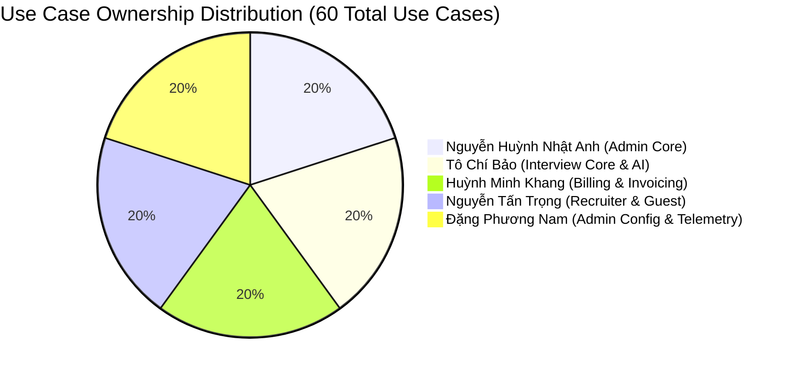

# CAPSTONE PROPOSAL EXPANSION SUMMARY

**Project Code:** 09_GFA26SE84  
**Project Name (EN):** Design and Development of an AI-Powered Virtual Technical Interview Simulation Platform with a 3D Virtual Interviewer  
**Project Name (VN):** Xây dựng nền tảng mô phỏng phỏng vấn kỹ thuật trực tuyến ứng dụng trí tuệ nhân tạo và nhân vật 3D ảo  
**Class:** SE1900-CAPSTONE | **Duration:** 11/05/2026 – 25/08/2026  
**Supervisor:** Mr. Nguyễn Thế Hoàng  
**Team Members:** Tô Chí Bảo, Huỳnh Minh Khang, Nguyễn Huỳnh Nhật Anh (Leader), Nguyễn Tấn Trọng, Đặng Phương Nam  

---

## 1. Executive Summary & Rationale

Following feedback from faculty mentors and reviewing professors that the initial proposal lacked sufficient functional scope and complexity for a 5-member engineering capstone, the project scope was expanded. 

This document summarizes **all newly introduced features, actors, database entities, billing mechanisms, and member allocations** now present in the full proposal files:
- [`9_GFA26SE84_AI_Virtual_Technical_Interview_Capstone_Register.md`](file:///C:/Users/Admin/Desktop/Graduation%20Thesis/9_GFA26SE84_AI_Virtual_Technical_Interview_Capstone_Register.md)
- [`Expanded_Capstone_Proposal.md`](file:///C:/Users/Admin/Desktop/Graduation%20Thesis/Expanded_Capstone_Proposal.md)

---

## 2. Before vs. After Comparison Matrix

| Project Dimension | Original Proposal (Draft) | Expanded Proposal (Current) | Difference & Impact |
|---|:---:|:---:|---|
| **System Actors** | 2 (*Admin, Candidate*) | **4 Actors** (*Admin, Candidate, Company Recruiter, Guest*) | Added corporate B2B hiring dimension + public trial funnel |
| **Total Use Cases** | ~14 informal bullet points | **60 Formal Use Cases** | +46 use cases with complete pre/post-conditions & flows |
| **Use Cases / Member** | Unassigned (~2.8 / member) | **12 Use Cases per Member** | Satisfies university bar of **≥10 UCs per student** |
| **Database Tables** | ~10 implied tables | **35 Defined Tables** (23 Core ⭐ + 12 Optional 🔹) | Clear data model with full types, foreign keys & indexes |
| **Billing & Monetization** | 3 vague bullet points | **Full Invoicing & Payment System** | Subscriptions, transactions, invoices, PDF receipts, refunds |
| **Corporate Recruiter Role** | None (0%) | **Full Recruiter Subsystem** (10 UCs) | Company profile, JD posting, talent pool analytics |
| **Public Guest Experience** | None | **Landing page, pricing matrix, 2-question demo interview** | Lowers barrier to entry for prospective candidates |
| **Real-Time Diagrams** | None | **4 Mermaid Architecture & Sequence Diagrams** | ERD, WebSocket FSM, Payment checkout, Gantt WBS |
| **Document Depth** | 270 lines (~13 KB) | **1,437 lines (~93 KB)** | Comprehensive, academically defendable proposal |

---

## 3. What Was Added by Category

### 3.1. New System Actors
1. **Company Recruiter (Enterprise / B2B Actor):**
   - Corporate registration with business tax code verification.
   - Company branding and official profile management.
   - Direct publishing, updating, and archiving of company Job Descriptions.
   - Anonymized talent pool competency analytics and benchmark charts for corporate JDs.
   - Recruiter Enterprise subscription tier with automated corporate VAT invoices.
2. **Guest (Public Visitor / Trial User Actor):**
   - Public landing page with WebGL 3D avatar preview.
   - Interactive pricing and feature comparison matrix.
   - 2-question interactive voice demo interview without account creation.

---

### 3.2. Billing, Payment & Invoicing Subsystem
- **Subscription Management:** Tiered recurring plans (*Free Starter*, *Pro Engineer*, *Recruiter Enterprise*) and pay-as-you-go credit bundles.
- **Payment Gateway Integrations:** Multi-provider gateway support for **VNPay**, **MoMo**, and **Stripe**.
- **Cryptographic Webhook Handlers:** HMAC-SHA512 checksum validation and idempotent transaction processing.
- **Standardized Digital Invoices:** Automatic generation of alphanumeric invoice numbers (e.g., `INV-2026-000841`), tax/VAT calculations, line-item itemization, and downloadable PDF receipts.
- **Refund & Dispute Pipeline:** Formal dispute filing with error proof attachment, administrative review notes, and automated credit balance adjustments.

---

### 3.3. Technical Adjustments Made Based on Feedback
- ❌ **Removed `technical_domains` table:** Skills are now dynamically categorized and stored as normalized strings and tags directly in `extracted_skills` and `topic_scores`.
- ❌ **Removed `coupons` / `coupon_redemptions` tables:** Payment features are streamlined directly into `subscription_plans`, `user_subscriptions`, `transactions`, `invoices`, and `refund_requests`.
- ❌ **Removed `Content Moderator` actor:** Moderation responsibilities are consolidated under `Admin` to maintain a realistic 4-actor architecture.

---

## 4. Work Allocation: 12 Use Cases per Team Member (60 Total)

The team has 5 full-stack software engineering students. Every member owns a cohesive, end-to-end domain spanning backend, frontend, database, and third-party integrations:

### Member 1: Nguyễn Huỳnh Nhật Anh (Leader) — Admin Core, Security & System Monitoring
| UC ID | Use Case Name | Subsystem / Focus |
|---|---|---|
| **UC-01** | View & Search User Accounts | User Governance & Query Filters |
| **UC-02** | Lock / Unlock User Account | Account State & Session Revocation |
| **UC-03** | View System Executive Dashboard | Real-Time Platform KPIs & MRR |
| **UC-04** | View & Filter Interview Sessions | Multi-Criteria Session Auditing |
| **UC-05** | View Session Diagnostics & Transcript | Transcript & Scoring Drill-Down |
| **UC-06** | Manage Virtual 3D Avatars Catalog | 3D Mesh (.glb) & Viseme Config |
| **UC-07** | Manage Voice Synthesizer Profiles | TTS Providers & Voice Personas |
| **UC-08** | Broadcast System Notifications | User Communication Queue |
| **UC-09** | Review & Process Refund Requests | Dispute Adjudication & Ledger Adjustment |
| **UC-10** | Approve / Reject Company Registrations | Corporate Verification & B2B Approval |
| **UC-11** | Manage Role-Based Permissions | RBAC Matrix & Privilege Assignment |
| **UC-12** | Terminate Live Abandoned Sessions | Orphaned WebSocket Session Cleanup |

---

### Member 2: Tô Chí Bảo — Candidate Interview Core & AI Pipeline
| UC ID | Use Case Name | Subsystem / Focus |
|---|---|---|
| **UC-13** | Register Candidate Account | Account Creation & Activation |
| **UC-14** | User Authentication & JWT Session | Argon2 Hashing & Token Refresh |
| **UC-15** | Manage Candidate Profile & Resume | Profile Data, CV Upload & Social Links |
| **UC-16** | Upload & Parse Job Description | Asynchronous LLM JD Extraction |
| **UC-17** | View Extracted Competencies & Skills | Categorized Skill Tag Visualization |
| **UC-18** | Edit & Confirm Skill Blueprint | Custom Skill Additions & Confirmation |
| **UC-19** | Configure Simulation Parameters | Duration, Avatar, Voice & Difficulty |
| **UC-20** | Test Audio Input & Microphone Readiness | Pre-Flight Audio Visualizer & Check |
| **UC-21** | Conduct AI Virtual Interview Room | Live Bi-Directional 3D Voice Simulation |
| **UC-22** | Resume Interrupted Interview Session | 10-Minute Network Drop Recovery |
| **UC-23** | View Historical Interview Attempts | Chronological Session Log & Scores |
| **UC-24** | View Comprehensive Performance Report | Radar Charts & Competency Diagnostics |

---

### Member 3: Huỳnh Minh Khang — Billing, Invoicing, Payments & Account
| UC ID | Use Case Name | Subsystem / Focus |
|---|---|---|
| **UC-25** | View Subscription Plans & Credit Bundles | Pricing Matrix & Feature Matrix |
| **UC-26** | Subscribe to Plan / Purchase Credits | Checkout Initiation & Gateway Redirect |
| **UC-27** | Process Payment via Gateway Webhook | IPN Signature Verification & Settlement |
| **UC-28** | Cancel / Toggle Auto-Renewal | Recurring Billing Cycle Management |
| **UC-29** | View User Billing & Transaction History | Personal Financial Audit Ledger |
| **UC-30** | View & Download Digital Tax Invoice PDF | Alphanumeric Invoice & PDF Streaming |
| **UC-31** | Submit Refund Dispute Request | Outage Claims & Error Attachment |
| **UC-32** | View Refund Dispute Status & Notes | Resolution Timeline & Receipt |
| **UC-33** | Rate Simulation & Submit Feedback | 5-Star Rating & Qualitative Comments |
| **UC-34** | Export Performance Report to PDF | Formatted Diagnostic PDF Export |
| **UC-35** | View Tailored Learning Recommendations | Personalized Study Material Mapping |
| **UC-36** | Reset & Change User Account Password | Secure Email Reset Flow |

---

### Member 4: Nguyễn Tấn Trọng — Company Recruiter & Guest Portal
| UC ID | Use Case Name | Subsystem / Focus |
|---|---|---|
| **UC-37** | Register Enterprise Recruiter Account | Corporate Application & Tax Verification |
| **UC-38** | Manage Company Profile & Branding | Corporate Identity, Logos & Website |
| **UC-39** | Post Corporate Job Description | Employer-Side JD Authoring |
| **UC-40** | Edit & Archive Corporate JDs | Job Lifecycle & Simulation Toggles |
| **UC-41** | View Posted JD Status & Candidate Metrics | Candidate Completion Count & Scores |
| **UC-42** | View Anonymized Talent Pool Benchmarks | Aggregated Skill Deficiency Analytics |
| **UC-43** | Subscribe to Corporate Recruiter Tier | Enterprise B2B Subscription Upgrade |
| **UC-44** | View Recruiter Corporate Invoices | Corporate VAT Invoice Access |
| **UC-45** | Manage JD Boilerplate Templates | Reusable Corporate JD Templates |
| **UC-46** | View Public Landing Page & Showcase | Marketing Hero & 3D Interactive Teaser |
| **UC-47** | View Public Pricing & Feature Comparison | Transparent Pricing Matrix |
| **UC-48** | Experience Interactive Demo Interview | 2-Question Public Voice Trial Room |

---

### Member 5: Đặng Phương Nam — Admin Config, Revenue & System Telemetry
| UC ID | Use Case Name | Subsystem / Focus |
|---|---|---|
| **UC-49** | Configure LLM Prompts & Evaluator Rubrics | System Prompt & Rubric Versioning |
| **UC-50** | Manage Commercial Subscription Plans | Plan Pricing & Feature Flags |
| **UC-51** | View System Security Audit Logs | Tamper-Evident Action Audit Trail |
| **UC-52** | View Financial Revenue Dashboard & MRR | GMV, MRR & Gateway Revenue Split |
| **UC-53** | View Platform-Wide Transaction Ledger | Master Monetary Ledger Auditing |
| **UC-54** | Generate & Export Comprehensive Invoice Reports | Accounting Reconciliation Spreadsheets |
| **UC-55** | Analyze Platform Interview Volume & Skill Gaps | Global Market Trends & Weaknesses |
| **UC-56** | Manage Dynamic Global System Settings | Runtime Dynamic Config (Redis/DB) |
| **UC-57** | View & Moderate Candidate Reviews | Feedback Queue Triage & Sentiment |
| **UC-58** | Export Aggregated System Analytics Data | BI Export Pipeline (CSV/JSON) |
| **UC-59** | Monitor Real-Time API Health & Latencies | Upstream Latency & Error Rate Gauges |
| **UC-60** | Manage File Uploads & Object Storage Quota | S3 Storage Usage & Orphan Purging |

---

## 5. Complete Database Table Catalog (35 Tables)

To give the team full sprint flexibility, tables are partitioned into **23 Core Tables (⭐ Must-Have)** and **12 Optional Tables (🔹 Nice-to-Have / Expandable)**:

| # | Table Name | Category | Priority | Purpose & Responsibility |
|---|---|---|:---:|---|
| 1 | `users` | Auth & Identity | ⭐ Core | Central login credentials, hashed passwords, roles, status |
| 2 | `candidates` | Auth & Identity | ⭐ Core | Professional headline, years of experience, bio, resume link |
| 3 | `recruiters` | Auth & Identity | ⭐ Core | Enterprise recruiter profile linked to company |
| 4 | `companies` | Auth & Identity | ⭐ Core | Enterprise organization profile, tax code, status |
| 5 | `roles` | Auth & Identity | ⭐ Core | Role master records (`ADMIN`, `CANDIDATE`, `RECRUITER`) |
| 6 | `permissions` | Auth & Identity | 🔹 Optional | Fine-grained API permission definitions |
| 7 | `role_permissions` | Auth & Identity | 🔹 Optional | Many-to-many role-permission mapping |
| 8 | `job_descriptions` | JD & Skills | ⭐ Core | Uploaded candidate JDs and recruiter job postings |
| 9 | `extracted_skills` | JD & Skills | ⭐ Core | AI-parsed technical skills with seniority levels |
| 10 | `candidate_skills` | JD & Skills | 🔹 Optional | Self-declared candidate skills from profile |
| 11 | `skill_assessments` | JD & Skills | 🔹 Optional | Historical rolling skill averages per candidate |
| 12 | `interview_configs` | Simulation | ⭐ Core | Duration, difficulty, question count & rubric presets |
| 13 | `interview_sessions` | Simulation | ⭐ Core | Operational execution record of each interview |
| 14 | `interview_questions` | Simulation | ⭐ Core | Prompts, spoken transcripts, and follow-up links |
| 15 | `question_feedback` | Simulation | 🔹 Optional | Dimension-level scores per question (accuracy/clarity) |
| 16 | `interview_recordings` | Simulation | 🔹 Optional | Media URLs of recorded audio snippets in object storage |
| 17 | `performance_reports` | Simulation | ⭐ Core | Final evaluation with overall & 5-dimension scores |
| 18 | `topic_scores` | Simulation | ⭐ Core | Breakdown of scores per technical topic in report |
| 19 | `virtual_avatars` | 3D & Audio | ⭐ Core | 3D avatar .glb mesh assets and viseme mapping |
| 20 | `voice_profiles` | 3D & Audio | ⭐ Core | Neural TTS voice profiles (Azure/ElevenLabs) |
| 21 | `subscription_plans` | Billing | ⭐ Core | Commercial tiers, prices, credits & billing cycles |
| 22 | `user_subscriptions` | Billing | ⭐ Core | User active subscription plan and remaining credits |
| 23 | `transactions` | Billing | ⭐ Core | Gateway payment records (VNPay, MoMo, Stripe) |
| 24 | `invoices` | Billing | ⭐ Core | Alphanumeric tax invoice records and PDF URLs |
| 25 | `invoice_items` | Billing | 🔹 Optional | Itemized line items within an invoice |
| 26 | `refund_requests` | Billing | ⭐ Core | Candidate refund dispute claims and review notes |
| 27 | `payment_methods` | Billing | 🔹 Optional | Tokenized saved cards for one-click purchases |
| 28 | `candidate_feedback` | Governance | ⭐ Core | 1-5 star ratings and post-interview feedback |
| 29 | `notifications` | Governance | ⭐ Core | In-app user notifications and system alerts |
| 30 | `audit_logs` | Governance | 🔹 Optional | Administrative action audit trail with IP address |
| 31 | `system_settings` | Governance | 🔹 Optional | Dynamic key-value configuration parameters |
| 32 | `file_uploads` | Storage | 🔹 Optional | Central file storage registry and metadata |
| 33 | `login_history` | Security | 🔹 Optional | User authentication log and IP tracking |
| 34 | `candidate_bookmarks` | Utilities | 🔹 Optional | Bookmarked JDs and favorite interview sessions |
| 35 | `jd_templates` | Recruiter | 🔹 Optional | Reusable corporate job description boilerplates |

---

## 6. How Your Team Should Use These Documents for Defense

1. **For Meeting with Supervisor (Mr. Nguyễn Thế Hoàng):**
   - Present this summary document to show the **60 use cases evenly split (12 per student)**.
   - Highlight the **4 actors** and the addition of **Corporate Recruiters** and **Invoicing/Billing**.
   - Emphasize that the database is now **35 tables** with 23 core tables ready for Phase 1.
2. **For Milestone Defense (SRS & Architecture Review):**
   - The primary proposal document (`Expanded_Capstone_Proposal.md`) contains all required UML diagrams, sequence charts, database data types, non-functional requirements (latencies, SLAs), and a 15-week WBS Gantt chart.
3. **For Sprint Slicing:**
   - Members can directly implement their assigned 12 use cases without overlapping responsibility.
   - Core tables (⭐) form Sprint 1–3 backlog; optional tables (🔹) serve as stretch goals for Sprints 4–5.
